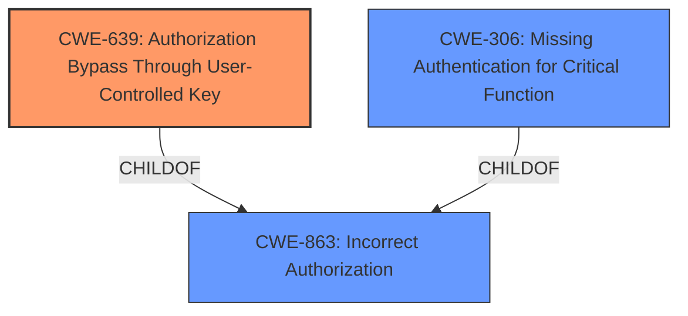

# Enhanced Analysis for CVE-2024-36257

# Summary
| CWE ID | CWE Name | Confidence | CWE Abstraction Level | CWE Vulnerability Mapping Label | CWE-Vulnerability Mapping Notes |
|---|---|---|---|---|---|
| CWE-639 | Authorization Bypass Through User-Controlled Key | 0.9 | Base | Allowed | Primary CWE - The application **fails to properly authorize** the request based on a user-controlled key (the remote server ID). |
| CWE-863 | Incorrect Authorization | 0.7 | Class | Allowed-with-Review | Secondary Candidate - A more general description of the authorization **failure**. |
| CWE-306 | Missing Authentication for Critical Function | 0.6 | Base | Allowed | Secondary Candidate - There's a **failure to authenticate** the remote server's identity before processing the profile picture update request. |

## Evidence and Confidence

*   **Confidence Score:** 0.9
*   **Evidence Strength:** HIGH

## Relationship Analysis
The primary weakness is CWE-639 Authorization Bypass Through User-Controlled Key, a Base level CWE. CWE-863 Incorrect Authorization is a broader Class-level CWE that describes the general authorization failure. CWE-306 Missing Authentication for Critical Function is another Base level CWE that describes the missing authentication.



## Vulnerability Chain
The vulnerability chain starts with the **failure to check** if the remote server requesting the profile picture update is authorized to do so for the target user. This leads to the impact of a malicious remote server being able to change profile images of users on another remote server.

## Summary of Analysis
The vulnerability is primarily due to an **authorization bypass** where the application **fails to properly authorize** the request to update a user's profile picture, allowing a malicious remote server to modify profile images of users belonging to another server. This aligns well with CWE-639, which describes an authorization bypass through a user-controlled key. The "remote server A" requesting the update acts as the "user-controlled key" that is not properly validated.

The evidence for this assessment is strong, based on the vulnerability description which states the application **fails to check** that the remote server A requesting the server B to update the profile picture of a user is the remote that actually has the user as a local one. This **failure to check** directly relates to an authorization issue.

CWE-863, Incorrect Authorization, is a broader category that could apply, but CWE-639 is more specific because it highlights the user-controlled key aspect of the authorization bypass. CWE-306, Missing Authentication for Critical Function, could also apply, as there's a **failure to authenticate** the remote server's identity. However, the core issue is the authorization bypass using the remote server ID, making CWE-639 the most accurate primary CWE.

Relevant CWE Information:

**CWE-639: Authorization Bypass Through User-Controlled Key**
The system's authorization functionality does not prevent one user from gaining access to another user's data or record by modifying the key value identifying the data. In this case, the "key value" is the remote server ID, which is not properly validated.

**CWE-863: Incorrect Authorization**
The product performs an authorization check when an actor attempts to access a resource or perform an action, but it does not correctly perform the check. This is a more general description of the authorization failure.

**CWE-306: Missing Authentication for Critical Function**
The product does not perform any authentication for functionality that requires a provable user identity or consumes a significant amount of resources. There's a **failure to authenticate** the remote server's identity before processing the profile picture update request.


## CWE Relationship Analysis

Current CWEs represent these abstraction levels: .


### Vulnerability Chain Analysis

**Chain starting from CWE-863:**
- 863 (Incorrect Authorization) - ROOT


**Chain starting from CWE-306:**
- 306 (Missing Authentication for Critical Function) - ROOT


### CWE Relationship Diagram

```mermaid
graph TD
    classDef primary fill:#f96,stroke:#333,stroke-width:2px
    classDef secondary fill:#69f,stroke:#333
    classDef tertiary fill:#9e9,stroke:#333
```