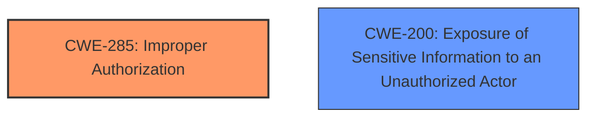

# Raw Analyzer Response for CVE-2024-36259

# Summary
| CWE ID    | CWE Name                                                                   | Confidence | CWE Abstraction Level | CWE Vulnerability Mapping Label | CWE-Vulnerability Mapping Notes |
| --------- | -------------------------------------------------------------------------- | ---------- | --------------------- | ------------------------------- | ------------------------------- |
| CWE-285   | Improper Authorization                                                     | 0.85       | Class                 | Primary CWE                     | Discouraged                   |
| CWE-200   | Exposure of Sensitive Information to an Unauthorized Actor                | 0.75       | Class                  | Secondary                       | Discouraged                   |

## Evidence and Confidence

*   **Confidence Score:** 0.80
*   **Evidence Strength:** HIGH

## Relationship Analysis
The primary relationship influencing the selection was the hierarchical relationship between CWE-285 (Improper Authorization) and its potential child CWEs. While more specific CWEs might exist, the available information doesn't provide enough detail to pinpoint the exact flaw in the authorization logic, making CWE-285 a suitable, albeit high-level, choice. CWE-200 is included as a secondary weakness due to the impact of the vulnerability which leads to the exposure of sensitive information.

## Vulnerability Chain
The vulnerability chain starts with **improper access control** (CWE-285), which allows remote authenticated attackers to then extract sensitive information (CWE-200) via a crafted attack.

## Summary of Analysis
Initially, the vulnerability description and key phrases pointed to an access control issue. The CVE reference link summary further clarified that the root cause involved a programming error in the access control logic, leading to crafted RPC search queries being executed with elevated privileges.

CWE-285 (Improper Authorization) was chosen as the primary CWE because the vulnerability stems from a flaw in the authorization mechanism, allowing unauthorized access to sensitive information. While CWE-285 is a Class-level CWE, the provided information doesn't offer enough granularity to pinpoint a more specific Base-level CWE. The guidance suggests that CWE-285 is appropriate when the access control failure exists but the root cause is unclear. The description mentions a programming error in the access control logic which indicates that the authorization was performed incorrectly.

CWE-200 (Exposure of Sensitive Information to an Unauthorized Actor) was selected as a secondary CWE because the impact of the vulnerability is the extraction of sensitive information by unauthorized actors.

The retriever results suggested other candidates like CWE-306 (Missing Authentication for Critical Function), CWE-639 (Authorization Bypass Through User-Controlled Key), and CWE-863 (Incorrect Authorization). However, CWE-306 was deemed inappropriate as the attack requires authentication. CWE-639 and CWE-863 were considered, but the description lacks specifics about user-controlled keys or explicit incorrect authorization checks, making CWE-285 a more suitable general classification.

The final selection of CWE-285 and CWE-200 represents the optimal level of specificity given the available evidence.