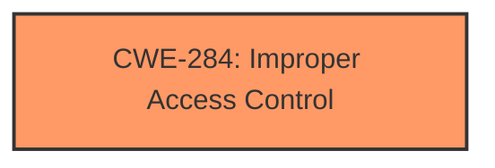

# Enhanced Analysis for CVE-2024-36261

# Summary
| CWE ID  | CWE Name                        | Confidence | CWE Abstraction Level | CWE Vulnerability Mapping Label | CWE-Vulnerability Mapping Notes |
| :------- | :------------------------------ | :--------- | :-------------------- | :------------------------------ | :------------------------------ |
| CWE-284 | Improper Access Control | 0.75       | Pillar                  | Primary                         | Discouraged                   |

## Evidence and Confidence

*   **Confidence Score:** 0.75
*   **Evidence Strength:** MEDIUM

## Relationship Analysis
The primary identified weakness is CWE-284 (Improper Access Control), which is a high-level category. Given that the vulnerability description states "**Improper access control** in Intel(R) RAID Web Console software all versions may allow an authenticated user to potentially enable denial of service via adjacent access," it's a reasonable starting point. However, ideally, we would map to a more specific child CWE if more details were available about the exact mechanism of the **improper access control**. As a Pillar, it does not have much hierarchical relationships beyond its parent. We will use this CWE, but recognize that it is a broad characterization.



## Vulnerability Chain
The chain of events starts with **improper access control**, leading to a denial-of-service vulnerability. In this case, **improper access control** is both the root cause and the direct enabler of the impact.

## Summary of Analysis
Initially, the vulnerability description points to a problem with access control, where an authenticated user can trigger a denial of service due to "**Improper access control**".

Based on the provided evidence, specifically the vulnerability description and the CVE Reference Links Content Summary, CWE-284 (Improper Access Control) appears to be the most appropriate mapping. The description clearly states **improper access control** as the root cause. The retriever results also lists this CWE as a possible candidate, although discouraged as a Pillar type. Since there isn't enough information to map to a more specific CWE, CWE-284 serves as a reasonable, albeit high-level, classification.

Other CWEs were considered but ultimately rejected because they lacked sufficient support from the vulnerability description:
*   CWE-306 (Missing Authentication for Critical Function): This CWE focuses on missing authentication, but the vulnerability description mentions an authenticated user.
*   CWE-862 (Missing Authorization): While the issue could be related to missing authorization, the description is too general and does not provide enough information to confirm this.
*   CWE-863 (Incorrect Authorization): Similar to CWE-862, there isn't enough evidence to suggest that authorization checks are present but flawed.
*   CWE-285 (Improper Authorization): This is a general authorization failure, but CWE-284 is more appropriate given that we can't determine if authentication or authorization is the problem.
*   CWE-787 (Out-of-bounds Write), CWE-125 (Out-of-bounds Read): These memory-related issues are not suggested or indicated in the text.

Ultimately, the assessment relies heavily on the provided evidence, specifically the "**Improper access control**" phrase in the vulnerability description and CVE summary.

Relevant CWE Information:
*   CWE-284: Improper Access Control


## CWE Relationship Analysis

Current CWEs represent these abstraction levels: .


### Vulnerability Chain Analysis

**Chain starting from CWE-863:**
- 863 (Incorrect Authorization) - ROOT


**Chain starting from CWE-862:**
- 862 (Missing Authorization) - ROOT


### CWE Relationship Diagram

```mermaid
graph TD
    classDef primary fill:#f96,stroke:#333,stroke-width:2px
    classDef secondary fill:#69f,stroke:#333
    classDef tertiary fill:#9e9,stroke:#333
```