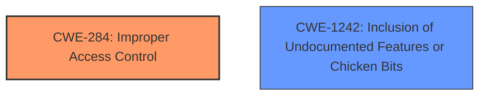

# Enhanced Analysis for CVE-2024-36287

# Summary
| CWE ID | CWE Name | Confidence | CWE Abstraction Level | CWE Vulnerability Mapping Label | CWE-Vulnerability Mapping Notes |
|---|---|---|---|---|---|
| CWE-284 | Improper Access Control | 0.7 | Pillar | Primary | Allowed |
| CWE-1242 | Inclusion of Undocumented Features or Chicken Bits | 0.6 | Base | Secondary | Allowed |

## Evidence and Confidence

*   **Confidence Score:** 0.7
*   **Evidence Strength:** MEDIUM

## Relationship Analysis
The primary CWE is CWE-284, a Pillar, which is a high-level category. The vulnerability involves bypassing security restrictions on macOS. While there is no direct child relationship explicitly linking to the bypass of TCC restrictions, CWE-284 is the closest high-level category. The secondary CWE is CWE-1242, which suggests the **failure to disable debug flags** could be considered an "undocumented feature" being unintentionally included.



## Vulnerability Chain
The vulnerability chain starts with the **failure to disable certain Electron debug flags**. This leads to the ability to bypass TCC restrictions on macOS.
- **Root Cause:** **fail to disable certain Electron debug flags**
- **Impact:** bypassing TCC restrictions

## Summary of Analysis
The initial assessment identified the **failure to disable certain Electron debug flags** as the root cause, leading to the bypass of TCC restrictions on macOS.

CWE-284 (Improper Access Control) is selected as the primary CWE because the vulnerability allows bypassing intended access restrictions (TCC on macOS). This aligns with the broad scope of access control issues covered by CWE-284.
CWE-1242 (Inclusion of Undocumented Features or Chicken Bits) is selected as a secondary CWE because the **Electron debug flags** that were not disabled could be considered an "undocumented feature" that unintentionally created a security vulnerability.

The evidence supporting these choices includes the vulnerability description highlighting the **failure to disable debug flags** and the resulting bypass of security restrictions.

Other CWEs Considered and Rejected:

*   CWE-200 (Exposure of Sensitive Information to an Unauthorized Actor): Rejected because the primary issue is not the exposure of sensitive information, but rather the bypassing of security restrictions.
*   CWE-88 (Improper Neutralization of Argument Delimiters in a Command ('Argument Injection')): Rejected because there is no evidence of argument injection in the vulnerability description.
*   CWE-923 (Improper Restriction of Communication Channel to Intended Endpoints): Rejected because there is no evidence of communication channel issues in the vulnerability description.

The selected CWEs are at an appropriate level of specificity, with CWE-284 providing a general categorization of access control issues, and CWE-1242 offering a more specific characterization of the root cause.


## CWE Relationship Analysis

Current CWEs represent these abstraction levels: .


### Vulnerability Chain Analysis

**Chain starting from CWE-88:**
- 88 (Improper Neutralization of Argument Delimiters in a Command ('Argument Injection')) - ROOT


**Chain starting from CWE-923:**
- 923 (Improper Restriction of Communication Channel to Intended Endpoints) - ROOT


### CWE Relationship Diagram

```mermaid
graph TD
    classDef primary fill:#f96,stroke:#333,stroke-width:2px
    classDef secondary fill:#69f,stroke:#333
    classDef tertiary fill:#9e9,stroke:#333
```