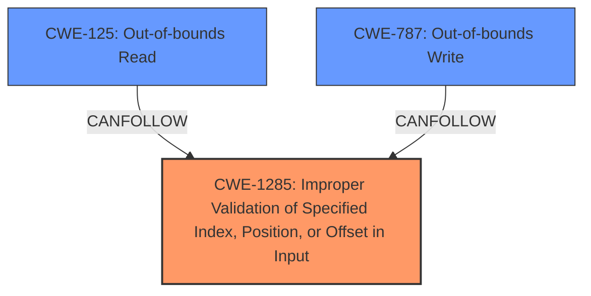

# Raw Analyzer Response for CVE-2024-36292

# Summary
| CWE ID | CWE Name | Confidence | CWE Abstraction Level | CWE Vulnerability Mapping Label | CWE-Vulnerability Mapping Notes |
|---|---|---|---|---|---|
| CWE-1285 | Improper Validation of Specified Index, Position, or Offset in Input | 0.8 | Base | Allowed | Primary CWE. The **improper buffer restrictions** likely stem from a failure to properly validate an index, position, or offset used to access the buffer. |
| CWE-125 | Out-of-bounds Read | 0.6 | Base | Allowed | Secondary candidate. Resulting from the **improper buffer restrictions**, the application may read data outside of the intended buffer. |
| CWE-787 | Out-of-bounds Write | 0.6 | Base | Allowed | Secondary candidate. Resulting from the **improper buffer restrictions**, the application may write data outside of the intended buffer. |

## Evidence and Confidence

*   **Confidence Score:** 0.7
*   **Evidence Strength:** MEDIUM

## Relationship Analysis
The primary weakness is identified as CWE-1285, which can lead to out-of-bounds read (CWE-125) or out-of-bounds write (CWE-787) conditions. CWE-1285 is a base-level CWE, providing a more specific description of the **improper buffer restrictions** than the class-level CWE-119.

## Vulnerability Chain
The vulnerability chain starts with **improper validation** of an index, position, or offset (CWE-1285). This leads to **improper buffer restrictions**, potentially resulting in either an out-of-bounds read (CWE-125) or out-of-bounds write (CWE-787), which ultimately causes a denial of service.

## Summary of Analysis
The initial assessment identified CWE-1285 as the most likely root cause due to its direct relevance to **improper buffer restrictions**, as the rootcause is likely caused by a failure to properly validate an index, position, or offset used to access the buffer. The retriever results listed CWE-119 as the top candidate, but this is a class-level CWE and thus less specific. The description provided specifies "**Improper buffer restrictions**", which aligns better with CWE-1285. The other candidates (CWE-125, CWE-787) are consequences of this **improper restriction**.

The selection of CWE-1285 is based on the vulnerability description emphasizing **improper buffer restrictions**, and the retriever results confirming the relevance of validation issues. The evidence is moderate, with a confidence score of 0.7. The final CWE selection is based on the following information:

*   **Vulnerability Description Key Phrases:** **Improper buffer restrictions**
*   **CVE Reference Links Content Summary:** Improper buffer restrictions for some Intel® Data Center GPU Flex Series for Windows driver before version 31.0.101.4314 may allow an authenticated user to potentially enable denial of service via local access.

# Enhanced Context (25 CWEs)
The following CWEs were identified as potentially relevant to this vulnerability:

## CWE-119: Improper Restriction of Operations within the Bounds of a Memory Buffer
**Abstraction Level**: Class
**Similarity Score**: 0.78
**Source**: dense

**Description**:
The product performs operations on a memory buffer, but it reads from or writes to a memory location outside the buffer's intended boundary. This may result in read or write operations on unexpected memory locations that could be linked to other variables, data structures, or internal program data.

**Mapping Guidance**:
- Usage: Discouraged
- Rationale: CWE-119 is commonly misused in low-information vulnerability reports when lower-level CWEs could be used instead, or when more details about the vulnerability are available.

*Analysis:* Although this CWE is related to buffer issues, it's a high-level classification. The root cause is more likely related to how the buffer restriction failed (validation). Therefore, it is not the primary CWE.

## CWE-1285: Improper Validation of Specified Index, Position, or Offset in Input
**Abstraction Level**: Base
**Similarity Score**: 0.78
**Source**: dense

**Description**:
The product receives input that is expected to specify an index, position, or offset into an indexable resource such as a buffer or file, but it does not validate or incorrectly validates that the specified index/position/offset has the required properties.

**Mapping Guidance**:
- Usage: Allowed
- Rationale: This CWE entry is at the Base level of abstraction, which is a preferred level of abstraction for mapping to the root causes of vulnerabilities.

*Analysis:* This is a strong candidate. The vulnerability description highlights **improper buffer restrictions**, and this CWE directly addresses the **improper validation** of indices, positions, or offsets, which could directly lead to such restrictions failing.

## CWE-131: Incorrect Calculation of Buffer Size
**Abstraction Level**: Base
**Similarity Score**: 0.77
**Source**: dense

**Description**:
The product does not correctly calculate the size to be used when allocating a buffer, which could lead to a buffer overflow.

**Mapping Guidance**:
- Usage: Allowed
- Rationale: This CWE entry is at the Base level of abstraction, which is a preferred level of abstraction for mapping to the root causes of vulnerabilities.

*Analysis:* While related to buffer issues, the description focuses on **improper restrictions** rather than the calculation of the size itself. It is not the primary CWE.

## CWE-755: Improper Handling of Exceptional Conditions
**Abstraction Level**: Class
**Similarity Score**: 0.76
**Source**: dense

**Description**:
The product does not handle or incorrectly handles an exceptional condition.

**Mapping Guidance**:
- Usage: Discouraged
- Rationale: This CWE entry is a level-1 Class (i.e., a child of a Pillar). It might have lower-level children that would be more appropriate

*Analysis:* This CWE is too generic and does not directly relate to the **improper buffer restrictions**.

## CWE-824: Access of Uninitialized Pointer
**Abstraction Level**: Base
**Similarity Score**: 0.75
**Source**: dense

**Description**:
The product accesses or uses a pointer that has not been initialized.

**Mapping Guidance**:
- Usage: Allowed
- Rationale: This CWE entry is at the Base level of abstraction, which is a preferred level of abstraction for mapping to the root causes of vulnerabilities.

*Analysis:* This CWE does not appear relevant to the vulnerability description.

## CWE-805: Buffer Access with Incorrect Length Value
**Abstraction Level**: Base
**Similarity Score**: 0.75
**Source**: dense

**Description**:
The product uses a sequential operation to read or write a buffer, but it uses an incorrect length value that causes it to access memory that is outside of the bounds of the buffer.

**Mapping Guidance**:
- Usage: Allowed
- Rationale: This CWE entry is at the Base level of abstraction, which is a preferred level of abstraction for mapping to the root causes of vulnerabilities.

*Analysis:* This is a possible impact as a result of **improper buffer restrictions**, but not the root cause.

## CWE-20: Improper Input Validation
**Abstraction Level**: Class
**Similarity Score**: 0.75
**Source**: dense

**Description**:
The product receives input or data, but it does
        not validate or incorrectly validates that the input has the
        properties that are required to process the data safely and
        correctly.

**Mapping Guidance**:
- Usage: Discouraged
- Rationale: CWE-20 is commonly misused in low-information vulnerability reports when lower-level CWEs could be used instead, or when more details about the vulnerability are available [REF-1287]. It is not useful for trend analysis. It is also a level-1 Class (i.e., a child of a Pillar).

*Analysis:* This is too generic. CWE-1285 provides a more specific description of the validation issue.

## CWE-125: Out-of-bounds Read
**Abstraction Level**: Base
**Similarity Score**: 0.74
**Source**: dense

**Description**:
The product reads data past the end, or before the beginning, of the intended buffer.

**Mapping Guidance**:
- Usage: Allowed
- Rationale: This CWE entry is at