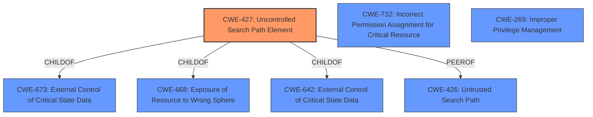

# Raw Analyzer Response for CVE-2024-36339

# Summary
| CWE ID    | CWE Name                                                                             | Confidence | CWE Abstraction Level | CWE Vulnerability Mapping Label | CWE-Vulnerability Mapping Notes |
| --------- | ------------------------------------------------------------------------------------ | ---------- | --------------------- | ------------------------------- | ------------------------------- |
| CWE-427   | Uncontrolled Search Path Element                                                      | 0.9        | Base                  | Primary                         | Allowed                         |
| CWE-732   | Incorrect Permission Assignment for Critical Resource                                 | 0.7        | Class                 | Secondary                       | Allowed-with-Review             |
| CWE-269   | Improper Privilege Management                                                      | 0.4        | Class                 | Secondary                       | Discouraged                     |

## Evidence and Confidence

*   **Confidence Score:** 0.9
*   **Evidence Strength:** HIGH

## Relationship Analysis
The primary CWE selected is CWE-427, which is a base-level CWE and accurately reflects the **DLL hijacking** vulnerability. The retriever results also suggests CWE-427 and CWE-426 (Untrusted Search Path), which are peer-of relationships that are closely related. The selection of CWE-427 is also influenced by the fact that it is a base-level CWE, which is preferred for mapping. The secondary CWEs include CWE-732, and CWE-269, these both are higher level classes, but are included as secondary considerations, but not as the primary cause.

## Vulnerability Chain
The vulnerability chain starts with a **DLL hijacking vulnerability** (CWE-427), which leads to privilege escalation and potentially arbitrary code execution.

## Summary of Analysis
The primary CWE identified is CWE-427 (Uncontrolled Search Path Element), which accurately describes the **DLL hijacking vulnerability**. The evidence to support this mapping comes directly from the vulnerability description: "A **DLL hijacking vulnerability** in the AMD Optimizing CPU Libraries could allow an attacker to achieve privilege escalation, potentially resulting in arbitrary code execution."

The retriever results also identify CWE-427 as a potential candidate.

The selection of CWE-427 is appropriate because it is a base-level CWE that describes the root cause of the vulnerability. The other CWEs considered were either too high-level or did not accurately reflect the specific nature of the **DLL hijacking vulnerability**.
The analysis is heavily based on the provided evidence, specifically the vulnerability description and CVE reference links content summary. The relationship graph further supports the selection of CWE-427 by highlighting its connections to other related CWEs.

Relevant CWE Information:

# Enhanced Context (25 CWEs)
The following CWEs were identified as potentially relevant to this vulnerability:

## CWE-427: Uncontrolled Search Path Element
**Abstraction Level**: Base
**Similarity Score**: 0.76
**Source**: dense

**Description**:
The product uses a fixed or controlled search path to find resources, but one or more locations in that path can be under the control of unintended actors.

**Mapping Guidance**:
- Usage: Allowed
- Rationale: This CWE entry is at the Base level of abstraction, which is a preferred level of abstraction for mapping to the root causes of vulnerabilities.

## CWE-732: Incorrect Permission Assignment for Critical Resource
**Abstraction Level**: Class
**Similarity Score**: 1578.93
**Source**: sparse

**Description**:
The product specifies permissions for a security-critical resource in a way that allows that resource to be read or modified by unintended actors.

**Mapping Guidance**:
- Usage: Allowed-with-Review
- Rationale: While the name itself indicates an assignment of permissions for resources, this is often misused for vulnerabilities in which "permissions" are not checked, which is an "authorization" weakness (CWE-285 or descendants) within CWE's model [REF-1287].

## CWE-269: Improper Privilege Management
**Abstraction Level**: Class
**Similarity Score**: 1580.39
**Source**: sparse

**Description**:
The product does not properly assign, modify, track, or check privileges for an actor, creating an unintended sphere of control for that actor.

**Mapping Guidance**:
- Usage: Discouraged
- Rationale: CWE-269 is commonly misused. It can be conflated with "privilege escalation," which is a technical impact that is listed in many low-information vulnerability reports [REF-1287]. It is not useful for trend analysis.