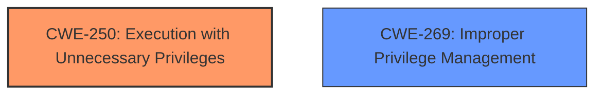

# Analysis Report for CVE-2024-36398

# Vulnerability Analysis Report: CVE-2024-36398

## Description

A vulnerability has been identified in SINEC NMS (All versions < V3.0). The affected application executes a subset of its services as `NT AUTHORITY\SYSTEM`. This could allow a local attacker to execute operating system commands with elevated privileges.

## Vulnerability Description Key Phrases

- **Impact:** execute operating system commands with elevated privileges
- **Attacker:** local attacker
- **Product:** SINEC NMS
- **Version:** All versions < V3.0

## Analysis (with Relationship Data)

# Summary
| CWE ID | CWE Name | Confidence | CWE Abstraction Level | CWE Vulnerability Mapping Label | CWE-Vulnerability Mapping Notes |
|---|---|---|---|---|---|
| CWE-250 | Execution with Unnecessary Privileges | 1.0 | Base | Allowed | Primary CWE. The application executes services with `NT AUTHORITY\SYSTEM` privileges, which is more than necessary. |
| CWE-269 | Improper Privilege Management | 0.5 | Class | Discouraged | Secondary candidate. While privilege management is involved, CWE-250 is a more specific root cause. |

## Evidence and Confidence

*   **Confidence Score:** 1.0
*   **Evidence Strength:** HIGH

## Relationship Analysis
The primary CWE is CWE-250, which is a Base level CWE. There are no direct parent or child relationships evident in this specific case. The suggested alternative of CWE-269 is a Class-level CWE and discouraged for use, making CWE-250 the more appropriate and specific choice.



## Vulnerability Chain
The vulnerability chain starts with the **root cause** of the SINEC NMS application executing a subset of its services as `NT AUTHORITY\SYSTEM` (**CWE-250**). This leads to the **impact** of a local attacker being able to execute operating system commands with elevated privileges.

## Summary of Analysis
The analysis indicates that the SINEC NMS application executes certain services with unnecessary privileges. This **weakness** allows a local attacker to execute operating system commands with elevated privileges.

The primary CWE identified is **CWE-250 Execution with Unnecessary Privileges**, which accurately reflects the **root cause** of the vulnerability, as the application runs with higher privileges than needed. This is further supported by the "CVE Reference Links Content Summary" which explicitly lists CWE-250 as a **weakness**.

Other CWEs were considered:

*   **CWE-269 Improper Privilege Management**: This was considered but deemed less specific than CWE-250. While privilege management is involved, the core issue is the unnecessary elevation of privileges, making CWE-250 a better fit. Also, CWE-269 is discouraged.
*   **CWE-732 Incorrect Permission Assignment for Critical Resource**: This was considered but is not the primary issue. The issue isn't about incorrect *permission* assignments but about the application running with unnecessary *privileges*.
*   **CWE-20 Improper Input Validation**: This is not relevant as the vulnerability isn't directly related to input validation.
*   **CWE-276 Incorrect Default Permissions**: This is not relevant as the vulnerability isn't about default permissions.
*   **CWE-94 Improper Control of Generation of Code ('Code Injection')**: This is not relevant as the vulnerability isn't related to code injection.

The evidence strongly supports the selection of CWE-250 as the primary CWE, with a confidence level of 1.0. This assessment is based on the provided vulnerability description, the CVE reference summary, and the MITRE CWE guidance.

Relevant CWE Information:

# Enhanced Context (25 CWEs)
The following CWEs were identified as potentially relevant to this vulnerability:

## CWE-250: Execution with Unnecessary Privileges
**Abstraction Level**: Base
**Similarity Score**: 0.076

**Description**:
The product executes a code segment with excessive privileges, creating an unwarranted security context that could be leveraged by attackers.

**Mapping Guidance**:
- Usage: Allowed
- Rationale: This CWE entry is at the Base level of abstraction, which is a preferred level of abstraction for mapping to the root causes of vulnerabilities.


## CWE Relationship Analysis

Current CWEs represent these abstraction levels: .


### Vulnerability Chain Analysis

**Chain starting from CWE-94:**
- 94 (Improper Control of Generation of Code ('Code Injection')) - ROOT


**Chain starting from CWE-732:**
- 732 (Incorrect Permission Assignment for Critical Resource) - ROOT


### CWE Relationship Diagram

```mermaid
graph TD
    classDef primary fill:#f96,stroke:#333,stroke-width:2px
    classDef secondary fill:#69f,stroke:#333
    classDef tertiary fill:#9e9,stroke:#333
```


*Report generated on 2025-07-13 08:58:44*
