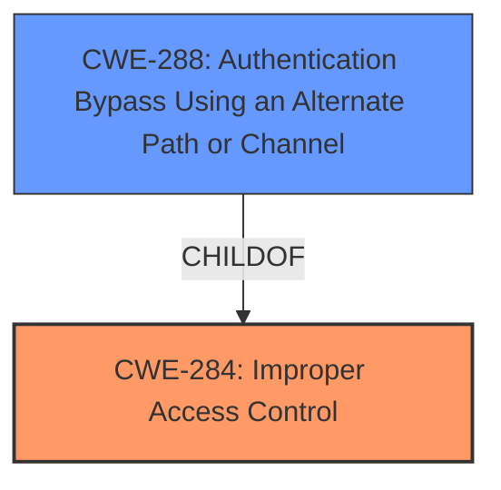

# Raw Analyzer Response for CVE-2024-36446

# Summary
| CWE ID | CWE Name | Confidence | CWE Abstraction Level | CWE Vulnerability Mapping Label | CWE-Vulnerability Mapping Notes |
|---|---|---|---|---|---|
| CWE-284 | Improper Access Control | 0.8 | Pillar | Primary | Allowed |
| CWE-288 | Authentication Bypass Using an Alternate Path or Channel | 0.6 | Base | Secondary Candidate | Allowed |

## Evidence and Confidence

*   **Confidence Score:** 0.8
*   **Evidence Strength:** HIGH

## Relationship Analysis
The primary selection is CWE-284, which is a high-level category. CWE-288 is a more specific type of authentication bypass. Since the vulnerability involves **improper access control** that leads to an authentication bypass, CWE-284 is selected as the primary weakness, with CWE-288 as a secondary weakness representing the authentication bypass achieved through **improper access control**.

## Vulnerability Chain
The vulnerability chain starts with **improper access control** (CWE-284), which leads to an authentication bypass (CWE-288), ultimately resulting in the ability to bypass the authorization schema and gain unauthorized access.
  - **Root Cause:** CWE-284 Improper Access Control
  - **Weakness:** CWE-288 Authentication Bypass Using an Alternate Path or Channel
  - **Impact:** Bypass of authorization schema

## Summary of Analysis
The initial assessment considered the retriever results, which suggested CWE-284, CWE-285, CWE-287, and CWE-306. The vulnerability description explicitly mentions "**improper access control**", pointing to CWE-284. The reference links content summary confirms an authentication bypass vulnerability. Based on the evidence, CWE-284 is the primary root cause, and CWE-288 describes the specific authentication bypass. The abstraction levels are appropriate, with CWE-284 as a high-level category and CWE-288 as a more specific base-level weakness.

The selection of CWE-284 and CWE-288 is primarily based on the following evidence:
- Vulnerability Description Key Phrases: "**improper access control**"
- CVE Reference Links Content Summary: "An authentication bypass vulnerability exists...Successful exploitation allows a malicious actor to bypass the authorization schema."

The graph relationships influenced the selection by showing that CWE-288 is a child of CWE-284.

# Enhanced Context (25 CWEs)
The following CWEs were identified as potentially relevant to this vulnerability:

## CWE-284: Improper Access Control
**Abstraction Level**: Pillar
**Similarity Score**: 0.265
**Source**: sparse

**Description**:
The software does not restrict access to resources (data, files, actions, etc.) to only the intended privileged actors (users, processes, etc.).

**Mapping Guidance**:
- Usage: Allowed
- Rationale: There are times when it is not possible to determine the specific type of access control problem, such as during initial triage. This is a very broad CWE that covers many types of access control problems. It should only be used when a more specific CWE is not available.

**Relationships**:
- PARENTOF -> CWE-264
- PARENTOF -> CWE-269
- PARENTOF -> CWE-272
- PARENTOF -> CWE-273
- PARENTOF -> CWE-275
- PARENTOF -> CWE-276
- PARENTOF -> CWE-279
- PARENTOF -> CWE-280
- PARENTOF -> CWE-281
- PARENTOF -> CWE-282
- PARENTOF -> CWE-283
- PARENTOF -> CWE-285
- PARENTOF -> CWE-288
- PARENTOF -> CWE-290
- PARENTOF -> CWE-291
- PARENTOF -> CWE-292
- PARENTOF -> CWE-293
- PARENTOF -> CWE-294
- PARENTOF -> CWE-296
- PARENTOF -> CWE-297
- PARENTOF -> CWE-298
- PARENTOF -> CWE-299
- PARENTOF -> CWE-300
- PARENTOF -> CWE-301
- PARENTOF -> CWE-302
- PARENTOF -> CWE-303
- PARENTOF -> CWE-304
- PARENTOF -> CWE-305
- PARENTOF -> CWE-306
- PARENTOF -> CWE-307
- PARENTOF -> CWE-308
- PARENTOF -> CWE-309
- PARENTOF -> CWE-310
- PARENTOF -> CWE-311
- PARENTOF -> CWE-312
- PARENTOF -> CWE-313
- PARENTOF -> CWE-314
- PARENTOF -> CWE-315
- PARENTOF -> CWE-316
- PARENTOF -> CWE-317
- PARENTOF -> CWE-318
- PARENTOF -> CWE-319
- PARENTOF -> CWE-320
- PARENTOF -> CWE-323
- PARENTOF -> CWE-324
- PARENTOF -> CWE-325
- PARENTOF -> CWE-326
- PARENTOF -> CWE-327
- PARENTOF -> CWE-328
- PARENTOF -> CWE-329
- PARENTOF -> CWE-330
- PARENTOF -> CWE-331
- PARENTOF -> CWE-332
- PARENTOF -> CWE-333
- PARENTOF -> CWE-334
- PARENTOF -> CWE-335
- PARENTOF -> CWE-336
- PARENTOF -> CWE-337
- PARENTOF -> CWE-338
- PARENTOF -> CWE-339
- PARENTOF -> CWE-340
- PARENTOF -> CWE-341
- PARENTOF -> CWE-342
- PARENTOF -> CWE-343
- PARENTOF -> CWE-344
- PARENTOF -> CWE-345
- PARENTOF -> CWE-346
- PARENTOF -> CWE-347
- PARENTOF -> CWE-348
- PARENTOF -> CWE-349
- PARENTOF -> CWE-350
- PARENTOF -> CWE-351
- PARENTOF -> CWE-352
- PARENTOF -> CWE-353
- PARENTOF -> CWE-354
- PARENTOF -> CWE-355
- PARENTOF -> CWE-356
- PARENTOF -> CWE-357
- PARENTOF -> CWE-358
- PARENTOF -> CWE-359
- PARENTOF -> CWE-360
- PARENTOF -> CWE-361
- PARENTOF -> CWE-362
- PARENTOF -> CWE-363
- PARENTOF -> CWE-364
- PARENTOF -> CWE-365
- PARENTOF -> CWE-366
- PARENTOF -> CWE-367
- PARENTOF -> CWE-368
- PARENTOF -> CWE-369
- PARENTOF -> CWE-370
- PARENTOF -> CWE-371
- PARENTOF -> CWE-372
- PARENTOF -> CWE-373
- PARENTOF -> CWE-374
- PARENTOF -> CWE-375
- PARENTOF -> CWE-376
- PARENTOF -> CWE-377
- PARENTOF -> CWE-378
- PARENTOF -> CWE-379
- PARENTOF -> CWE-380
- PARENTOF -> CWE-381
- PARENTOF -> CWE-382
- PARENTOF -> CWE-383
- PARENTOF -> CWE-384
- PARENTOF -> CWE-385
- PARENTOF -> CWE-386
- PARENTOF -> CWE-387
- PARENTOF -> CWE-388
- PARENTOF -> CWE-389
- PARENTOF -> CWE-390
- PARENTOF -> CWE-3