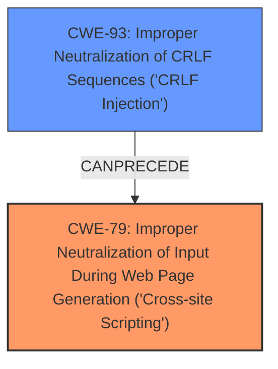

# Raw Analyzer Response for CVE-2024-36459

# Summary
| CWE ID | CWE Name | Confidence | CWE Abstraction Level | CWE Vulnerability Mapping Label | CWE-Vulnerability Mapping Notes |
|---|---|---|---|---|---|
| CWE-79 | Improper Neutralization of Input During Web Page Generation ('Cross-site Scripting') | 1.0 | Base | Allowed | Primary CWE. The vulnerability description explicitly mentions a cross-site scripting vulnerability. |
| CWE-93 | Improper Neutralization of CRLF Sequences ('CRLF Injection') | 0.7 | Base | Allowed | Secondary CWE. The vulnerability description mentions CRLF injection as the attack vector. |

## Evidence and Confidence

*   **Confidence Score:** 0.9
*   **Evidence Strength:** MEDIUM

## Relationship Analysis
- CWE-79 (Improper Neutralization of Input During Web Page Generation) is a base CWE that describes the general class of cross-site scripting vulnerabilities.
- CWE-93 (Improper Neutralization of CRLF Sequences) is a base CWE that describes the specific type of injection vulnerability involving CRLF sequences. It can precede CWE-79 by injecting CRLF to set headers that cause XSS.
- The vulnerability description indicates that a CRLF injection vulnerability leads to cross-site scripting, suggesting a chain relationship.

## Vulnerability Chain
The vulnerability chain starts with:
1.  **Root Cause:** **Improper Neutralization of CRLF Sequences** (CWE-93), which allows an attacker to inject CRLF characters into HTTP headers.
2.  **Weakness:** This leads to **Improper Neutralization of Input During Web Page Generation** (CWE-79) because the injected CRLF sequences can be used to manipulate the HTTP response in a way that introduces XSS.
3.  **Impact:** The final impact is the execution of arbitrary Javascript code in a client browser.

## Summary of Analysis
The primary weakness is CWE-79 because the description explicitly mentions "**cross-site scripting**". The vulnerability description states that the vulnerability is due to "CRLF **cross-site scripting** vulnerability." This suggests that CRLF injection (CWE-93) is the mechanism that leads to the XSS (CWE-79). Therefore, CWE-93 is a secondary weakness that facilitates the primary weakness, CWE-79.

The retriever results also show CWE-79 as the top combined result, which supports the decision.

CWE-113 was considered but not used. CWE-113 (Improper Neutralization of CRLF Sequences in HTTP Headers ('HTTP Request/Response Splitting')) is a more specific variant of CWE-93, but the description doesn't explicitly mention that the CRLF injection occurs in HTTP headers. Therefore, the more general CWE-93 is more appropriate.
CWE-352 (Cross-Site Request Forgery (CSRF)) was considered but rejected because the description does not describe a CSRF vulnerability.
CWE-80 (Improper Neutralization of Script-Related HTML Tags in a Web Page (Basic XSS)) was considered but rejected because CWE-79 is a more general description of cross-site scripting vulnerabilities, and there is no specific mention of HTML tag neutralization.
CWE-444 (Inconsistent Interpretation of HTTP Requests ('HTTP Request/Response Smuggling')) was considered but rejected because the vulnerability description does not describe HTTP request smuggling.

The selected CWEs are at the optimal level of specificity because they accurately represent the vulnerability's root cause (CRLF injection) and its primary impact (cross-site scripting).