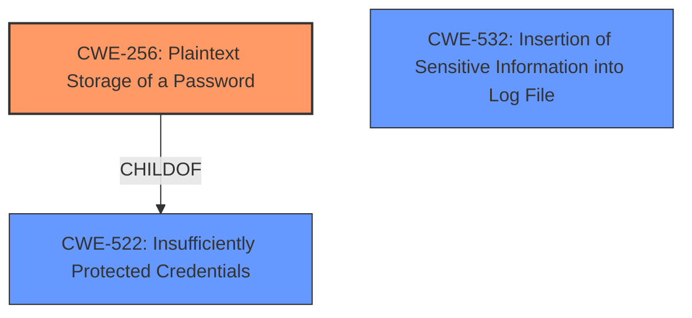

# Analysis Report for CVE-2024-36460

# Vulnerability Analysis Report: CVE-2024-36460

## Description

The front-end audit log allows viewing of **unprotected plaintext passwords**, where the passwords are displayed in plain text.

## Vulnerability Description Key Phrases

- **Weakness:** unprotected plaintext passwords
- **Impact:** view unprotected plaintext passwords
- **Component:** front-end audit log

## Analysis (with Relationship Data)

# Summary
| CWE ID  | CWE Name                                                 | Confidence | CWE Abstraction Level | CWE Vulnerability Mapping Label | CWE-Vulnerability Mapping Notes |
| :-------- | :------------------------------------------------------- | :--------- | :-------------------- | :------------------------------ | :------------------------------ |
| CWE-256   | Plaintext Storage of a Password                        | 1          | Base                  | Primary                         | Allowed                         |
| CWE-532   | Insertion of Sensitive Information into Log File        | 0.9        | Base                  | Secondary                       | Allowed                         |
| CWE-522   | Insufficiently Protected Credentials                   | 0.7        | Class                 | Secondary                       | Allowed-with-Review             |

## Evidence and Confidence

*   **Confidence Score:** 0.95
*   **Evidence Strength:** HIGH

## Relationship Analysis
The primary relationship influencing the CWE selection is the parent-child relationship, particularly how CWE-256 *Plaintext Storage of a Password* is a child of CWE-522 *Insufficiently Protected Credentials*. Additionally, CWE-532 *Insertion of Sensitive Information into Log File* is related as sensitive information is being stored, although this is secondary to the primary weakness of the password being in plaintext. The abstraction levels were also considered, with the preference being given to the base level CWEs where appropriate.



## Vulnerability Chain
The vulnerability chain starts with the **root cause**: the system's failure to protect passwords before logging them. This leads directly to the **weakness**: storing passwords in plaintext. The final impact is the potential compromise of credentials due to the accessibility of the unprotected passwords in the audit log.

## Summary of Analysis
The analysis is strongly based on the provided evidence, specifically the statements: "The front-end audit log allows viewing of **unprotected plaintext passwords**, where the passwords are displayed in plain text" and "The vulnerability stems from the Zabbix frontend audit log storing passwords in plaintext. This occurs because the system does not properly mask or protect sensitive password data before logging it." The primary CWE, CWE-256, is the most specific and directly reflects the core issue. The graph relationships helped clarify that while CWE-522 is related, CWE-256 is a more precise classification. The selected CWEs are at the optimal level of specificity because they accurately describe the **root cause** and the immediate consequences of the vulnerability.

Relevant CWE Information:

# Enhanced Context (25 CWEs)
The following CWEs were identified as potentially relevant to this vulnerability:

## CWE-256: Plaintext Storage of a Password
**Abstraction Level**: Base
**Similarity Score**: 0.72
**Source**: dense

**Description**:
Storing a password in plaintext may result in a system compromise.

**Mapping Guidance**:
- Usage: Allowed
- Rationale: This CWE entry is at the Base level of abstraction, which is a preferred level of abstraction for mapping to the root causes of vulnerabilities.

**Rationale**: This CWE perfectly matches the vulnerability description, where **passwords are stored in plaintext** within the audit log. The evidence is the vulnerability description and CVE reference links.
**CWE-256** is the best choice since it describes **unprotected passwords** being stored in the audit logs. The abstraction level is Base, which is desired. The usage is ALLOWED.
Confidence Level: 1

## CWE-532: Insertion of Sensitive Information into Log File
**Abstraction Level**: Base
**Similarity Score**: 0.70
**Source**: dense

**Description**:
The product writes sensitive information to a log file.

**Mapping Guidance**:
- Usage: Allowed
- Rationale: This CWE entry is at the Base level of abstraction, which is a preferred level of abstraction for mapping to the root causes of vulnerabilities.

**Rationale**: This CWE applies as the **plaintext passwords**, which are sensitive information, are being inserted into the log file. This is related since the **passwords are being stored in plaintext** into the log, although the passwords being in plaintext is the primary issue. The evidence is the vulnerability description and CVE reference links.
**CWE-532** is a secondary candidate since sensitive information in the form of **plaintext passwords** is being inserted into the log files. The abstraction level is Base, which is desired. The usage is ALLOWED.
Confidence Level: 0.9

## CWE-522: Insufficiently Protected Credentials
**Abstraction Level**: Class
**Similarity Score**: 0.70
**Source**: dense

**Description**:
The product transmits or stores authentication credentials, but it uses an insecure method that is susceptible to unauthorized interception and/or retrieval.

**Mapping Guidance**:
- Usage: Allowed-with-Review
- Rationale: This CWE entry is a Class and might have Base-level children that would be more appropriate

**Rationale**: This CWE applies since the authentication credentials are not protected with encryption or masking. However, it is not as specific as CWE-256. The evidence is the vulnerability description and CVE reference links.
**CWE-522** is a candidate since the credentials are not sufficiently protected. However, there are more specific base level CWEs such as CWE-256. The abstraction level is Class, but the Rationale specifically says there might be more appropriate Base-level children. The usage is ALLOWED-with-Review.
Confidence Level: 0.7

## Other Considerations:
CWE-312: Cleartext Storage of Sensitive Information was considered but not used because CWE-256 is more specific to passwords.
CWE-916: Use of Password Hash With Insufficient Computational Effort was considered but not used since there was no evidence provided the passwords were being hashed.
CWE-260: Password in Configuration File was considered but not used as the passwords were not stored in a configuration file.
CWE-319: Cleartext Transmission of Sensitive Information was considered but not used since the passwords were not being transmitted.
CWE-257: Storing Passwords in a Recoverable Format was considered but not used since there was no evidence the passwords were being stored in an encrypted, but recoverable format.
CWE-778: Insufficient Logging was considered but not used since the vulnerability is that the passwords were **unprotected** and in **plaintext**, and is not that the logging was insufficient.
CWE-261: Weak Encoding for Password was considered but not used since there was no evidence that the password was being encoded with a weak encoding.


## CWE Relationship Analysis

Current CWEs represent these abstraction levels: .


### Vulnerability Chain Analysis

**Chain starting from CWE-260:**
- 260 (Password in Configuration File) - ROOT


**Chain starting from CWE-916:**
- 916 (Use of Password Hash With Insufficient Computational Effort) - ROOT


### CWE Relationship Diagram

```mermaid
graph TD
    classDef primary fill:#f96,stroke:#333,stroke-width:2px
    classDef secondary fill:#69f,stroke:#333
    classDef tertiary fill:#9e9,stroke:#333
```


*Report generated on 2025-07-13 09:03:11*
