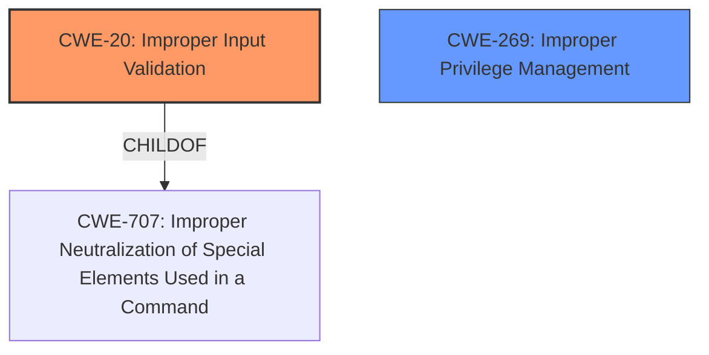

# Raw Analyzer Response for CVE-2024-36482

# Summary
| CWE ID | CWE Name | Confidence | CWE Abstraction Level | CWE Vulnerability Mapping Label | CWE-Vulnerability Mapping Notes |
|---|---|---|---|---|---|
| CWE-20 | Improper Input Validation | 1.0 | Class | Primary | Discouraged |
| CWE-269 | Improper Privilege Management | 0.5 | Class | Secondary | Discouraged |

## Evidence and Confidence

*   **Confidence Score:** 0.8
*   **Evidence Strength:** HIGH

## Relationship Analysis
The primary relationship that influenced the decision was the parent-child relationship between CWE-707 (Improper Neutralization of Special Elements Used in a Command) and CWE-20 (Improper Input Validation), where CWE-20 is a child of CWE-707. Additionally, the guidance that CWE-20 is often misused when lower-level CWEs could be used was noted. However, in this case, the information is limited, and a more specific CWE cannot be determined. CWE-269 (Improper Privilege Management) was considered due to the impact being privilege escalation, but it was determined that the **root cause** is **improper input validation**, not improper privilege management.

## Vulnerability Chain
The vulnerability chain starts with **improper input validation** (CWE-20), which allows a privileged user to perform actions that lead to an escalation of privilege.
  - Root Cause: CWE-20 Improper Input Validation
  - Impact: Escalation of Privilege

## Summary of Analysis
The initial assessment focused on identifying the **root cause** of the vulnerability. The vulnerability description explicitly states that the vulnerability is due to **improper input validation**. The CVE Reference Links Content Summary also confirms this.

Based on the retriever results, CWE-20 (Improper Input Validation) was a strong candidate. Although it is discouraged, there is no other information to add further specificity.

CWE-269 (Improper Privilege Management) was also considered because of the privilege escalation impact, but the **root cause** is **improper input validation**, not an issue with how privileges are managed. Therefore, CWE-20 is the most appropriate primary CWE.

Relevant Evidence:
- "Vulnerability Description Key Phrases: rootcause: **Improper input validation**"
- "CVE Reference Links Content Summary: Root cause of vulnerability: **Improper input validation**"

The selected CWEs are at the optimal level of specificity, given the available information. While CWE-20 is a class-level CWE and is generally discouraged, without further information about the specific type of **improper input validation**, it's the most accurate classification.

Relevant CWE Information:

# Enhanced Context (25 CWEs)
The following CWEs were identified as potentially relevant to this vulnerability:

## CWE-20: Improper Input Validation
The vulnerability description states that the **root cause** is **improper input validation**. The CVE Reference Links Content Summary also confirms this.

## CWE-269: Improper Privilege Management
This was considered but discarded because the **root cause** is **improper input validation**, not an issue with how privileges are managed, even though the impact is privilege escalation.