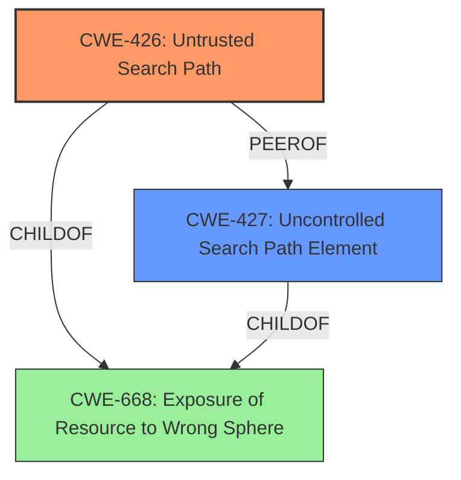

# Raw Analyzer Response for CVE-2024-36507

# Summary
| CWE ID | CWE Name | Confidence | CWE Abstraction Level | CWE Vulnerability Mapping Label | CWE-Vulnerability Mapping Notes |
|---|---|---|---|---|---|
| CWE-426 | Untrusted Search Path | 1.0 | Base | Allowed | Primary CWE |
| CWE-427 | Uncontrolled Search Path Element | 0.7 | Base | Allowed | Secondary Candidate |
| CWE-434 | Unrestricted Upload of File with Dangerous Type | 0.3 | Base | Allowed | Secondary Candidate |

## Evidence and Confidence

*   **Confidence Score:** 0.9
*   **Evidence Strength:** HIGH

## Relationship Analysis
The primary CWE is CWE-426, which is a base level CWE. CWE-427 is a peer of CWE-426, and both are children of CWE-668. The vulnerability description directly states that an **untrusted search path** is the root cause, making CWE-426 the most appropriate choice. The relationship with CWE-427 indicates a similar but slightly different weakness.

## Vulnerability Chain
The vulnerability chain starts with an **untrusted search path** (CWE-426). This leads to **DLL hijacking**, which allows an attacker to run arbitrary code. The root cause is the **untrusted search path**, and the impact is arbitrary code execution.

CWE-426 (Untrusted Search Path) -> DLL Hijacking -> Arbitrary Code Execution

## Summary of Analysis
The vulnerability description clearly indicates an **untrusted search path** as the root cause, which directly aligns with CWE-426. The "CVE Reference Links Content Summary" reinforces this by stating, "An **untrusted search path vulnerability** (CWE-426) exists in FortiClient Windows." The retriever results also list CWE-426 as a top candidate. The relationship analysis shows that CWE-426 is a base-level CWE and is the most specific and accurate representation of the weakness.

CWE-427 (Uncontrolled Search Path Element) was considered because it is closely related to CWE-426, but CWE-426 is a more precise description of the vulnerability. CWE-434 (Unrestricted Upload of File with Dangerous Type) was considered because the attacker places a malicious DLL, but the root cause is not related to the upload itself.

Relevant CWE Information:

# Enhanced Context (25 CWEs)
The following CWEs were identified as potentially relevant to this vulnerability:

## CWE-427: Uncontrolled Search Path Element
**Abstraction Level**: Base
**Similarity Score**: 0.79
**Source**: dense

**Description**:
The product uses a fixed or controlled search path to find resources, but one or more locations in that path can be under the control of unintended actors.

**Mapping Guidance**:
- Usage: Allowed
- Rationale: This CWE entry is at the Base level of abstraction, which is a preferred level of abstraction for mapping to the root causes of vulnerabilities.

## CWE-426: Untrusted Search Path
**Abstraction Level**: Base
**Similarity Score**: 0.78
**Source**: dense

**Description**:
The product searches for critical resources using an externally-supplied search path that can point to resources that are not under the product's direct control.

**Mapping Guidance**:
- Usage: Allowed
- Rationale: This CWE entry is at the Base level of abstraction, which is a preferred level of abstraction for mapping to the root causes of vulnerabilities.

## CWE-434: Unrestricted Upload of File with Dangerous Type
**Abstraction Level**: base
**Similarity Score**: 2.21
**Source**: graph

**Description**:
CWE-434: Unrestricted Upload of File with Dangerous Type

**Mapping Guidance**:
- Usage: Allowed
- Rationale: This CWE entry is at the Base level of abstraction, which is a preferred level of abstraction for mapping to the root causes of vulnerabilities.

**Relationships**:
- CANFOLLOW -> CWE-73
- CANFOLLOW -> CWE-184
- CANFOLLOW -> CWE-183
- PEEROF -> CWE-430
- PEEROF -> CWE-436