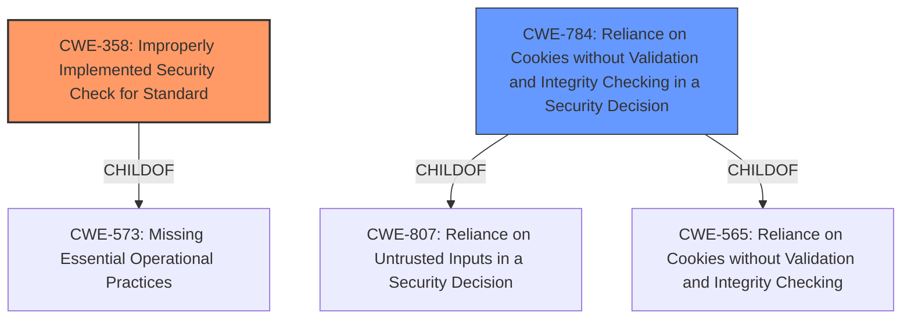

# Analysis Report for CVE-2024-36511

# Vulnerability Analysis Report: CVE-2024-36511

## Description

An **improperly implemented security check for standard vulnerability [CWE-358]** in FortiADC Web Application Firewall (WAF) 7.4.0 through 7.4.4, 7.2 all versions, 7.1 all versions, 7.0 all versions, 6.2 all versions, 6.1 all versions, 6.0 all versions when cookie security policy is enabled may allow an attacker, under specific conditions, to retrieve the initial encrypted and signed cookie protected by the feature

## Vulnerability Description Key Phrases

- **Rootcause:** improperly implemented security check for standard vulnerability [CWE-358]
- **Impact:** retrieve the initial encrypted and signed cookie
- **Attacker:** attacker
- **Product:** FortiADC Web Application Firewall (WAF)
- **Version:** 7.4.0 through 7.4.4, 7.2 all versions, 7.1 all versions, 7.0 all versions, 6.2 all versions, 6.1 all versions, 6.0 all versions
- **Component:** cookie security policy

## Analysis (with Relationship Data)

# Summary
| CWE ID | CWE Name | Confidence | CWE Abstraction Level | CWE Vulnerability Mapping Label | CWE-Vulnerability Mapping Notes |
|---|---|---|---|---|---|
| CWE-358 | Improperly Implemented Security Check for Standard | 1.0 | Base | Allowed | Primary CWE. The vulnerability description explicitly states this CWE as the root cause. |
| CWE-784 | Reliance on Cookies without Validation and Integrity Checking in a Security Decision | 0.7 | Variant | Allowed | Secondary CWE. The vulnerability allows an attacker to retrieve the initial encrypted and signed cookie, indicating a reliance on cookies without proper validation. |

## Evidence and Confidence

*   **Confidence Score:** 0.85
*   **Evidence Strength:** HIGH

## Relationship Analysis
The primary CWE is CWE-358, which indicates a problem with the implementation of a security check according to a standard. CWE-784 is a variant that addresses a reliance on cookies without validation in a security decision, which is a more specific case related to the cookie security policy. CWE-358 is a base CWE which is child of CWE-573 (Missing Essential Operational Practices). CWE-784 is a variant CWE which is child of CWE-807 (Reliance on Untrusted Inputs in a Security Decision) and CWE-565 (Reliance on Cookies without Validation and Integrity Checking).



## Vulnerability Chain
The vulnerability chain starts with an **improperly implemented security check [CWE-358]** in the FortiADC Web Application Firewall (WAF). This leads to a bypass of the cookie security policy, allowing an attacker to retrieve the initial encrypted and signed cookie. This can be seen as a reliance on cookies without proper validation and integrity checking **[CWE-784]**. The retrieval of the cookie is the impact, allowing potential further attacks depending on the contents and usage of the cookie.

## Summary of Analysis
The primary assessment is based on the explicit statement in the vulnerability description that the root cause is an **improperly implemented security check for standard vulnerability [CWE-358]**. The CVE Reference Links Content Summary section reinforces this by stating: "Root cause of vulnerability: An improperly implemented security check for CWE-358 in FortiADC Web Application Firewall (WAF) when the cookie security policy is enabled." The weakness allows retrieval of signed cookies. Therefore, CWE-784 is included to map to the cookie aspect of the vulnerability.

The relationship graph influenced the selection by showing how CWE-358 and CWE-784 are related to broader categories of weaknesses.

The selected CWEs are at the optimal level of specificity because CWE-358 directly addresses the root cause, while CWE-784 specifies the type of data affected by the vulnerability (cookies) and how the security is bypassed (validation and integrity checking).

Relevant CWE Information:
*   **CWE-358:** Directly stated as the root cause.
*   **CWE-784:** Captures the aspect of cookie reliance without validation.


## CWE Relationship Analysis

Current CWEs represent these abstraction levels: .


### Vulnerability Chain Analysis

**Chain starting from CWE-565:**
- 565 (Reliance on Cookies without Validation and Integrity Checking) - ROOT


**Chain starting from CWE-784:**
- 784 (Reliance on Cookies without Validation and Integrity Checking in a Security Decision) - ROOT


### CWE Relationship Diagram

```mermaid
graph TD
    classDef primary fill:#f96,stroke:#333,stroke-width:2px
    classDef secondary fill:#69f,stroke:#333
    classDef tertiary fill:#9e9,stroke:#333
```


*Report generated on 2025-07-13 09:07:45*
