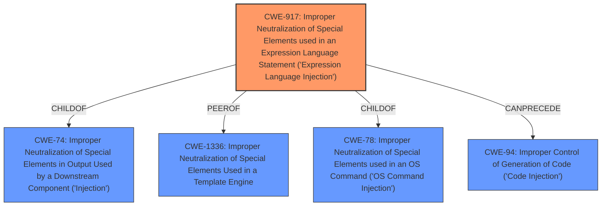

# Analysis for CVE-2024-36522

# Summary

| CWE ID | CWE Name | Confidence | CWE Abstraction Level | CWE Vulnerability Mapping Label | CWE-Vulnerability Mapping Notes |
|---|---|---|---|---|---|
| CWE-917 | Improper Neutralization of Special Elements used in an Expression Language Statement ('Expression Language Injection') | 0.9 | Base | Allowed | Primary CWE |

## Evidence and Confidence

*   **Confidence Score:** 0.9
*   **Evidence Strength:** HIGH

## Relationship Analysis
The primary CWE selected is CWE-917, which is a Base level CWE. There is no need to go to a more specific Variant because the description clearly describes an Expression Language Injection. Although there are other potential matches, they are either too general or do not accurately reflect the specific vulnerability.

## Vulnerability Chain
The vulnerability chain starts with the **improper neutralization** of special elements in an expression language statement (CWE-917). This leads to XSLT injection, which further results in remote code execution. The root cause is the lack of proper input validation, which allows an attacker to inject malicious code.

## Summary of Analysis
The analysis is based on the provided vulnerability description and the associated CVE Reference Links Content Summary. The key phrase "**XSLT injection**" is a strong indicator. The vulnerability description explicitly mentions that the default configuration of XSLTResourceStream.java is vulnerable to remote code execution via **XSLT injection**. The Retriever Results also suggest CWE-917 as a potential match.

CWE-917 (Improper Neutralization of Special Elements used in an Expression Language Statement ('Expression Language Injection')) is the most appropriate CWE because it directly addresses the **root cause** of the vulnerability, which is the **improper neutralization** of special elements in an expression language statement. This weakness allows for **XSLT injection**, ultimately leading to remote code execution. The evidence clearly supports this classification, and the CWE is at the optimal level of specificity (Base).

The other CWEs from the Retriever Results were considered but not used because they were either too general (e.g., CWE-20 Improper Input Validation) or did not accurately reflect the specific type of injection vulnerability (e.g., CWE-79 Improper Neutralization of Input During Web Page Generation ('Cross-site Scripting')). CWE-1336 (Improper Neutralization of Special Elements Used in a Template Engine) was close, but CWE-917 is slightly more specific to Expression Language Injection.