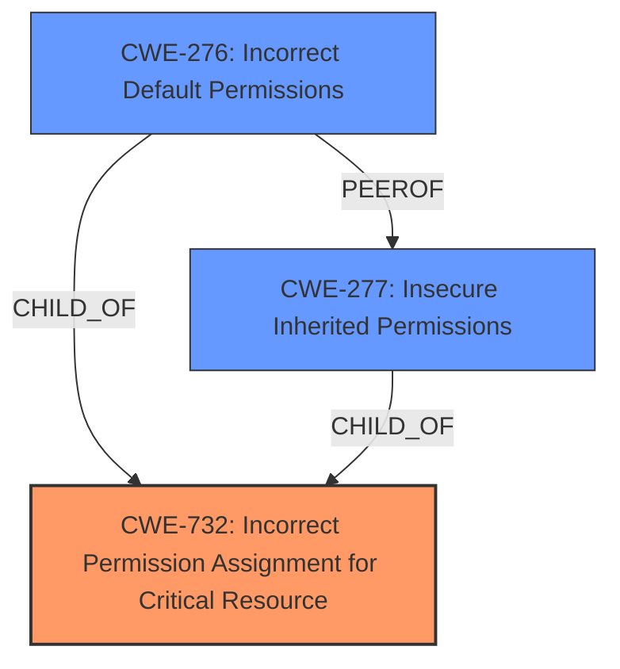

# Analysis for CVE-2024-36535

# Summary
| CWE ID | CWE Name | Confidence | CWE Abstraction Level | CWE Vulnerability Mapping Label | CWE-Vulnerability Mapping Notes |
|---|---|---|---|---|---|
| CWE-732 | Incorrect Permission Assignment for Critical Resource | 0.9 | Class | Allowed-with-Review | Primary CWE |
| CWE-276 | Incorrect Default Permissions | 0.7 | Base | Allowed | Secondary Candidate |
| CWE-277 | Insecure Inherited Permissions | 0.6 | Variant | Allowed | Secondary Candidate |

## Evidence and Confidence

*   **Confidence Score:** 0.8
*   **Evidence Strength:** HIGH

## Relationship Analysis
The primary CWE selected is CWE-732, "Incorrect Permission Assignment for Critical Resource", which is a Class-level CWE. While the description mentions "insecure permissions," the context and impact (accessing sensitive data and escalating privileges) suggest that the permissions assigned to a critical resource (the service account) are incorrect. CWE-732 is parent of several other CWEs. CWE-276 "Incorrect Default Permissions", which is a Base level CWE, and CWE-277 "Insecure Inherited Permissions", which is a Variant level CWE, are also considered as secondary candidates because the root cause could be due to incorrect default settings or inherited configurations.

## Vulnerability Chain
The vulnerability chain starts with **insecure permissions** assigned to the service account (CWE-732), which allows attackers to steal the service account token. With the stolen token, attackers can access sensitive data and escalate privileges, potentially taking over the Kubernetes cluster.

## Summary of Analysis
Based on the provided information, the primary weakness is the **incorrect permission assignment** for the service account, making CWE-732 the most appropriate choice. The vulnerability description explicitly mentions "**Insecure permissions**" as the root cause, and the impact involves accessing sensitive data and escalating privileges by obtaining the service account token. The "CVE Reference Links Content Summary" section confirms that the service account has excessive privileges, allowing attackers to access all secrets within the cluster.

The selection of CWE-732 is influenced by the "Privileges vs Permissions Guidance," which suggests that CWE-732 is relevant when the permissions for a security-critical resource are incorrectly assigned. Although CWE-732 is a Class-level CWE, it is chosen due to its direct relevance to the vulnerability's description and impact. While other CWEs like CWE-276 (Incorrect Default Permissions) and CWE-277 (Insecure Inherited Permissions) were considered, they are less specific to the core issue of incorrect permissions for a *critical resource*.

Relevant CWE Information:

# Enhanced Context (25 CWEs)
The following CWEs were identified as potentially relevant to this vulnerability:

## CWE-266: Incorrect Privilege Assignment
**Abstraction Level**: Base
**Similarity Score**: 0.79

*This CWE was considered but not selected.* It focuses on the actor's identity level or capabilities (e.g., root, admin, regular user, guest). The current vulnerability is more about the permissions assigned to a *resource*, rather than a user's privilege.

## CWE-280: Improper Handling of Insufficient Permissions or Privileges 
**Abstraction Level**: Base
**Similarity Score**: 0.77

*This CWE was considered but not selected.* The vulnerability does not stem from the product incorrectly handling insufficient privileges.

## CWE-267: Privilege Defined With Unsafe Actions
**Abstraction Level**: Base
**Similarity Score**: 0.77

*This CWE was considered but not selected.* It focuses on a privilege that can be used to perform unsafe actions. The current vulnerability isn't directly about the definition of the privilege.

## CWE-274: Improper Handling of Insufficient Privileges
**Abstraction Level**: Base
**Similarity Score**: 0.76

*This CWE was considered but not selected.* It's similar to CWE-280, focusing on insufficient privileges, which is not the root cause here.

## CWE-276: Incorrect Default Permissions
**Abstraction Level**: Base
**Similarity Score**: 0.75

*This CWE was considered as a secondary candidate.* While the root cause might be due to incorrect default settings, the impact and description focus on incorrect permission assignment for a critical resource.

## CWE-668: Exposure of Resource to Wrong Sphere
**Abstraction Level**: Class
**Similarity Score**: 0.75

*This CWE was considered but not selected.* This is too general and doesn't specifically address the permission-related aspect.

## CWE-281: Improper Preservation of Permissions
**Abstraction Level**: Base
**Similarity Score**: 0.74

*This CWE was considered but not selected.* The vulnerability doesn't involve the incorrect preservation of permissions during operations.

## CWE-59: Improper Link Resolution Before File Access ('Link Following')
**Abstraction Level**: Base
**Similarity Score**: 0.74

*This CWE was considered but not selected.* This is not related to link following.

## CWE-41: Improper Resolution of Path Equivalence
**Abstraction Level**: Base
**Similarity Score**: 0.73

*This CWE was considered but not selected.* This is not related to path equivalence issues.

## CWE-404: Improper Resource Shutdown or Release
**Abstraction Level**: Class
**Similarity Score**: 0.73

*This CWE was considered but not selected.* This is not related to resource shutdown or release.

## CWE-863: Incorrect Authorization
**Abstraction Level**: Class
**Similarity Score**: 1657.71

*This CWE was considered but not selected.* While the **incorrect permissions** lead to **improper authorization**, the root cause is the **incorrect permission assignment** itself.

## CWE-732: Incorrect Permission Assignment for Critical Resource
**Abstraction Level**: Class
**Similarity Score**: 1653.23

*This CWE was selected as the primary.* The vulnerability specifically involves incorrect permission assignment for a critical resource (the service account).

## CWE-285: Improper Authorization
**Abstraction Level**: Class
**Similarity Score**: 1604.34

*This CWE was considered but not selected.* Similar to CWE-863, this focuses on authorization checks.

## CWE-269: Improper Privilege Management
**Abstraction Level**: Class
**Similarity Score**: 1602.57

*This CWE was considered but not selected.* It's a broader category and not as specific as CWE-732.

## CWE-59: Improper Link Resolution Before File Access ('Link Following')
**Abstraction Level**: Base
**Similarity Score**: 1562.76

*This CWE was considered but not selected.* This is not related to link following.

## CWE-613: Insufficient Session Expiration
**Abstraction Level**: base
**Similarity Score**: 3.06

*This CWE was considered but not selected.* Not relevant to session expiration.

## CWE-280: Improper Handling of Insufficient Permissions or Privileges 
**Abstraction Level**: Base
**Similarity Score**: 2.49

*This CWE was considered but not selected.* The vulnerability does not stem from the product incorrectly handling insufficient privileges.

## CWE-274: Improper Handling of Insufficient Privileges
**Abstraction Level**: Base
**Similarity Score**: 2.49

*This CWE was considered but not selected.* It's similar to CWE-280, focusing on insufficient privileges, which is not the root cause here.

## CWE-250: Execution with Unnecessary Privileges
**Abstraction Level**: base
**Similarity Score**: 2.47

*This CWE was considered but not selected.* Not relevant to unnecessary privileges.

## CWE-1386: Insecure Operation on Windows Junction / Mount Point
**Abstraction Level**: base
**Similarity Score**: 2.47

*This CWE was considered but not selected.* Not related to Windows Junction/Mount Point.

## CWE-306: Missing Authentication for Critical Function
**Abstraction Level**: base
**Similarity Score**: 2.40

*This CWE was considered but not selected.* The vulnerability is not primarily due to missing authentication.

## CWE-378: Creation of Temporary File With Insecure Permissions
**Abstraction Level**: base
**Similarity Score**: 2.40

*This CWE was considered but not selected.* The vulnerability is not related to insecure temporary files