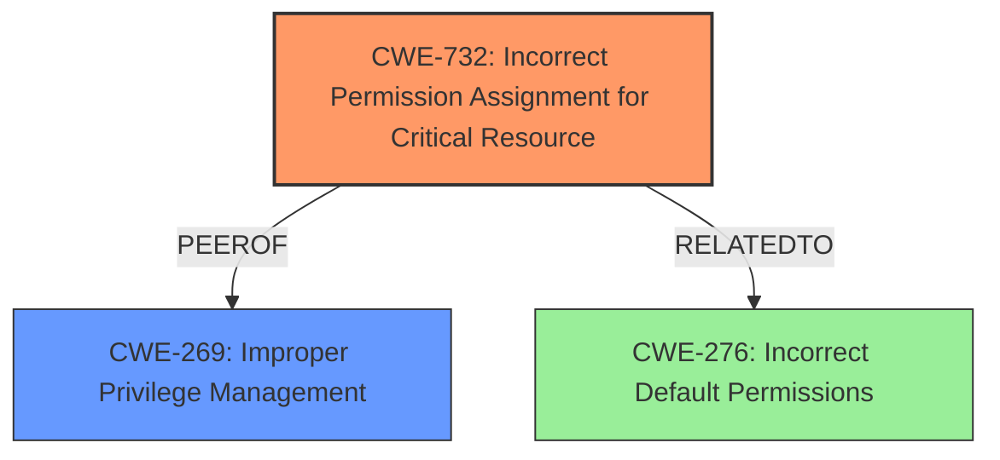

# Enhanced Analysis for CVE-2024-36536

# Summary
| CWE ID | CWE Name | Confidence | CWE Abstraction Level | CWE Vulnerability Mapping Label | CWE-Vulnerability Mapping Notes |
|---|---|---|---|---|---|
| CWE-732 | Incorrect Permission Assignment for Critical Resource | 0.9 | Class | Allowed-with-Review | Primary CWE |
| CWE-269 | Improper Privilege Management | 0.6 | Class | Discouraged | Secondary Candidate |

## Evidence and Confidence

*   **Confidence Score:** 0.9
*   **Evidence Strength:** HIGH

## Relationship Analysis
The primary relationship influencing the decision is the hierarchical structure where CWE-732 "Incorrect Permission Assignment for Critical Resource" is a class-level CWE. This indicates a broader category of permission-related issues. The retriever results also suggested CWE-276 "Incorrect Default Permissions," which is a Base level CWE. The choice of CWE-732 is supported by the specific mention of "service accounts token" as the critical resource affected by the **insecure permissions**. While CWE-276 might initially seem applicable, the broader scope of CWE-732 and its explicit focus on critical resources makes it a better fit. CWE-269 "Improper Privilege Management" is also considered due to the impact of privilege escalation, but it is less specific to the root cause of **incorrect permissions**.



## Vulnerability Chain
The vulnerability chain starts with **insecure permissions** on the service account token (CWE-732). This leads to the ability for attackers to access sensitive data and ultimately escalate privileges.

## Summary of Analysis
The initial assessment focused on identifying the root cause of the vulnerability. The **insecure permissions** leading to access of the service account token is the primary weakness. The provided evidence from the "CVE Reference Links Content Summary" and the vulnerability description strongly supports this.

The statement "Insecure permissions in fabedge v0.8.1 allows attackers to access sensitive data and escalate privileges by obtaining the service accounts token" clearly indicates a permission-related issue. The retriever results pointed to several CWEs, with CWE-732 and CWE-276 being the most relevant.

CWE-732 is chosen because it directly addresses **incorrect permission assignments** for critical resources, which aligns perfectly with the exposed service account token. While CWE-276 addresses **incorrect default permissions**, the vulnerability description doesn't explicitly state that the *default* permissions are incorrect, only that the permissions are **insecure**. CWE-269 is considered because of the privilege escalation impact, but it's a higher-level CWE and less descriptive of the root cause. Therefore, CWE-732 is the most specific and appropriate choice.

Relevant CWE Information:
# Enhanced Context (25 CWEs)
The following CWEs were identified as potentially relevant to this vulnerability:

## CWE-732: Incorrect Permission Assignment for Critical Resource
**Abstraction Level**: Class
**Similarity Score**: 1578.95
**Source**: sparse

**Description**:
The product specifies permissions for a security-critical resource in a way that allows that resource to be read or modified by unintended actors.

**Mapping Guidance**:
- Usage: Allowed-with-Review
- Rationale: While the name itself indicates an assignment of permissions for resources, this is often misused for vulnerabilities in which "permissions" are not checked, which is an "authorization" weakness (CWE-285 or descendants) within CWE's model [REF-1287].

## CWE-269: Improper Privilege Management
**Abstraction Level**: Class
**Similarity Score**: 1576.74
**Source**: sparse

**Description**:
The product does not properly assign, modify, track, or check privileges for an actor, creating an unintended sphere of control for that actor.

**Mapping Guidance**:
- Usage: Discouraged
- Rationale: CWE-269 is commonly misused. It can be conflated with "privilege escalation," which is a technical impact that is listed in many low-information vulnerability reports [REF-1287]. It is not useful for trend analysis.


## CWE Relationship Analysis

Current CWEs represent these abstraction levels: .


### Vulnerability Chain Analysis

**Chain starting from CWE-276:**
- 276 (Incorrect Default Permissions) - ROOT


**Chain starting from CWE-269:**
- 269 (Improper Privilege Management) - ROOT


### CWE Relationship Diagram

```mermaid
graph TD
    classDef primary fill:#f96,stroke:#333,stroke-width:2px
    classDef secondary fill:#69f,stroke:#333
    classDef tertiary fill:#9e9,stroke:#333
```