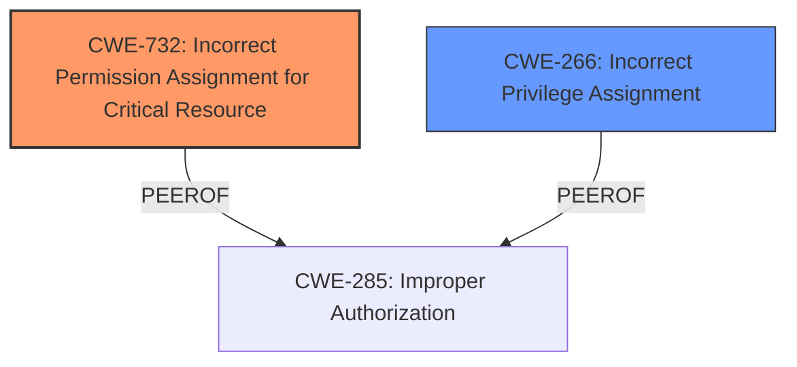

# Analysis Report for CVE-2024-36537

# Vulnerability Analysis Report: CVE-2024-36537

## Description

**Insecure permissions** in cert-manager v1.14.4 allows attackers to access sensitive data and escalate privileges by obtaining the service accounts token.

## Vulnerability Description Key Phrases

- **Rootcause:** Insecure permissions
- **Impact:** ['access sensitive data', 'escalate privileges']
- **Attacker:** attackers
- **Product:** cert-manager
- **Version:** v1.14.4

## Analysis (with Relationship Data)

# Summary
| CWE ID | CWE Name | Confidence | CWE Abstraction Level | CWE Vulnerability Mapping Label | CWE-Vulnerability Mapping Notes |
|---|---|---|---|---|---|
| CWE-732 | Incorrect Permission Assignment for Critical Resource | 0.9 | Class | Allowed-with-Review | Primary CWE |
| CWE-266 | Incorrect Privilege Assignment | 0.7 | Base | Allowed | Secondary Candidate |

## Evidence and Confidence

*   **Confidence Score:** 0.9
*   **Evidence Strength:** HIGH

## Relationship Analysis
The primary relationship influencing the CWE selection is the hierarchical relationship. CWE-732 is a Class-level CWE, while some of its children might be more specific. However, based on the available information, the **root cause** is related to **incorrect permission assignment** of a critical resource. While privilege escalation is a consequence, the initial weakness lies in the assignment of permissions. CWE-266 (Incorrect Privilege Assignment) was considered, but it represents a slightly different scenario involving the rights assigned to a user role, rather than the permissions for a specific resource.



## Vulnerability Chain
The vulnerability chain starts with **insecure permissions** on a service account's token (CWE-732). This leads to attackers gaining access to sensitive data (secrets) and ultimately escalating privileges to take over the entire Kubernetes cluster. The chain is:

1.  **CWE-732:** **Incorrect Permission Assignment for Critical Resource** (root cause: **insecure permissions** on the service account token)
2.  Access to sensitive data (secrets)
3.  Privilege escalation
4.  Complete cluster takeover (impact)

## Summary of Analysis
The initial assessment focused on the **insecure permissions** as the root cause. The Retriever results highlighted CWE-732 (Incorrect Permission Assignment for Critical Resource) as a strong candidate. The vulnerability description explicitly mentions **"Insecure permissions in cert-manager v1.14.4 allows attackers to access sensitive data and escalate privileges by obtaining the service accounts token."** The CVE Reference Links Content Summary further supports this by stating, "**Root cause of vulnerability: - Insecure permissions in cert-manager versions 1.14.4 and earlier. Specifically, the vulnerability stems from incorrect access control, allowing unauthorized access to sensitive data.**"

CWE-732 aligns with the description of **incorrect permission assignment** for the service account token, which is a critical resource. While the impact includes privilege escalation, the root cause is the permission issue. Therefore, CWE-732 is the most accurate representation of the vulnerability's root cause. The mapping guidance for privileges vs. permissions helped distinguish that the issue is about the permissions on a resource, not an incorrect assignment of privileges to a user.

CWE-266 (Incorrect Privilege Assignment) was considered as a secondary candidate due to the privilege escalation aspect. However, it was determined that CWE-732 is a better fit because it directly addresses the incorrect permission assignment on a critical resource.

The selected CWEs are at the optimal level of specificity because they directly address the root cause of the vulnerability, which is the **incorrect permission assignment** for the service account token.

Relevant CWE Information:

# Enhanced Context (25 CWEs)
The following CWEs were identified as potentially relevant to this vulnerability:

## CWE-266: Incorrect Privilege Assignment
**Abstraction Level**: Base
**Similarity Score**: 0.78
**Source**: dense

**Description**:
A product incorrectly assigns a privilege to a particular actor, creating an unintended sphere of control for that actor.

**Mapping Guidance**:
- Usage: Allowed
- Rationale: This CWE entry is at the Base level of abstraction, which is a preferred level of abstraction for mapping to the root causes of vulnerabilities.

## CWE-732: Incorrect Permission Assignment for Critical Resource
**Abstraction Level**: Class
**Similarity Score**: 1832.24
**Source**: sparse

**Description**:
The product specifies permissions for a security-critical resource in a way that allows that resource to be read or modified by unintended actors.

**Mapping Guidance**:
- Usage: Allowed-with-Review
- Rationale: While the name itself indicates an assignment of permissions for resources, this is often misused for vulnerabilities in which "permissions" are not checked, which is an "authorization" weakness (CWE-285 or descendants) within CWE's model [REF-1287].


## CWE Relationship Analysis

Current CWEs represent these abstraction levels: .


### Vulnerability Chain Analysis

**Chain starting from CWE-266:**
- 266 (Incorrect Privilege Assignment) - ROOT


**Chain starting from CWE-285:**
- 285 (Improper Authorization) - ROOT


### CWE Relationship Diagram

```mermaid
graph TD
    classDef primary fill:#f96,stroke:#333,stroke-width:2px
    classDef secondary fill:#69f,stroke:#333
    classDef tertiary fill:#9e9,stroke:#333
```


*Report generated on 2025-07-13 09:09:48*
