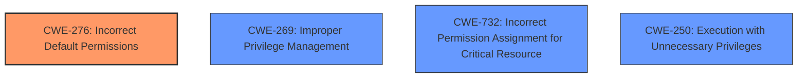

# Analysis Report for CVE-2024-36586

# Vulnerability Analysis Report: CVE-2024-36586

## Description

An issue in AdGuardHome v0.93 to latest allows unprivileged attackers to escalate privileges via overwriting the AdGuardHome binary.

## Vulnerability Description Key Phrases

- **Impact:** escalate privileges
- **Vector:** overwriting AdGuardHome binary
- **Attacker:** unprivileged attackers
- **Product:** AdGuardHome
- **Version:** v0.93 to latest

## Analysis (with Relationship Data)

# Summary
| CWE ID | CWE Name | Confidence | CWE Abstraction Level | CWE Vulnerability Mapping Label | CWE-Vulnerability Mapping Notes |
|---|---|---|---|---|---|
| CWE-276 | Incorrect Default Permissions | 0.9 | Base | Primary | Allowed |
| CWE-269 | Improper Privilege Management | 0.6 | Class | Secondary | Discouraged |
| CWE-732 | Incorrect Permission Assignment for Critical Resource | 0.5 | Class | Secondary | Allowed-with-Review |
| CWE-250 | Execution with Unnecessary Privileges | 0.5 | Base | Secondary | Allowed |

## Evidence and Confidence

*   **Confidence Score:** 0.7
*   **Evidence Strength:** MEDIUM

## Relationship Analysis
The primary CWE is CWE-276, which is at the Base level and is a good fit for describing the **incorrect default permissions** that allow an unprivileged user to overwrite the binary. CWE-269, CWE-732 and CWE-250 were also considered due to privilege and permission issues. The relationships show that CWE-274 is a child of CWE-269 and peer of CWE-280. CWE-59 is a parent of CWE-61.



## Vulnerability Chain
The vulnerability chain starts with **incorrect default permissions** (CWE-276) on the AdGuardHome binary, allowing an unprivileged attacker to overwrite it. This leads to the attacker planting a malicious binary. Upon service restart, the malicious binary is executed with elevated privileges, leading to privilege escalation.

## Summary of Analysis
The primary assessment is based on the provided evidence that the AdGuardHome binary can be overwritten by an unprivileged attacker. The **root cause** is **incorrect default permissions** (CWE-276), which allows the attacker to overwrite the binary. The impact is privilege escalation.

The following is the relevant evidence:
- "Root cause of vulnerability: The AdGuardHome binary can be overwritten by an unprivileged attacker, which leads to privilege escalation upon service restart."
- "Weaknesses/vulnerabilities present: Binary planting - the ability to overwrite the AdGuardHome binary with a malicious payload."
- "**impact:** escalate privileges"
- "**vector:** overwriting AdGuardHome binary"
- "**attacker:** unprivileged attackers"

CWE-276 is at the optimal level of specificity because it directly describes the **incorrect permissions** that allow the binary to be overwritten.

Relevant CWE Information:

**CWE-276: Incorrect Default Permissions**
During installation, installed file permissions are set to allow anyone to modify those files.

The retriever results include CWE-276 with high relevance, reinforcing this selection.

CWE-269 is discouraged according to MITRE guidance, but is included because of the **privilege escalation** component.
CWE-732 is included because of the **incorrect permission assignment** component and overwriting the binary.
CWE-250 is included because the malicious binary is then run with **unnecessary privileges**.

Other CWEs considered but not used:

*   CWE-843, CWE-59, CWE-191, CWE-782, CWE-121, CWE-363: These CWEs do not accurately represent the **root cause** of the vulnerability, which is **incorrect permissions**.


## CWE Relationship Analysis

Current CWEs represent these abstraction levels: .


### Vulnerability Chain Analysis

**Chain starting from CWE-274:**
- 274 (Improper Handling of Insufficient Privileges) - ROOT


**Chain starting from CWE-280:**
- 280 (Improper Handling of Insufficient Permissions or Privileges ) - ROOT


### CWE Relationship Diagram

```mermaid
graph TD
    classDef primary fill:#f96,stroke:#333,stroke-width:2px
    classDef secondary fill:#69f,stroke:#333
    classDef tertiary fill:#9e9,stroke:#333
```


*Report generated on 2025-07-13 09:12:05*
