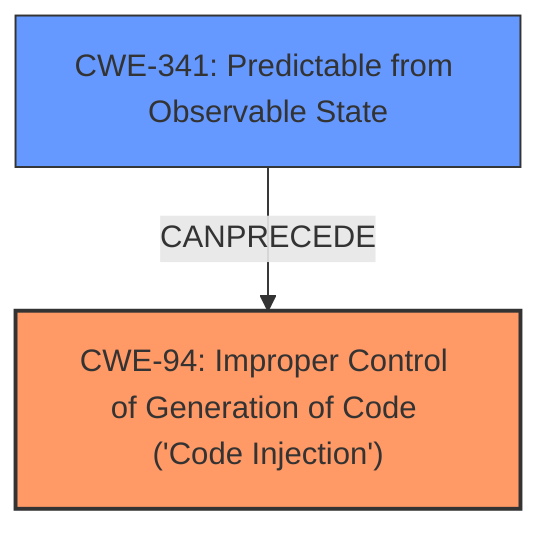

# Analysis for CVE-2024-36679

# Summary
| CWE ID | CWE Name | Confidence | CWE Abstraction Level | CWE Vulnerability Mapping Label | CWE-Vulnerability Mapping Notes |
|---|---|---|---|---|---|
| CWE-94 | Improper Control of Generation of Code ('Code Injection') | 0.9 | Base | Allowed-with-Review | Primary CWE: This is the root cause of the vulnerability. |
| CWE-341 | Predictable from Observable State | 0.7 | Base | Allowed | Secondary CWE: The predictable token directly enables the code injection. |

## Evidence and Confidence

*   **Confidence Score:** 0.8
*   **Evidence Strength:** HIGH

## Relationship Analysis
The primary weakness is **CWE-94**, which describes the **improper control of code generation** leading to code injection. The predictable token, **CWE-341**, is a prerequisite for exploiting this vulnerability, making it a secondary weakness.
The relationship between these CWEs can be viewed as **CWE-341** *CanPrecede* **CWE-94**.

## Vulnerability Chain
1.  **Root Cause:** **Predictable token (CWE-341)** allows unauthorized access to code generation process.
2.  **Weakness:** **Improper Control of Generation of Code (CWE-94)** due to lack of proper input validation or sanitization.
3.  **Impact:** Arbitrary PHP code injection leading to potential Remote Code Execution (RCE).

## Summary of Analysis
Based on the vulnerability description and the "CVE Reference Links Content Summary", the root cause is the **improper control of code generation** (CWE-94) that leads to PHP code injection. The existence of a **predictable token (CWE-341)** makes the exploitation possible.

The vulnerability description mentions "**PHP Code injection**". The retriever results list several CWEs, including:

*   CWE-94: Improper Control of Generation of Code ('Code Injection')
*   CWE-341: Predictable from Observable State
*   CWE-96: Improper Neutralization of Directives in Statically Saved Code ('Static Code Injection')
*   CWE-95: Improper Neutralization of Directives in Dynamically Evaluated Code ('Eval Injection')

CWE-94 is the most appropriate primary CWE because the core issue is the **improper control** over how code is generated, which allows the injection of malicious code.
The presence of a **predictable token** is a key enabler, leading to consideration of CWE-341.

The evidence is: "Due to a **predictable token**, the method `LcpsaveTranslations()` suffer of a white writer that can inject PHP code into a PHP file."

CWE-94 is chosen as the primary weakness because the root cause is the lack of control over code generation. The abstraction level (Base) is appropriate for mapping to the root causes of vulnerabilities.
CWE-341 is a secondary weakness because the predictable token makes the code injection possible.

CWEs considered but not used:

*   CWE-96 and CWE-95: While these relate to code injection, they are more specific to static or dynamic evaluation contexts. The broader CWE-94 is more fitting as the vulnerability doesn't explicitly detail static or dynamic code generation.
*   CWE-79: This relates to Cross-Site Scripting (XSS), which is a different type of vulnerability.