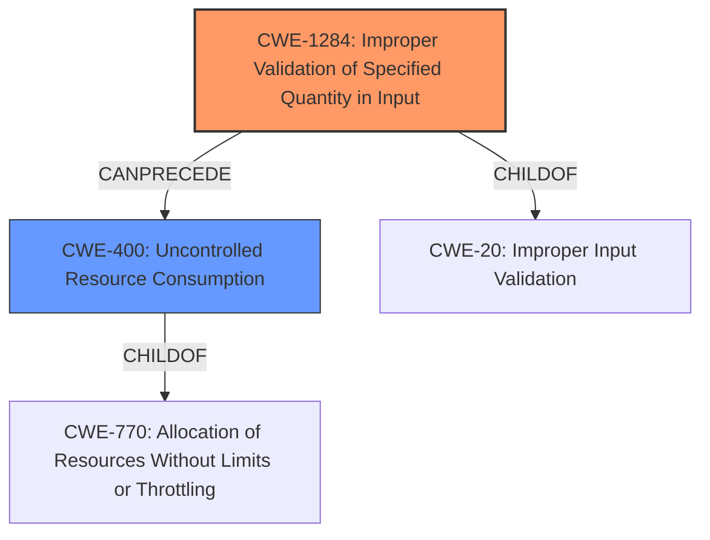

# Enhanced Analysis for CVE-2024-36745

# Summary
| CWE ID | CWE Name | Confidence | CWE Abstraction Level | CWE Vulnerability Mapping Label | CWE-Vulnerability Mapping Notes |
|---|---|---|---|---|---|
| CWE-1284 | Improper Validation of Specified Quantity in Input | 0.8 | Base | Allowed | Primary CWE: The product receives input that is expected to specify a quantity (such as size or length), but it does not validate or incorrectly validates that the quantity has the required properties. |
| CWE-400 | Uncontrolled Resource Consumption | 0.6 | Class | Allowed | Secondary Candidate: The software does not properly control the consumption of a limited resource, which could lead to resource exhaustion. |

## Evidence and Confidence

*   **Confidence Score:** 0.7
*   **Evidence Strength:** MEDIUM

## Relationship Analysis
The primary weakness is **Improper Validation of Specified Quantity in Input (CWE-1284)**, a Base level CWE. This can lead to **Uncontrolled Resource Consumption (CWE-400)**, a Class level CWE, as a consequence. CWE-1284 is a child of CWE-20 (Improper Input Validation), and CWE-400 is a child of CWE-770 (Allocation of Resources Without Limits or Throttling). This shows a hierarchical relationship where the lack of input validation directly causes resource consumption issues.



## Vulnerability Chain
The vulnerability chain starts with the **improper validation of a negative value** provided as input to the `oneflow.index_select` parameter (CWE-1284). This leads to **uncontrolled resource consumption (CWE-400)**, ultimately resulting in a Denial of Service (DoS).

## Summary of Analysis
The analysis indicates that the root cause of the vulnerability is the **lack of input validation (CWE-1284)** on the `oneflow.index_select` parameter, which allows a negative value to be processed. This leads to a denial-of-service condition by causing the application to consume excessive resources (CWE-400).

The evidence from the vulnerability description states: "An issue in OneFlow-Inc. Oneflow v0.9.1 allows attackers to cause a Denial of Service (DoS) via inputting a negative value into the oneflow.index_select parameter."

The Retriever Results identified several potentially relevant CWEs. CWE-1284, **Improper Validation of Specified Quantity in Input**, is the most appropriate as it directly addresses the root cause of the vulnerability: the **failure to validate the input** to `oneflow.index_select`. CWE-770, **Allocation of Resources Without Limits or Throttling**, is related, but CWE-400, **Uncontrolled Resource Consumption** is a more direct consequence of the **improper validation** and thus, is a more suitable secondary CWE.

CWEs like **NULL Pointer Dereference (CWE-476)**, **Heap-based Buffer Overflow (CWE-122)**, and **Memory Allocation with Excessive Size Value (CWE-789)**, while present in the Retriever Results, do not accurately describe the vulnerability's root cause based on the available information. There's no explicit mention of memory allocation issues or pointer dereferences in the provided description.

The selection of CWE-1284 and CWE-400 provides a clear representation of the vulnerability, with CWE-1284 being the root cause and CWE-400 being the direct consequence leading to the DoS. They are specific and provide more accurate representation of the vulnerability than their parent CWEs.


## CWE Relationship Analysis

Current CWEs represent these abstraction levels: .


### Vulnerability Chain Analysis

**Chain starting from CWE-1284:**
- 1284 (Improper Validation of Specified Quantity in Input) - ROOT


**Chain starting from CWE-400:**
- 400 (Uncontrolled Resource Consumption) - ROOT


### CWE Relationship Diagram

```mermaid
graph TD
    classDef primary fill:#f96,stroke:#333,stroke-width:2px
    classDef secondary fill:#69f,stroke:#333
    classDef tertiary fill:#9e9,stroke:#333
```