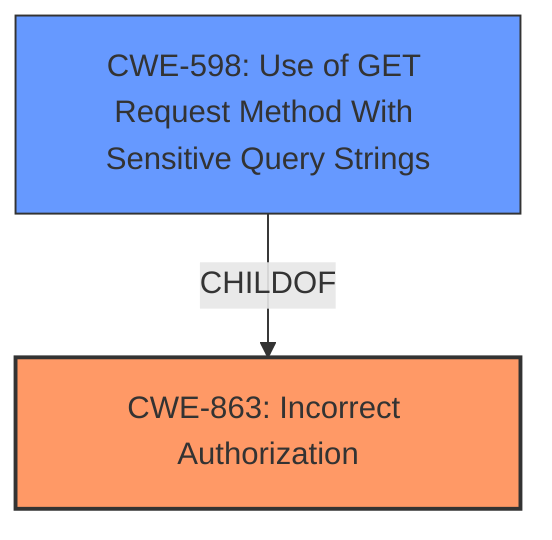

# Analysis for CVE-2024-36829

# Summary
| CWE ID | CWE Name | Confidence | CWE Abstraction Level | CWE Vulnerability Mapping Label | CWE-Vulnerability Mapping Notes |
|---|---|---|---|---|---|
| CWE-863 | Incorrect Authorization | 0.9 | Class | Allowed-with-Review | Primary CWE |
| CWE-598 | Use of GET Request Method With Sensitive Query Strings | 0.6 | Variant | Allowed | Secondary Candidate |

## Evidence and Confidence

*   **Confidence Score:** 0.8
*   **Evidence Strength:** HIGH

## Relationship Analysis
The primary relationship is between CWE-863 (Incorrect Authorization) as a Class-level CWE and potential Base-level children that would be more appropriate if there was sufficient evidence. The vulnerability description indicates an authorization problem, making CWE-863 a strong candidate. CWE-598 is a variant that is related to sending sensitive information via a GET request and query string, so that is a secondary candidate.

## Vulnerability Chain
The vulnerability chain starts with **incorrect access control**, leading to the ability to obtain sensitive information by sending a crafted query string.

## Summary of Analysis
The vulnerability description explicitly states **"Incorrect access control"** as the root cause. The impact is the disclosure of sensitive information, achieved by crafting a query string.

Given the explicit mention of **"Incorrect access control"**, the best initial mapping is CWE-863 (Incorrect Authorization). This is further supported by the CVE Reference Links Content Summary, which identifies "**Incorrect Access Control vulnerability that allows attackers to bypass access controls.**"

CWE-863 is a Class-level CWE, and the mapping guidance suggests considering more specific Base-level children if available. However, the provided information lacks specifics about the exact nature of the authorization failure. Without more detail on *how* the authorization is incorrect, it is not possible to select a more specific child CWE.

CWE-598 is a variant that is related to sending sensitive information via a GET request and query string, so that is a secondary candidate because a crafted query string is mentioned.

Relevant CWE Information:

# Enhanced Context (25 CWEs)
The following CWEs were identified as potentially relevant to this vulnerability:

## CWE-863: Incorrect Authorization
**Abstraction Level**: Class
**Similarity Score**: 1234.11
**Source**: sparse

**Description**:
The product performs an authorization check when an actor attempts to access a resource or perform an action, but it does not correctly perform the check.

**Mapping Guidance**:
- Usage: Allowed-with-Review
- Rationale: This CWE entry is a Class and might have Base-level children that would be more appropriate

## CWE-598: Use of GET Request Method With Sensitive Query Strings
**Abstraction Level**: Variant
**Similarity Score**: 0.598
**Source**: dense

**Description**:
The product transmits sensitive information in cleartext as part of a query string in a GET request.

**Mapping Guidance**:
- Usage: Allowed
- Rationale: This CWE entry is at the Variant level of abstraction, which is a preferred level of abstraction for mapping to the root causes of vulnerabilities.