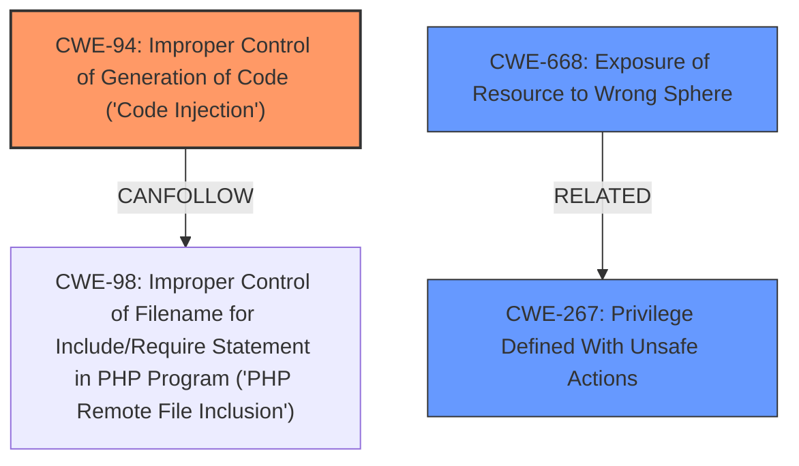

# Raw Analyzer Response for CVE-2024-36983

# Summary
| CWE ID | CWE Name | Confidence | CWE Abstraction Level | CWE Vulnerability Mapping Label | CWE-Vulnerability Mapping Notes |
|---|---|---|---|---|---|
| CWE-94 | Improper Control of Generation of Code ('Code Injection') | 0.9 | Base | Allowed-with-Review | Primary CWE. The **improper control of generation of code** allows an authenticated user to inject code into the Splunk platform installation directory. |
| CWE-668 | Exposure of Resource to Wrong Sphere | 0.7 | Class | Discouraged | Secondary candidate. The `runshellscript` command, intended for internal use, is being exposed through external lookups. |
| CWE-267 | Privilege Defined With Unsafe Actions | 0.6 | Base | Allowed | Secondary candidate. A particular privilege can be used to perform unsafe actions that were not intended. |

## Evidence and Confidence

*   **Confidence Score:** 0.8
*   **Evidence Strength:** HIGH

## Relationship Analysis
The primary CWE is CWE-94, which is a base-level CWE. CWE-94 has parent-child relationships with CWE-96, CWE-95, CWE-1336, and CWE-913. The vulnerability involves injecting code, making CWE-94 a relevant choice. The chain relationship shows that CWE-94 can follow CWE-98 which is 'PHP Remote File Inclusion'. CWE-668 and CWE-267 are related as both involve misconfiguration of resources or privileges, but are secondary to the root cause of code injection.

## Vulnerability Chain
The vulnerability chain starts with the authenticated user's ability to create an external lookup. The user then calls a legacy internal function (`runshellscript`). This leads to **improper control of code generation** (CWE-94), which allows the user to inject code into the Splunk platform's installation directory. Finally, the injected code is executed, resulting in arbitrary code execution.
  - The **Primary CWE** is CWE-94 because the root cause is the **improper control of code generation**.

## Summary of Analysis
The initial analysis identified CWE-94 as the primary weakness due to the **improper control of code generation**. This aligns with the vulnerability description, which states that an authenticated user can inject code into the Splunk platform installation directory, leading to arbitrary code execution. The retriever results also listed CWE-94 as a potential match.

The evidence from the "CVE Reference Links Content Summary" section supports this: "Authenticated users can create external lookups that call the deprecated `runshellscript` function. This allows them to inject arbitrary code into the Splunk platform's installation directory."

The graph relationships and abstraction levels were considered to ensure the selected CWEs are at the appropriate level of specificity. CWE-94 is a base-level CWE, providing a good balance between specificity and generality.

Other CWEs considered but not used:

*   CWE-74 (Improper Neutralization of Special Elements in Output Used by a Downstream Component ('Injection')): While injection is involved, CWE-94 is more specific to code injection.
*   CWE-22 (Improper Limitation of a Pathname to a Restricted Directory ('Path Traversal')): Not applicable as the vulnerability does not involve path traversal.
*   CWE-502 (Deserialization of Untrusted Data): Not applicable as the vulnerability does not involve deserialization of untrusted data.
*   CWE-427 (Uncontrolled Search Path Element): While the attacker is placing files in the Splunk directory, it is not related to the search path.

Relevant CWE Information:

# Enhanced Context (25 CWEs)
The following CWEs were identified as potentially relevant to this vulnerability:

## CWE-497: Exposure of Sensitive System Information to an Unauthorized Control Sphere
**Abstraction Level**: Base
**Similarity Score**: 0.77
**Source**: dense

**Description**:
The product does not properly prevent sensitive system-level information from being accessed by unauthorized actors who do not have the same level of access to the underlying system as the product does.

**Mapping Guidance**:
- Usage: Allowed
- Rationale: This CWE entry is at the Base level of abstraction, which is a preferred level of abstraction for mapping to the root causes of vulnerabilities.

## CWE-74: Improper Neutralization of Special Elements in Output Used by a Downstream Component ('Injection')
**Abstraction Level**: Class
**Similarity Score**: 0.77
**Source**: dense

**Description**:
The product constructs all or part of a command, data structure, or record using externally-influenced input from an upstream component, but it does not neutralize or incorrectly neutralizes special elements that could modify how it is parsed or interpreted when it is sent to a downstream component.

**Mapping Guidance**:
- Usage: Discouraged
- Rationale: CWE-74 is high-level and often misused when lower-level weaknesses are more appropriate.

## CWE-267: Privilege Defined With Unsafe Actions
**Abstraction Level**: Base
**Similarity Score**: 0.76
**Source**: dense

**Description**:
A particular privilege, role, capability, or right can be used to perform unsafe actions that were not intended, even when it is assigned to the correct entity.

**Mapping Guidance**:
- Usage: Allowed
- Rationale: This CWE entry is at the Base level of abstraction, which is a preferred level of abstraction for mapping to the root causes of vulnerabilities.

## CWE-668: Exposure of Resource to Wrong Sphere
**Abstraction Level**: Class
**Similarity Score**: 0.76
**Source**: dense

**Description**:
The product exposes a resource to the wrong control sphere, providing unintended actors with inappropriate access to the resource.

**Mapping Guidance**:
- Usage: Discouraged
- Rationale: CWE-668 is high-level and is often misused as a catch-all when lower-level CWE IDs might be applicable. It is sometimes used for low-information vulnerability reports [REF-1287]. It is a level-1 Class (i.e., a child of a Pillar). It is not useful for trend analysis.

## CWE-116: Improper Encoding or Escaping of Output
**Abstraction Level**: Class
**Similarity Score**: 0.75
**Source**: dense

**Description**:
The product prepares a structured message for communication with another component, but encoding or escaping of the data is either missing or done incorrectly. As a result, the intended structure of the message is not preserved.

**Mapping Guidance**:
- Usage: Allowed-with-Review
- Rationale: This CWE entry is a Class and might have Base-level children that would be more appropriate

## CWE-538: Insertion of Sensitive Information into Externally-Accessible File or Directory
**Abstraction Level**: Base
**Similarity Score**: 0.75
**Source**: dense

**Description**:
The product places sensitive information into files or directories that are accessible to actors who are allowed to have access to the files, but not to the sensitive information.

**Mapping Guidance**:
- Usage: Allowed
- Rationale: This CWE entry is at the Base level of abstraction, which is a preferred level of abstraction for mapping to the root causes of vulnerabilities.

## CWE-138: Improper Neutralization of Special Elements
**Abstraction Level**: Class
**Similarity Score**: 0.75
**Source**: dense

**Description**:
The product receives input from an upstream component, but it does not neutralize or incorrectly neutralizes special elements that could be interpreted as control elements or syntactic markers when they are sent to a downstream component.

**Mapping Guidance**:
- Usage: Discouraged
- Rationale: This CWE entry is a level-1 Class (i.e., a child of a Pillar). It might have lower-level children that would be more appropriate

## CWE-212: Improper Removal of Sensitive Information Before Storage or Transfer
**Abstraction Level**: Base
**Similarity Score**: 0.75
**Source**: dense

**Description**:
The product stores, transfers, or shares a resource that contains sensitive information, but it does not properly remove that information before the product makes the resource available to unauthorized actors.

**Mapping Guidance**:
- Usage: Allowed
- Rationale: This CWE entry is at the Base level of abstraction, which is a preferred level of abstraction for mapping to the root causes of vulnerabilities.

## CWE-42