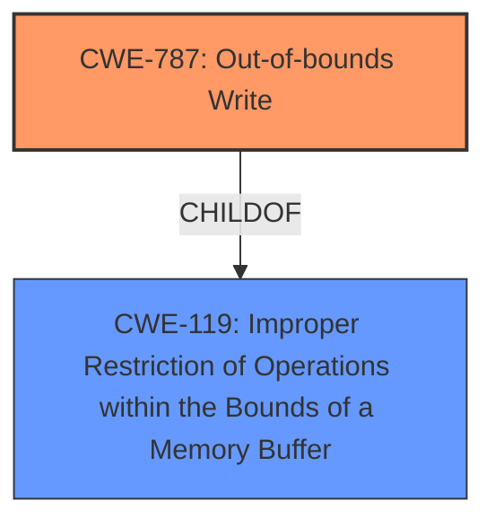

# Raw Analyzer Response for CVE-2024-37000

# Summary
| CWE ID    | CWE Name                                                                    | Confidence | CWE Abstraction Level | CWE Vulnerability Mapping Label | CWE-Vulnerability Mapping Notes |
| :---------- | :-------------------------------------------------------------------------- | :--------- | :-------------------- | :------------------------------ | :------------------------------ |
| CWE-787     | Out-of-bounds Write                                                       | 0.95       | Base                  | Primary                       | Allowed                       |
| CWE-119     | Improper Restriction of Operations within the Bounds of a Memory Buffer | 0.75       | Class                 | Secondary                     | Discouraged                    |

## Evidence and Confidence

*   **Confidence Score:** 0.9
*   **Evidence Strength:** HIGH

## Relationship Analysis
The primary CWE is CWE-787, which is a base-level weakness describing an out-of-bounds write. CWE-119 is a parent class of CWE-787, indicating that the out-of-bounds write is a specific type of improper restriction of operations within memory buffers.

## Vulnerability Chain
The chain of events is as follows:
1.  A **maliciously crafted X_B file** is parsed.
2.  This leads to an **out-of-bounds write (CWE-787)**, causing **memory corruption**.
3.  The **memory corruption** results in a **write access violation**.
4.  In conjunction with other vulnerabilities, this can lead to **code execution**.

The **primary CWE** is CWE-787, as it is the direct cause of the memory corruption due to the **out-of-bounds write**.

## Summary of Analysis
The analysis is based on the provided vulnerability description, which clearly states that parsing a maliciously crafted X_B file leads to a **memory corruption** vulnerability by **write access violation**. This directly points to CWE-787 (Out-of-bounds Write) as the primary weakness. The key phrases "memory corruption" and "write access violation" strongly suggest that data is being written outside of the intended buffer boundaries. The evidence from the "Keyphrase-Specific CWE Analysis" further supports this conclusion, with CWE-787 consistently receiving the highest score for various aspects of the vulnerability, including the **WEAKNESS**, **IMPACT**, **VECTOR**, **PRODUCT**, and **COMPONENT**.

CWE-119 (Improper Restriction of Operations within the Bounds of a Memory Buffer) was considered as a broader classification, but CWE-787 is more specific and accurately describes the **root cause** of the vulnerability. While CWE-119 is a parent of CWE-787, choosing the child provides a more precise characterization of the flaw.

The selection of CWE-787 is at the optimal level of specificity because it directly reflects the **out-of-bounds write** condition described in the vulnerability. Other CWEs like CWE-125 (Out-of-bounds Read), CWE-122 (Heap-based Buffer Overflow), CWE-476 (NULL Pointer Dereference), and CWE-190 (Integer Overflow or Wraparound) were considered but ultimately deemed less relevant as the core issue is an **unauthorized write** operation outside of buffer boundaries, not reading, allocation errors, null pointer dereferences, or integer handling issues.

Relevant CWE Information:

# Enhanced Context (25 CWEs)
The following CWEs were identified as potentially relevant to this vulnerability:

## CWE-824: Access of Uninitialized Pointer
**Abstraction Level**: Base
**Similarity Score**: 0.74
**Source**: dense

**Description**:
The product accesses or uses a pointer that has not been initialized.

**Mapping Guidance**:
- Usage: Allowed
- Rationale: This CWE entry is at the Base level of abstraction, which is a preferred level of abstraction for mapping to the root causes of vulnerabilities.

## CWE-129: Improper Validation of Array Index
**Abstraction Level**: Variant
**Similarity Score**: 0.72
**Source**: dense

**Description**:
The product uses untrusted input when calculating or using an array index, but the product does not validate or incorrectly validates the index to ensure the index references a valid position within the array.

**Mapping Guidance**:
- Usage: Allowed
- Rationale: This CWE entry is at the Variant level of abstraction, which is a preferred level of abstraction for mapping to the root causes of vulnerabilities.

## CWE-131: Incorrect Calculation of Buffer Size
**Abstraction Level**: Base
**Similarity Score**: 0.72
**Source**: dense

**Description**:
The product does not correctly calculate the size to be used when allocating a buffer, which could lead to a buffer overflow.

**Mapping Guidance**:
- Usage: Allowed
- Rationale: This CWE entry is at the Base level of abstraction, which is a preferred level of abstraction for mapping to the root causes of vulnerabilities.

## CWE-657: Violation of Secure Design Principles
**Abstraction Level**: Class
**Similarity Score**: 0.72
**Source**: dense

**Description**:
The product violates well-established principles for secure design.

**Mapping Guidance**:
- Usage: Discouraged
- Rationale: This CWE entry is a level-1 Class (i.e., a child of a Pillar). It might have lower-level children that would be more appropriate

## CWE-788: Access of Memory Location After End of Buffer
**Abstraction Level**: Base
**Similarity Score**: 0.72
**Source**: dense

**Description**:
The product reads or writes to a buffer using an index or pointer that references a memory location after the end of the buffer.

**Mapping Guidance**:
- Usage: Discouraged
- Rationale: The CWE entry might be misused when lower-level CWE entries might be available. It also overlaps existing CWE entries and might be deprecated in the future.

## CWE-497: Exposure of Sensitive System Information to an Unauthorized Control Sphere
**Abstraction Level**: Base
**Similarity Score**: 0.72
**Source**: dense

**Description**:
The product does not properly prevent sensitive system-level information from being accessed by unauthorized actors who do not have the same level of access to the underlying system as the product does.

**Mapping Guidance**:
- Usage: Allowed
- Rationale: This CWE entry is at the Base level of abstraction, which is a preferred level of abstraction for mapping to the root causes of vulnerabilities.

## CWE-345: Insufficient Verification of Data Authenticity
**Abstraction Level**: Class
**Similarity Score**: 0.72
**Source**: dense

**Description**:
The product does not sufficiently verify the origin or authenticity of data, in a way that causes it to accept invalid data.

**Mapping Guidance**:
- Usage: Discouraged
- Rationale: This CWE entry is a level-1 Class (i.e., a child of a Pillar). It might have lower-level children that would be more appropriate

## CWE-125: Out-of-bounds Read
**Abstraction Level**: Base
**Similarity Score**: 0.72
**Source**: dense

**Description**:
The product reads data past the end, or before the beginning, of the intended buffer.

**Mapping Guidance**:
- Usage: Allowed
- Rationale: This CWE entry is at the Base level of abstraction, which is a preferred level of abstraction for mapping to the root causes of vulnerabilities.

## CWE-668: Exposure of Resource to Wrong Sphere
**Abstraction Level**: Class
**Similarity Score**: 0.72
**Source**: dense

**Description**:
The product exposes a resource to the wrong control sphere, providing unintended actors with inappropriate access to the resource.

**Mapping Guidance**:
- Usage: Discouraged
- Rationale: CWE-668 is high-level and is often misused as a catch-all when lower-level CWE IDs might be applicable. It is sometimes used for low-information vulnerability reports [REF-1287]. It is a level-1 Class (i.e., a child of a Pillar). It is not useful for trend analysis.

## CWE-74: Improper Neutralization of Special Elements in Output Used by a Downstream Component ('Injection')
**Abstraction Level**: Class
**Similarity Score**: 0.71
**Source**: dense

**Description**:
The product constructs all or part of a command, data structure, or record using externally-influenced input from an upstream component, but it does not neutralize or incorrectly neutralizes special elements that could modify how it is parsed or interpreted when it is sent to a downstream component.

**Mapping Guidance**:
- Usage: Discouraged
- Rationale: CWE-74 is high-level and often misused when lower-level weaknesses are more appropriate.

## CWE-125: Out-of-bounds Read
**Abstraction