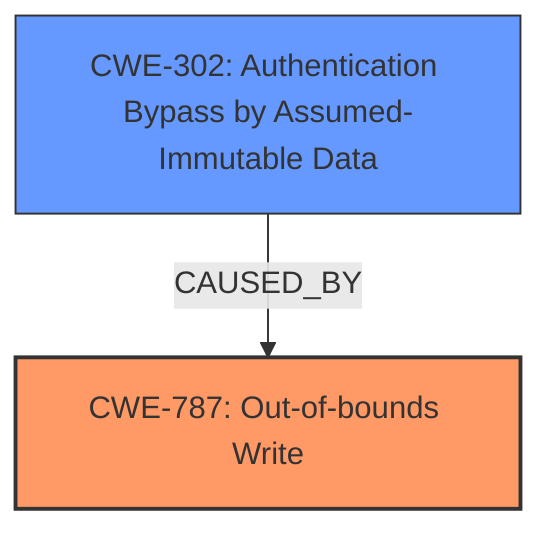

# Analysis for CVE-2024-37036

# Summary
| CWE ID | CWE Name | Confidence | CWE Abstraction Level | CWE Vulnerability Mapping Label | CWE-Vulnerability Mapping Notes |
|---|---|---|---|---|---|
| CWE-787 | Out-of-bounds Write | 1.0 | Base | Primary | Allowed |
| CWE-302 | Authentication Bypass by Assumed-Immutable Data | 0.7 | Base | Secondary | Allowed |

## Evidence and Confidence

*   **Confidence Score:** 0.85
*   **Evidence Strength:** HIGH

## Relationship Analysis
The primary relationship impacting the decision is the direct identification of **CWE-787 Out-of-bounds Write** as the root cause of the vulnerability. The guidance on Authentication vs Authorization helps in identifying the impact of the vulnerability, which is an authentication bypass. **CWE-302 Authentication Bypass by Assumed-Immutable Data** helps to identify the impact of the root cause.

## Vulnerability Chain
The vulnerability chain starts with the **CWE-787 Out-of-bounds Write**, which is triggered by a malformed POST request. This leads to an authentication bypass, indicating that the out-of-bounds write corrupts data used for authentication, which is described by **CWE-302 Authentication Bypass by Assumed-Immutable Data**.

## Summary of Analysis
The analysis is strongly based on the explicit statement that the **root cause** of the vulnerability is an **Out-of-bounds Write**. The vulnerability description and CVE Reference Links Content Summary both confirm this. The technical impact is that this leads to an authentication bypass.

Evidence:
*   Vulnerability Description Key Phrases: "**rootcause:** **Out-of-bounds Write**"
*   CVE Reference Links Content Summary: "**Root cause of vulnerability**: An out-of-bounds write vulnerability exists."

Based on this, **CWE-787 Out-of-bounds Write** is selected as the primary CWE because it directly describes the root cause. The CWE is at the Base level of abstraction, which is preferred.

The Retriever Results also list **CWE-787 Out-of-bounds Write** as a possible match, further supporting this decision.

The secondary CWE is **CWE-302 Authentication Bypass by Assumed-Immutable Data**. The malformed POST request leads to an out-of-bounds write, corrupting data used for authentication, allowing an attacker to bypass authentication.

The selected CWEs are at the optimal level of specificity, with **CWE-787 Out-of-bounds Write** pinpointing the coding error and **CWE-302 Authentication Bypass by Assumed-Immutable Data** describing the impact.

**CWE-125 Out-of-bounds Read** was considered but not selected because the vulnerability description explicitly states that the issue is an **Out-of-bounds Write**, not a read.

**CWE-131 Incorrect Calculation of Buffer Size** was considered but the description says the **rootcause** is an **Out-of-bounds Write**. So the buffer calculation is not the rootcause.

**CWE-190 Integer Overflow or Wraparound**, **CWE-197 Numeric Truncation Error**, and **CWE-191 Integer Underflow (Wrap or Wraparound)** were considered as the source of the Out-of-bounds Write. This would have been a good choice if there was evidence. But the evidence in the vulnerability description is only that a malformed POST request results in an Out-of-bounds Write.

**CWE-129 Improper Validation of Array Index** was considered but the description says the **rootcause** is an **Out-of-bounds Write**. So the improper validation is not the rootcause.

**CWE-119 Improper Restriction of Operations within the Bounds of a Memory Buffer** was considered because it is a parent of **CWE-787 Out-of-bounds Write**. But **CWE-787 Out-of-bounds Write** provides a more specific description of the vulnerability.