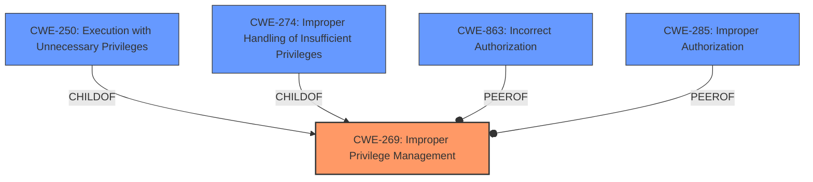

# Analysis for CVE-2024-37133

# Summary
| CWE ID  | CWE Name                                                      | Confidence | CWE Abstraction Level | CWE Vulnerability Mapping Label | CWE-Vulnerability Mapping Notes |
| :-------- | :------------------------------------------------------------ | :--------- | :-------------------- | :------------------------------ | :------------------------------ |
| CWE-269 | Improper Privilege Management                                 | 0.9        | Class                 | Primary CWE                   | Discouraged                   |
| CWE-266 | Incorrect Privilege Assignment                                | 0.6        | Base                  | Secondary Candidate           | Allowed                       |
| CWE-250 | Execution with Unnecessary Privileges                         | 0.5        | Base                  | Secondary Candidate           | Allowed                       |

## Evidence and Confidence

*   **Confidence Score:** 0.8
*   **Evidence Strength:** HIGH

## Relationship Analysis
The primary CWE identified is CWE-269, which is a Class-level CWE. While it's generally preferred to map to Base or Variant level CWEs, the provided description focuses on the high-level concept of **improper privilege management** without detailing the specific mechanism of the failure. CWE-269 has child relationships with CWE-250 and CWE-274, which are both Base level CWEs. The retriever results also suggest CWE-863 and CWE-285 as possibilities, which have a peer relationship.

## Vulnerability Chain
The vulnerability chain starts with **improper privilege management** (CWE-269), which leads to an attacker gaining unauthorized root-level access. The description doesn't specify the exact mechanism of the privilege management failure.

## Summary of Analysis
The initial assessment strongly points to CWE-269 due to the explicit mention of "**improper privilege management**" in the vulnerability description. The CVE Reference Links Content Summary reinforces this by stating, "Root cause of vulnerability: **Improper privilege management** in Dell PowerScale OneFS" and "Weaknesses/vulnerabilities present: **Improper privilege management**." Despite CWE-269 being a Class-level CWE and the recommendation to prefer Base or Variant levels when possible, the lack of specific details about the *how* of the **improper privilege management** makes it difficult to select a more specific CWE.

The retriever results also list CWE-266 (**Incorrect Privilege Assignment**) and CWE-250 (**Execution with Unnecessary Privileges**) as possibilities. While these are Base-level CWEs and could potentially provide more specificity, there isn't enough information to definitively say that the vulnerability involves incorrect assignment of privileges or execution with unnecessary privileges. The description only states that there's **improper management**, which could encompass a broader range of issues.

I am overriding the general mapping guidance to prefer a more specific CWE because the evidence is insufficient to determine the exact mechanism of the **improper privilege management**. Using CWE-269 provides a reasonable balance between accuracy and specificity given the available information.

Relevant CWE Information:

# Enhanced Context (25 CWEs)
The following CWEs were identified as potentially relevant to this vulnerability:

## CWE-269: Improper Privilege Management
**Abstraction Level**: Class
**Similarity Score**: 1535.91
**Source**: sparse

**Description**:
The product does not properly assign, modify, track, or check privileges for an actor, creating an unintended sphere of control for that actor.

**Mapping Guidance**:
- Usage: Discouraged
- Rationale: CWE-269 is commonly misused. It can be conflated with "privilege escalation," which is a technical impact that is listed in many low-information vulnerability reports [REF-1287]. It is not useful for trend analysis.

## CWE-266: Incorrect Privilege Assignment
**Abstraction Level**: Base
**Similarity Score**: 0.79
**Source**: dense

**Description**:
A product incorrectly assigns a privilege to a particular actor, creating an unintended sphere of control for that actor.

**Mapping Guidance**:
- Usage: Allowed
- Rationale: This CWE entry is at the Base level of abstraction, which is a preferred level of abstraction for mapping to the root causes of vulnerabilities.

## CWE-250: Execution with Unnecessary Privileges
**Abstraction Level**: base
**Similarity Score**: 2.47
**Source**: graph

**Description**:
CWE-250: Execution with Unnecessary Privileges

**Mapping Guidance**:
- Usage: Allowed
- Rationale: This CWE entry is at the Base level of abstraction, which is a preferred level of abstraction for mapping to the root causes of vulnerabilities.