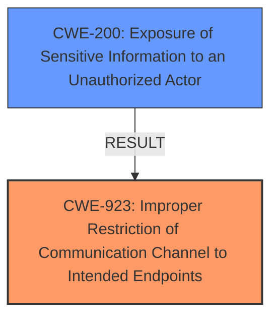

# Analysis for CVE-2024-37150

# Summary
| CWE ID | CWE Name | Confidence | CWE Abstraction Level | CWE Vulnerability Mapping Label | CWE-Vulnerability Mapping Notes |
|---|---|---|---|---|---|
| CWE-923 | Improper Restriction of Communication Channel to Intended Endpoints | 0.8 | Class | Primary | Allowed-with-Review |
| CWE-200 | Exposure of Sensitive Information to an Unauthorized Actor | 0.6 | Class | Secondary | Discouraged |

## Evidence and Confidence

*   **Confidence Score:** 0.7
*   **Evidence Strength:** MEDIUM

## Relationship Analysis
The primary CWE selected is CWE-923, which is a Class-level CWE. While a more specific Base or Variant CWE would be ideal, the available information does not strongly point to a more specific weakness. CWE-923 describes the core issue of a communication channel not being properly restricted to the intended endpoint, which aligns with the vulnerability where credentials intended for a specific registry are sent to a different domain. CWE-200 is a secondary consideration, representing the impact of the vulnerability, where sensitive information is exposed. However, CWE-200 is discouraged as a primary mapping, as it represents the impact rather than the root cause.

## Vulnerability Chain
The vulnerability chain starts with the **improper restriction of the communication channel (CWE-923)**, where Deno fails to ensure that credentials are only sent to the intended endpoint (the specific tarball URL's domain). This leads to the **exposure of sensitive information (CWE-200)**, as the `.npmrc` credentials are sent to an unauthorized actor (a different domain potentially controlled by an attacker).

## Summary of Analysis
The initial analysis focused on identifying the root cause of the vulnerability based on the provided evidence. The key phrase "send .npmrc credentials to tarball URL" and the CVE Reference Links Content Summary, which states that "Deno was incorrectly using the authentication credentials associated with the npm registry URL for the scope of the package, instead of using the credentials associated with the specific URL of the tarball itself," helped narrow down the possible CWEs.

CWE-923 was selected as the primary CWE because it directly addresses the **improper restriction** of the communication channel. The vulnerability is triggered because Deno sends credentials to the wrong endpoint (the tarball URL), which is a violation of proper communication channel restriction.

CWE-200 was considered as a secondary CWE to represent the impact of the vulnerability. However, it is not the root cause. The primary issue is the **incorrect authorization**, which leads to the sensitive information being exposed.

The other CWEs from the Retriever Results were considered but ultimately not selected because they did not accurately represent the core weakness. For example, CWE-863 (Incorrect Authorization) is a broader category, and while applicable, CWE-923 is more specific to the communication channel aspect of the vulnerability. CWE-212 (Improper Removal of Sensitive Information Before Storage or Transfer) is not applicable, as the sensitive information is not being stored or transferred improperly within the application itself, but rather sent to the wrong destination.

Relevant CWE Information:
- **CWE-923: Improper Restriction of Communication Channel to Intended Endpoints**
- **CWE-200: Exposure of Sensitive Information to an Unauthorized Actor**