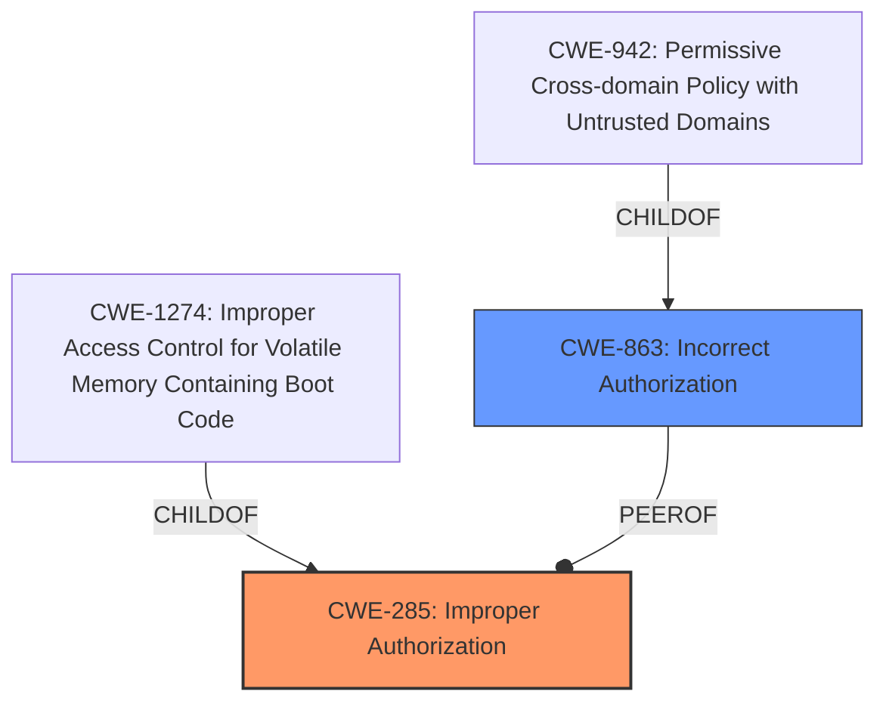

# Analysis Report for CVE-2024-37159

# Vulnerability Analysis Report: CVE-2024-37159

## Description

Evmos is the Ethereum Virtual Machine (EVM) Hub on the Cosmos Network. This vulnerability allowed a user to create a validator using vested tokens to deposit the self-bond. This vulnerability is fixed in 18.0.0.

## Vulnerability Description Key Phrases

- **Impact:** create a validator using vested tokens to deposit the self-bond
- **Attacker:** user
- **Product:** Evmos
- **Version:** 18.0.0

## Analysis (with Relationship Data)

# Summary
| CWE ID  | CWE Name | Confidence | CWE Abstraction Level | CWE Vulnerability Mapping Label | CWE-Vulnerability Mapping Notes |
|-----------------|------------------------------------------------------|----------------|-------------------------|-----------------------------------|------------------------------------|
| CWE-285 | Improper Authorization | 0.8 | Class | Allowed-with-Review | Primary CWE. Authorization is **missing** to validate that the validator creation is not using vested tokens. |
| CWE-863 | Incorrect Authorization | 0.6 | Class | Allowed-with-Review | Secondary Candidate. The authorization check could be implemented **incorrectly**. |

## Evidence and Confidence

*   **Confidence Score:** 0.7
*   **Evidence Strength:** MEDIUM

## Relationship Analysis
The primary relationship that influenced the decision was the parent-child relationship between CWE-285 (Improper Authorization) and its potential children, as well as the peer relationship with CWE-863 (Incorrect Authorization). While CWE-285 is a high-level class, the evidence suggests a **missing** authorization check, making it the most appropriate starting point. CWE-863 was considered because the authorization check could be implemented **incorrectly**.



## Vulnerability Chain
The vulnerability chain starts with the **missing** or **incorrect** authorization check, leading to the ability to create a validator using vested tokens.

1.  **Root Cause:** CWE-285 **Improper Authorization**: The system **does not perform** an authorization check to prevent the use of vested tokens for validator creation. Or CWE-863 **Incorrect Authorization** in which the check is implemented **incorrectly**.
2.  **Impact:** A user can create a validator using vested tokens to deposit the self-bond, potentially gaining unauthorized control or benefits within the Evmos network.

## Summary of Analysis
The initial analysis focused on identifying the root cause of the vulnerability, which is the ability to create a validator using vested tokens. The **Vulnerability Description Key Phrases** highlighted the **impact** (create a validator using vested tokens). The **CVE Reference Links Content Summary** indicated a "Lack of a check to prevent validator creation using vested tokens."

CWE-285, **Improper Authorization**, was selected as the primary CWE because the evidence suggests that an authorization check is **missing**. The system **does not** properly verify that the tokens used for validator creation are not vested. This aligns with the definition of CWE-285: "The product does not perform or incorrectly performs an authorization check when an actor attempts to access a resource or perform an action."

CWE-863, **Incorrect Authorization**, was considered as a secondary candidate because it's possible that an authorization check was implemented, but was done **incorrectly**.

The retriever results also listed **Improper Authorization** CWE-285 and **Incorrect Authorization** CWE-863.

The final decision favored CWE-285 as the primary CWE due to the clear indication of a **missing** authorization check. The abstraction level of Class was chosen because there wasn't enough information to pinpoint a more specific Base-level CWE.

Relevant CWE Information:
- CWE-285: Improper Authorization: "The product does not perform or incorrectly performs an authorization check when an actor attempts to access a resource or perform an action."
- CWE-863: Incorrect Authorization: "The product performs an authorization check when an actor attempts to access a resource or perform an action, but it does not correctly perform the check."


## CWE Relationship Analysis

Current CWEs represent these abstraction levels: .


### Vulnerability Chain Analysis

**Chain starting from CWE-863:**
- 863 (Incorrect Authorization) - ROOT


**Chain starting from CWE-942:**
- 942 (Permissive Cross-domain Policy with Untrusted Domains) - ROOT


### CWE Relationship Diagram

```mermaid
graph TD
    classDef primary fill:#f96,stroke:#333,stroke-width:2px
    classDef secondary fill:#69f,stroke:#333
    classDef tertiary fill:#9e9,stroke:#333
```


*Report generated on 2025-07-13 09:30:17*
