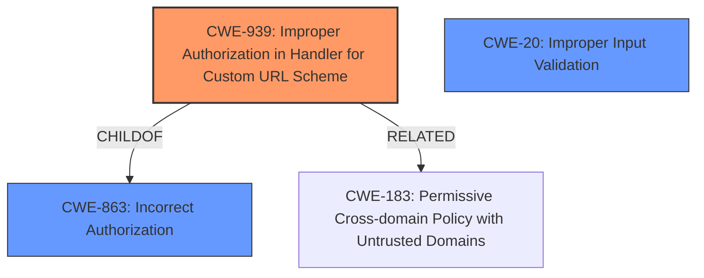

# Analysis Report for CVE-2024-37182

# Vulnerability Analysis Report: CVE-2024-37182

## Description

Mattermost Desktop App versions <=5.7.0 **fail to correctly prompt for permission when opening external URLs** which allows a remote attacker to force a victim over the Internet to run arbitrary programs on the victims system via custom URI schemes.

## Vulnerability Description Key Phrases

- **Rootcause:** fail to correctly prompt for permission when opening external URLs
- **Impact:** run arbitrary programs
- **Vector:** custom URI schemes
- **Attacker:** remote attacker
- **Product:** Mattermost Desktop App
- **Version:** <=5.7.0

## Analysis (with Relationship Data)

# Summary
| CWE ID  | CWE Name                                                                   | Confidence | CWE Abstraction Level | CWE Vulnerability Mapping Label | CWE-Vulnerability Mapping Notes |
| ------- | -------------------------------------------------------------------------- | ---------- | --------------------- | ------------------------------- | ------------------------------- |
| CWE-939 | Improper Authorization in Handler for Custom URL Scheme                  | 0.9        | Base                  | Primary                         | Allowed                         |
| CWE-20  | Improper Input Validation                                                  | 0.6        | Class                 | Secondary                       | Allowed-with-Review             |

## Evidence and Confidence

*   **Confidence Score:** 0.8
*   **Evidence Strength:** MEDIUM

## Relationship Analysis

The primary relationship that influenced the selection was the hierarchical structure. CWE-939 is a Base level CWE which is a child of CWE-863 (Incorrect Authorization), and also related to CWE-183 (Permissive Cross-domain Policy with Untrusted Domains). CWE-20, Improper Input Validation, is included as a secondary CWE because the **failure to correctly prompt for permission** can be viewed as a form of **improper validation** of the external URL.



## Vulnerability Chain

The vulnerability chain starts with the application **failing to correctly prompt for permission when opening external URLs**. This **lack of proper authorization** leads to the system executing arbitrary programs.

## Summary of Analysis

The primary assessment is based on the vulnerability description indicating a **failure to correctly prompt for permission when opening external URLs**. The retriever results and the CWE descriptions support this assessment.

The selected CWEs are at an optimal level of specificity because CWE-939 directly addresses the **improper authorization** within the context of custom URL schemes, while CWE-20 accounts for the **lack of input validation**.

The primary evidence supporting the selection of CWE-939 is:
*   **Vulnerability Description:** "Mattermost Desktop App versions <=5.7.0 **fail to correctly prompt for permission when opening external URLs** which allows a remote attacker to force a victim over the Internet to run arbitrary programs on the victims system via custom URI schemes."
*   **Vulnerability Description Key Phrases:** "**rootcause:** **fail to correctly prompt for permission when opening external URLs**"

The inclusion of CWE-20 is based on the interpretation that the **failure to prompt for permission** is a form of **improper input validation**, as the application does not properly validate whether the user intends to open the external URL.

Relevant CWE Information:

# Enhanced Context (25 CWEs)
The following CWEs were identified as potentially relevant to this vulnerability:

## CWE-939: Improper Authorization in Handler for Custom URL Scheme
**Abstraction Level**: Base
**Similarity Score**: 0.245

**Description**:
The product does not properly authorize requests to handlers for custom URL schemes, which could allow unintended access or actions.

**Mapping Guidance**:
- Usage: Allowed
- Rationale: This CWE entry is at the Base level of abstraction, which is a preferred level of abstraction for mapping to the root causes of vulnerabilities.

## CWE-20: Improper Input Validation
**Abstraction Level**: Class
**Similarity Score**: N/A

**Description**:
The product does not validate or incorrectly validates input.

**Mapping Guidance**:
- Usage: Allowed-with-Review
- Rationale: This CWE entry is a Class and might have Base-level children that would be more appropriate

# Detailed Analysis of Selected CWEs

## CWE-939: Improper Authorization in Handler for Custom URL Scheme

*   **Technical Explanation:** This CWE applies because the Mattermost Desktop App **fails to correctly prompt for permission** which is a form of **improper authorization** when opening external URLs via custom URI schemes. The application should verify whether the user intends to open the URL, but it does not.
*   **Security Implications:** A remote attacker can force a victim to run arbitrary programs on their system.
*   **Relationship Analysis:** CWE-939 is a base CWE and a child of CWE-863 (Incorrect Authorization).
*   **Mapping Guidance Influence:** The mapping guidance ALLOWED usage influenced this decision.
*   **Confidence:** 0.9

## CWE-20: Improper Input Validation

*   **Technical Explanation:** The application does not properly validate the input, specifically the external URL, before attempting to open it. The **failure to prompt for permission** can be seen as a **lack of input validation**.
*   **Security Implications:** This can lead to the execution of arbitrary programs on the victim's system.
*   **Relationship Analysis:** This is a class level CWE
*   **Mapping Guidance Influence:** The mapping guidance ALLOWED-WITH-REVIEW usage influenced this decision.
*   **Confidence:** 0.6

# Analysis of Rejected CWEs

*   **CWE-88 (Improper Neutralization of Argument Delimiters in a Command ('Argument Injection')) and CWE-78 (Improper Neutralization of Special Elements used in an OS Command ('OS Command Injection'))**: These were considered due to the "run arbitrary programs" impact. However, the root cause is not directly related to command injection, but rather the **lack of authorization** and **input validation** before executing the URL.
*   **CWE-863 (Incorrect Authorization)** and **CWE-285 (Improper Authorization)**: These are class-level CWEs. CWE-939 is a more specific base-level CWE that directly addresses the authorization issue in custom URL schemes.
*   **CWE-250 (Execution with Unnecessary Privileges)**: While the vulnerability allows running arbitrary programs, the core issue is not that the application is running with unnecessary privileges, but rather that it **fails to properly authorize** the opening of external URLs.
*   **CWE-434 (Unrestricted Upload of File with Dangerous Type)**: This CWE is not applicable because the vulnerability does not involve uploading files.
*   **CWE-22 (Improper Limitation of a Pathname to a Restricted Directory ('Path Traversal'))**: This CWE is not applicable because the vulnerability does not involve path traversal.


## CWE Relationship Analysis

Current CWEs represent these abstraction levels: .


### Vulnerability Chain Analysis

**Chain starting from CWE-183:**
- 183 (Permissive List of Allowed Inputs) - ROOT


**Chain starting from CWE-863:**
- 863 (Incorrect Authorization) - ROOT


### CWE Relationship Diagram

```mermaid
graph TD
    classDef primary fill:#f96,stroke:#333,stroke-width:2px
    classDef secondary fill:#69f,stroke:#333
    classDef tertiary fill:#9e9,stroke:#333
```


*Report generated on 2025-07-13 09:31:38*
