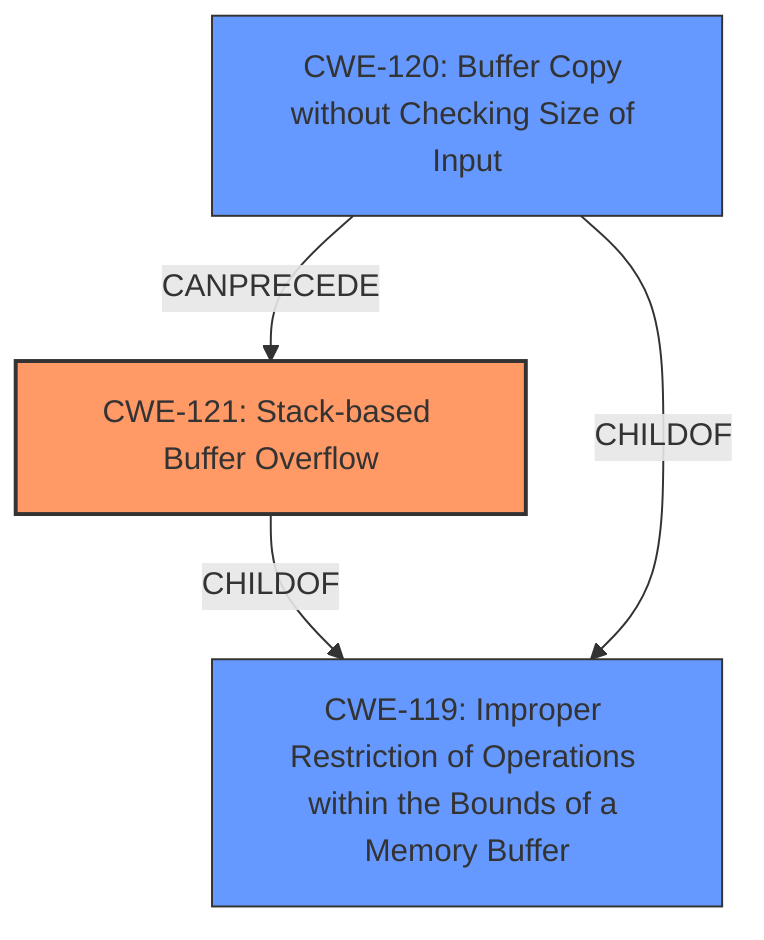

# Enhanced Analysis for CVE-2024-37184

# Summary
| CWE ID | CWE Name | Confidence | CWE Abstraction Level | CWE Vulnerability Mapping Label | CWE-Vulnerability Mapping Notes |
|---|---|---|---|---|---|
| CWE-121 | Stack-based Buffer Overflow | 1.0 | Variant | Allowed | Primary CWE: The vulnerability is specifically a stack-based buffer overflow. |
| CWE-120 | Buffer Copy without Checking Size of Input ('Classic Buffer Overflow') | 0.8 | Base | Allowed-with-Review | Secondary Candidate: This is a more general case of buffer overflow. |
| CWE-119 | Improper Restriction of Operations within the Bounds of a Memory Buffer | 0.6 | Class | Discouraged | Secondary Candidate: This is a very general description of buffer overflows and is discouraged. |

## Evidence and Confidence

*   **Confidence Score:** 1.0
*   **Evidence Strength:** HIGH

## Relationship Analysis
The primary CWE is CWE-121 (Stack-based Buffer Overflow), which is a variant of the more general CWE-119 (Improper Restriction of Operations within the Bounds of a Memory Buffer). CWE-120 (Buffer Copy without Checking Size of Input) is also related as a common cause of buffer overflows, and it can precede CWE-121. The analysis favors CWE-121 due to the explicit mention of "stack-based buffer overflow" in the vulnerability description.



## Vulnerability Chain
The vulnerability chain starts with the **lack of input size validation** in the `adm.cgi rep_as_bridge()` function when copying the `wl_rep_ssid2g` POST parameter to the stack. This leads to a **stack-based buffer overflow** (CWE-121) when a specially crafted HTTP request with an overly long `wl_rep_ssid2g` parameter is sent. The final impact is arbitrary code execution.

## Summary of Analysis
The analysis is based on the vulnerability description, which explicitly states that a **stack-based buffer overflow** exists in the Wavlink AC3000 M33A8.V5030.210505. The CVE Reference Links Content Summary confirms this by stating: "A buffer overflow vulnerability exists in the `adm.cgi rep_as_bridge()` functionality due to the **lack of input size validation** when copying the `wl_rep_ssid2g` POST parameter to the stack," and "Weaknesses/vulnerabilities present: Stack-based buffer overflow (CWE-120)." While the content summary mentions CWE-120, the vulnerability description is very specific about it being stack-based, making CWE-121 the more appropriate choice.

The graph relationships influenced the decision by highlighting the relationship between CWE-121, CWE-120, and CWE-119. However, the explicit mention of "stack-based" in the description led to selecting the more specific CWE-121.

CWE-121 is at the optimal level of specificity because it accurately reflects the type of buffer overflow described in the vulnerability.

**CWEs Considered but Not Used:**

*   **CWE-120 (Buffer Copy without Checking Size of Input):** While related and mentioned in the content summary, it's a more general case and less specific than CWE-121. The vulnerability description explicitly states "stack-based," making CWE-121 a better fit.
*   **CWE-119 (Improper Restriction of Operations within the Bounds of a Memory Buffer):** This is a very general class of buffer overflow vulnerabilities. The description provides enough information to select a more specific variant (CWE-121).
*   **CWE-190 (Integer Overflow or Wraparound):** Not directly related to the described vulnerability, which is a buffer overflow due to missing input size validation.
*   **CWE-1284 (Improper Validation of Specified Quantity in Input):** While there's a **lack of input size validation**, the resulting vulnerability is explicitly a stack-based buffer overflow, making CWE-121 more appropriate.
*   **CWE-195 (Signed to Unsigned Conversion Error):** Not related to the buffer overflow issue.
*   **CWE-805 (Buffer Access with Incorrect Length Value):** Not as precise as CWE-121, which describes the specific type of buffer overflow.
*   **CWE-131 (Incorrect Calculation of Buffer Size):** The issue is not with the incorrect calculation, but the complete absence of input size validation when copying data to the stack.
*   **CWE-193 (Off-by-one Error):** Not applicable as the vulnerability is a buffer overflow, not an off-by-one error.
*   **CWE-130 (Improper Handling of Length Parameter Inconsistency):** Not applicable as the primary issue is not handling inconsistencies, but failing to check the size at all.


## CWE Relationship Analysis

Current CWEs represent these abstraction levels: .


### Vulnerability Chain Analysis

**Chain starting from CWE-121:**
- 121 (Stack-based Buffer Overflow) - ROOT


**Chain starting from CWE-1284:**
- 1284 (Improper Validation of Specified Quantity in Input) - ROOT


### CWE Relationship Diagram

```mermaid
graph TD
    classDef primary fill:#f96,stroke:#333,stroke-width:2px
    classDef secondary fill:#69f,stroke:#333
    classDef tertiary fill:#9e9,stroke:#333
```