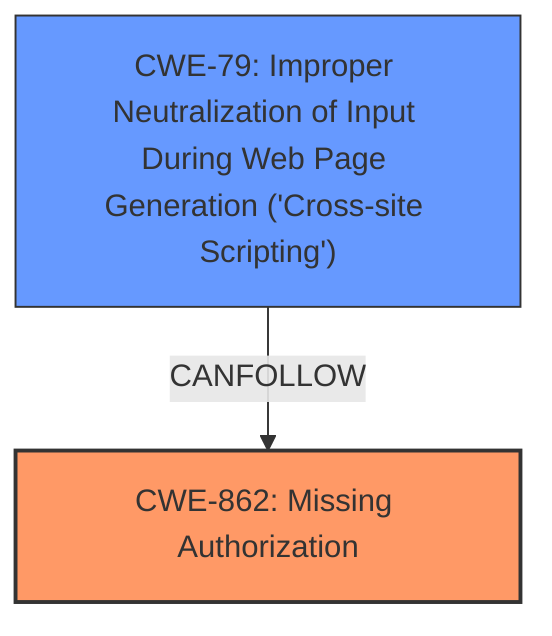

# Analysis for CVE-2024-37214

# Summary
| CWE ID | CWE Name | Confidence | CWE Abstraction Level | CWE Vulnerability Mapping Label | CWE-Vulnerability Mapping Notes |
|---|---|---|---|---|---|
| CWE-862 | Missing Authorization | 0.9 | Class |  Primary CWE | Allowed-with-Review |
| CWE-79 | Improper Neutralization of Input During Web Page Generation ('Cross-site Scripting') | 0.9 | Base | Secondary | Allowed |

## Evidence and Confidence

*   **Confidence Score:** 0.9
*   **Evidence Strength:** HIGH

## Relationship Analysis
The primary weakness identified is **Missing Authorization** (CWE-862), which is a Class-level CWE. The secondary weakness is **Improper Neutralization of Input During Web Page Generation ('Cross-site Scripting')** (CWE-79), which is a Base-level CWE. The relationship here is that **missing authorization** can allow an attacker to inject malicious scripts, leading to XSS.

## Vulnerability Chain
The vulnerability chain starts with the **Missing Authorization** (CWE-862), allowing an attacker with low privileges (subscriber) to inject malicious scripts. This leads to **Improper Neutralization of Input During Web Page Generation ('Cross-site Scripting')** (CWE-79), which can then result in various malicious activities when other users visit the site.

## Summary of Analysis
The analysis is based on the provided evidence from the vulnerability description and CVE Reference Links Content Summary. The **root cause** is the **Missing Authorization vulnerability**, which allows for the exploitation of an XSS vulnerability. The **Vulnerability Description Key Phrases** also highlight the **Missing Authorization vulnerability** as the root cause and **XSS** as a weakness. The chain relationship clearly shows how the lack of authorization leads to the XSS vulnerability. The selected CWEs are at the optimal level of specificity, with CWE-862 representing the **missing authorization** and CWE-79 representing the XSS vulnerability.

Relevant CWE Information:

*   **CWE-862: Missing Authorization** - The application doesn't check whether the user is authorized at all. This aligns with the **Missing Authorization vulnerability** described.
*   **CWE-79: Improper Neutralization of Input During Web Page Generation ('Cross-site Scripting')** - The plugin has an XSS vulnerability, allowing the injection of malicious scripts.

Other CWEs Considered:

*   CWE-284: Improper Access Control - This is a higher-level CWE and less specific than CWE-862. Since the evidence clearly points to **missing authorization**, CWE-862 is more appropriate.
*   CWE-863: Incorrect Authorization - This CWE implies that an authorization check is present but flawed, which is not the case here, as authorization is **missing**.
*   CWE-306: Missing Authentication for Critical Function - This relates to **missing authentication**, but the description focuses on **authorization** issues after a user has some level of access (subscriber).
*   CWE-425: Direct Request ('Forced Browsing') - While related to access control, it is less specific than CWE-862, as it generally relates to direct access of restricted URLs.
*   CWE-639: Authorization Bypass Through User-Controlled Key - The system's authorization functionality does not prevent one user from gaining access to another user's data or record by modifying the key value identifying the data.

The final decision is to use CWE-862 and CWE-79 based on the root cause analysis and the specific details provided in the vulnerability description and CVE reference.