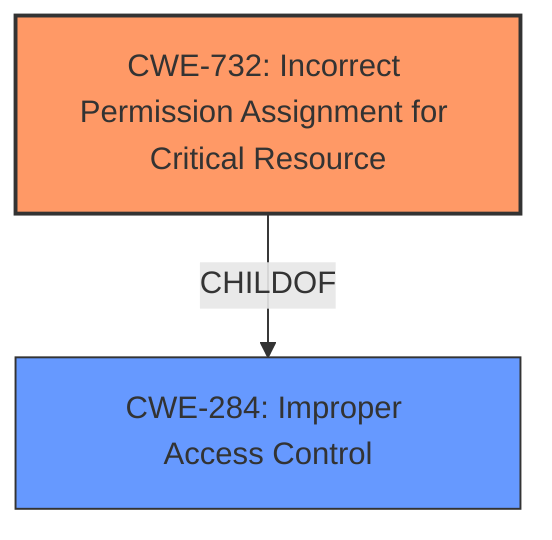

# Analysis Report for CVE-2024-37289

# Vulnerability Analysis Report: CVE-2024-37289

## Description

An **improper access control** vulnerability in Trend Micro Apex One could allow a local attacker to escalate privileges on affected installations. Please note an attacker must first obtain the ability to execute low-privileged code on the target system in order to exploit this vulnerability.

## Vulnerability Description Key Phrases

- **Rootcause:** improper access control
- **Impact:** escalate privileges
- **Attacker:** local attacker
- **Product:** Trend Micro Apex One

## Analysis (with Relationship Data)

# Summary
| CWE ID | CWE Name | Confidence | CWE Abstraction Level | CWE Vulnerability Mapping Label | CWE-Vulnerability Mapping Notes |
|---|---|---|---|---|---|
| CWE-732 | Incorrect Permission Assignment for Critical Resource | 0.9 | Class | Primary CWE | Allowed-with-Review |
| CWE-284 | Improper Access Control | 0.6 | Pillar | Secondary Candidate | Discouraged |

## Evidence and Confidence

*   **Confidence Score:** 0.8
*   **Evidence Strength:** HIGH

## Relationship Analysis
The primary CWE selected is CWE-732, a Class-level CWE. CWE-732 is related to CWE-284, Improper Access Control, which is a Pillar-level CWE. CWE-732 is more specific and preferred over the more general CWE-284. The vulnerability involves incorrect assignment of permissions to a critical resource, making CWE-732 a better fit.



## Vulnerability Chain
The vulnerability chain starts with the **improper access control** on the "Suspect" folder in Trend Micro Apex One. This leads to a local attacker being able to escalate privileges and eventually execute arbitrary code.
  - **Root Cause**: **Improper Access Control** (Incorrect permission assignment)
  - **Weakness**: Privilege Escalation
  - **Impact**: Arbitrary Code Execution

## Summary of Analysis
The initial analysis focused on identifying the root cause of the vulnerability. The key phrase "**improper access control**" in the vulnerability description, along with the CVE Reference Links Content Summary detailing the flawed access control mechanisms for the "Suspect" folder, pointed towards access control related CWEs. The selection of CWE-732 is based on the description of the vulnerability as an **incorrect permission assignment** for a critical resource (the "Suspect" folder). While CWE-284 is a broader category, CWE-732 provides a more specific classification. The evidence strongly supports this classification, detailing how the access control mechanisms are not correctly implemented. The retriever results also list CWE-732 as a potentially relevant CWE. The high confidence score reflects the clear match between the vulnerability description and the CWE definition.

Relevant CWE Information:

# Enhanced Context (25 CWEs)
The following CWEs were identified as potentially relevant to this vulnerability:

## CWE Classification Guidance

The following guidance has been automatically included because relevant keywords were detected in the vulnerability description:

### Authentication vs Authorization vs Access Control Guidance

### Privileges vs Permissions Guidance

# Complete CWE Specifications

CWE-250: Execution with Unnecessary Privileges

CWE-732: Incorrect Permission Assignment for Critical Resource

CWE-284: Improper Access Control

CWE-59: Improper Link Resolution Before File Access ('Link Following')

CWE-346: Origin Validation Error

CWE-1386: Insecure Operation on Windows Junction / Mount Point

CWE-269: Improper Privilege Management

CWE-367: Time-of-check Time-of-use (TOCTOU) Race Condition

CWE-1220: Insufficient Granularity of Access Control

CWE-363: Race Condition Enabling Link Following

## CWE-732: Incorrect Permission Assignment for Critical Resource
*   **Technical Explanation:** The Trend Micro Apex One product assigns permissions for the "Suspect" folder in a way that allows unintended actors (local attackers with low privileges) to read or modify the resource. This **incorrect permission assignment** allows attackers to escalate their privileges.
*   **Security Implications and Potential Impact:** This vulnerability allows a local attacker to escalate their privileges to the SYSTEM level, potentially leading to arbitrary code execution and full system compromise.
*   **Parent-Child Relationships:** CWE-732 is a child of CWE-284 (Improper Access Control), but is more specific.
*   **Primary/Secondary:** Primary CWE, as it directly addresses the root cause.
*   **MITRE Mapping Guidance:** The usage is "Allowed-with-Review". The guidance notes that while the name indicates assignment of permissions, it is sometimes misused for vulnerabilities where "permissions" are not checked, which is an "authorization" weakness. However, in this case, the evidence clearly indicates an **incorrect assignment of permissions**, making CWE-732 appropriate.

## CWE-284: Improper Access Control
*   **Technical Explanation:** While this CWE broadly covers access control issues, it is less specific than CWE-732. The vulnerability description indicates a flaw in the access control mechanisms, but the root cause is specifically related to **incorrect permission assignment** rather than a general lack of access control.
*   **Security Implications and Potential Impact:** As a general access control issue, it can lead to unauthorized access to resources and potential compromise of the system.
*   **Parent-Child Relationships:** CWE-284 is a parent of CWE-732.
*   **Primary/Secondary:** Secondary candidate.
*   **MITRE Mapping Guidance:** The usage is "Discouraged". The rationale is that it's extremely high-level and often misused in low-information vulnerability reports. Given that a more specific CWE (CWE-732) is applicable, CWE-284 is not the best choice.

**Other CWEs Considered but Not Used:**

*   CWE-266 (Incorrect Privilege Assignment), CWE-267 (Privilege Defined With Unsafe Actions), CWE-285 (Improper Authorization), CWE-863 (Incorrect Authorization), CWE-269 (Improper Privilege Management): These CWEs were considered but deemed less appropriate. The vulnerability is more about incorrect assignment of permissions to a specific resource than about the assignment or management of privileges in general. The access control list on a resource is **improperly** set.
*   CWE-73 (External Control of File Name or Path), CWE-59 (Improper Link Resolution Before File Access ('Link Following')), CWE-41 (Improper Resolution of Path Equivalence): These CWEs relate to file path manipulation, which is not the primary issue in this vulnerability.
*   CWE-754 (Improper Check for Unusual or Exceptional Conditions): This CWE is too general and doesn't accurately reflect the root cause.
*   CWE-732 (Incorrect Permission Assignment for Critical Resource): This CWE was selected for the Primary CWE.
*   CWE-367 (Time-of-check Time-of-use (TOCTOU) Race Condition), CWE-363 (Race Condition Enabling Link Following): These CWEs involve race conditions, which are not described in the vulnerability.
*   CWE-250 (Execution with Unnecessary Privileges): This CWE doesn't fit, as the issue isn't about a process running with unnecessary privileges, but about **incorrect permission** settings on the "Suspect" folder.


## CWE Relationship Analysis

Current CWEs represent these abstraction levels: .


### Vulnerability Chain Analysis

**Chain starting from CWE-863:**
- 863 (Incorrect Authorization) - ROOT


**Chain starting from CWE-732:**
- 732 (Incorrect Permission Assignment for Critical Resource) - ROOT


### CWE Relationship Diagram

```mermaid
graph TD
    classDef primary fill:#f96,stroke:#333,stroke-width:2px
    classDef secondary fill:#69f,stroke:#333
    classDef tertiary fill:#9e9,stroke:#333
```


*Report generated on 2025-07-13 09:35:03*
