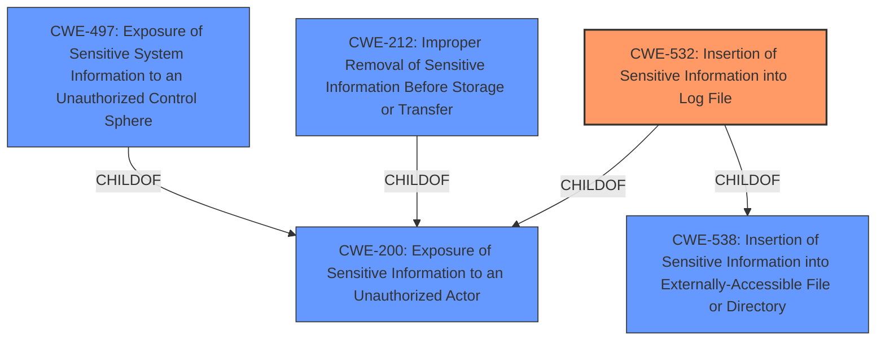

# Analysis Report for CVE-2024-37307

# Vulnerability Analysis Report: CVE-2024-37307

## Description

Cilium is a networking, observability, and security solution with an eBPF-based dataplane. Starting in version 1.13.0 and prior to versions 1.13.7, 1.14.12, and 1.15.6, the output of `cilium-bugtool` **can contain sensitive data** when the tool is run (with the `--envoy-dump` flag set) against Cilium deployments with the Envoy proxy enabled. Users of the TLS inspection, Ingress with TLS termination, Gateway API with TLS termination, and Kafka network policies with API key filtering features are affected. The sensitive data includes the CA certificate, certificate chain, and private key used by Cilium HTTP Network Policies, and when using Ingress/Gateway API and the API keys used in Kafka-related network policy. `cilium-bugtool` is a debugging tool that is typically invoked manually and does not run during the normal operation of a Cilium cluster. This issue has been patched in Cilium v1.15.6, v1.14.12, and v1.13.17. There is no workaround to this issue.

## Vulnerability Description Key Phrases

- **Weakness:** can contain sensitive data
- **Impact:** expose CA certificate, certificate chain, private key; expose API keys
- **Vector:** run with --envoy-dump flag
- **Product:** Cilium
- **Version:** 1.13.0 to 1.13.6, 1.14.0 to 1.14.11, 1.15.0 to 1.15.5
- **Component:** cilium-bugtool

## Analysis (with Relationship Data)

# Summary

| CWE ID | CWE Name | Confidence | CWE Abstraction Level | CWE Vulnerability Mapping Label | CWE-Vulnerability Mapping Notes |
|---|---|---|---|---|---|
| CWE-532 | Insertion of Sensitive Information into Log File | 0.9 | Base | Allowed | Primary CWE |
| CWE-212 | Improper Removal of Sensitive Information Before Storage or Transfer | 0.7 | Base | Allowed | Secondary Candidate |
| CWE-497 | Exposure of Sensitive System Information to an Unauthorized Control Sphere | 0.6 | Base | Allowed | Secondary Candidate |

## Evidence and Confidence

*   **Confidence Score:** 0.8
*   **Evidence Strength:** HIGH

## Relationship Analysis

The primary CWE selected is CWE-532, which represents the specific issue of sensitive information being written to a log file. While other CWEs like CWE-212 and CWE-497 were considered due to their relevance to sensitive information exposure, CWE-532 was deemed more specific to the vulnerability's root cause.



## Vulnerability Chain

The vulnerability chain starts with the **improper inclusion of sensitive data** (CA certificate, certificate chain, private key, and API keys) in the output of the `cilium-bugtool` when the `--envoy-dump` flag is used. This leads directly to **exposure of sensitive information**, which could then be exploited by attackers.

The chain is:
1.  **Root Cause:** **Improper inclusion of sensitive data** in `cilium-bugtool` output. (CWE-532)
2.  **Impact:** Exposure of sensitive information, potentially leading to unauthorized access or impersonation.

## Summary of Analysis

The initial analysis considered several CWEs related to sensitive information exposure and authorization issues. The final selection of CWE-532 is based on the direct evidence of sensitive information being written to a file (the output of `cilium-bugtool`). The vulnerability description and CVE Reference Links Content Summary clearly indicate that the `cilium-bugtool`, when run with the `--envoy-dump` flag, **can contain sensitive data** because it was not sanitizing sensitive data present in Envoy's configuration dump. The fix involves adding a post-processing masking function to redact the sensitive fields.

The graph relationships influenced the decision by highlighting the connections between information exposure CWEs. While CWE-212 and CWE-497 are relevant, CWE-532 is the most specific and directly applicable to the vulnerability.

The selected CWE is at the optimal level of specificity, as it directly addresses the root cause of the vulnerability. It is a Base level CWE, which is preferred according to the mapping guidance.

**CWEs Considered but Not Used:**

*   **CWE-201 (Insertion of Sensitive Information Into Sent Data):** While sensitive data is being exposed, it's not necessarily being "sent" in the traditional sense. The data is being written to a file, making CWE-532 a better fit.
*   **CWE-212 (Improper Removal of Sensitive Information Before Storage or Transfer):** This is relevant, but CWE-532 is more specific about the sensitive information ending up in a log file.
*   **CWE-287 (Improper Authentication):** The vulnerability does not directly relate to authentication failures, so this CWE was not selected.
*   **CWE-269 (Improper Privilege Management):** This is not directly related, since the issue is exposure of data and not privilege management.
*   **CWE-497 (Exposure of Sensitive System Information to an Unauthorized Control Sphere):** This CWE is similar but less specific than CWE-532. CWE-532 explicitly mentions insertion into a log file, which aligns directly with the vulnerability description.
*   **CWE-319 (Cleartext Transmission of Sensitive Information):** Not applicable because the sensitive information is not being transmitted in cleartext over a network.
*   **CWE-863 (Incorrect Authorization):** The vulnerability does not directly involve authorization failures.

# Enhanced Context (25 CWEs)
The following CWEs were identified as potentially relevant to this vulnerability:

## CWE-212: Improper Removal of Sensitive Information Before Storage or Transfer
**Abstraction Level**: Base
**Similarity Score**: 0.73
**Source**: dense

**Description**:
The product stores, transfers, or shares a resource that contains sensitive information, but it does not properly remove that information before the product makes the resource available to unauthorized actors.

**Mapping Guidance**:
- Usage: Allowed
- Rationale: This CWE entry is at the Base level of abstraction, which is a preferred level of abstraction for mapping to the root causes of vulnerabilities.


## CWE-497: Exposure of Sensitive System Information to an Unauthorized Control Sphere
**Abstraction Level**: Base
**Similarity Score**: 0.73
**Source**: dense

**Description**:
The product does not properly prevent sensitive system-level information from being accessed by unauthorized actors who do not have the same level of access to the underlying system as the product does.

**Mapping Guidance**:
- Usage: Allowed
- Rationale: This CWE entry is at the Base level of abstraction, which is a preferred level of abstraction for mapping to the root causes of vulnerabilities.


## CWE-267: Privilege Defined With Unsafe Actions
**Abstraction Level**: Base
**Similarity Score**: 0.71
**Source**: dense

**Description**:
A particular privilege, role, capability, or right can be used to perform unsafe actions that were not intended, even when it is assigned to the correct entity.

**Mapping Guidance**:
- Usage: Allowed
- Rationale: This CWE entry is at the Base level of abstraction, which is a preferred level of abstraction for mapping to the root causes of vulnerabilities.


## CWE-532: Insertion of Sensitive Information into Log File
**Abstraction Level**: Base
**Similarity Score**: 0.71
**Source**: dense

**Description**:
The product writes sensitive information to a log file.

**Mapping Guidance**:
- Usage: Allowed
- Rationale: This CWE entry is at the Base level of abstraction, which is a preferred level of abstraction for mapping to the root causes of vulnerabilities.


## CWE-346: Origin Validation Error
**Abstraction Level**: Class
**Similarity Score**: 0.71
**Source**: dense

**Description**:
The product does not properly verify that the source of data or communication is valid.

**Mapping Guidance**:
- Usage: Allowed-with-Review
- Rationale: This CWE entry is a Class and might have Base-level children that would be more appropriate


## CWE-668: Exposure of Resource to Wrong Sphere
**Abstraction Level**: Class
**Similarity Score**: 0.70
**Source**: dense

**Description**:
The product exposes a resource to the wrong control sphere, providing unintended actors with inappropriate access to the resource.

**Mapping Guidance**:
- Usage: Discouraged
- Rationale: CWE-668 is high-level and is often misused as a catch-all when lower-level CWE IDs might be applicable. It is sometimes used for low-information vulnerability reports [REF-1287]. It is a level-1 Class (i.e., a child of a Pillar). It is not useful for trend analysis.


## CWE-538: Insertion of Sensitive Information into Externally-Accessible File or Directory
**Abstraction Level**: Base
**Similarity Score**: 0.70
**Source**: dense

**Description**:
The product places sensitive information into files or directories that are accessible to actors who are allowed to have access to the files, but not to the sensitive information.

**Mapping Guidance**:
- Usage: Allowed
- Rationale: This CWE entry is at the Base level of abstraction, which is a preferred level of abstraction for mapping to the root causes of vulnerabilities.


## CWE-203: Observable Discrepancy
**Abstraction Level**: Base
**Similarity Score**: 0.70
**Source**: dense

**Description**:


## CWE Relationship Analysis

Current CWEs represent these abstraction levels: .


### Vulnerability Chain Analysis

**Chain starting from CWE-863:**
- 863 (Incorrect Authorization) - ROOT


**Chain starting from CWE-203:**
- 203 (Observable Discrepancy) - ROOT


### CWE Relationship Diagram

```mermaid
graph TD
    classDef primary fill:#f96,stroke:#333,stroke-width:2px
    classDef secondary fill:#69f,stroke:#333
    classDef tertiary fill:#9e9,stroke:#333
```


*Report generated on 2025-07-13 09:36:03*
