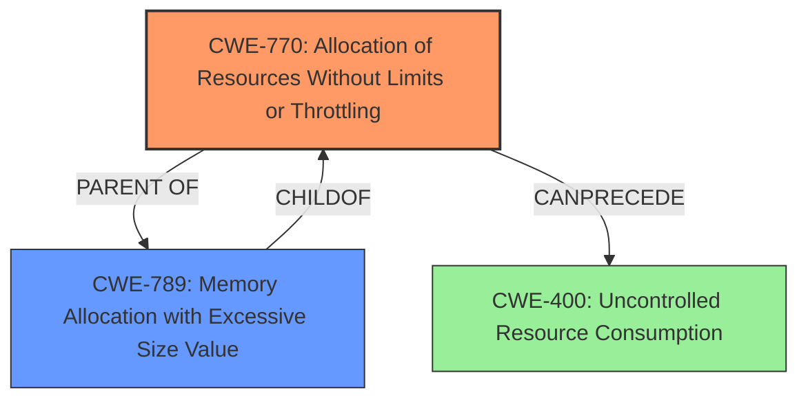

# Enhanced Analysis for CVE-2024-37358

# Summary
| CWE ID | CWE Name | Confidence | CWE Abstraction Level | CWE Vulnerability Mapping Label | CWE-Vulnerability Mapping Notes |
|---|---|---|---|---|---|
| CWE-770 | Allocation of Resources Without Limits or Throttling | 0.9 | Base | Allowed | Primary CWE. The vulnerability involves **unbounded memory allocation** due to a lack of restrictions on resource allocation. |
| CWE-789 | Memory Allocation with Excessive Size Value | 0.8 | Variant | Allowed | Secondary candidate. While related, CWE-770 more directly captures the root cause of the vulnerability which is the lack of limits or throttling on resource allocation. |

## Evidence and Confidence

*   **Confidence Score:** 0.9
*   **Evidence Strength:** HIGH

## Relationship Analysis
The primary relationship that impacted my decision was the parent-child relationship between CWE-770 (Allocation of Resources Without Limits or Throttling) and CWE-789 (Memory Allocation with Excessive Size Value). CWE-789 is a more specific variant of CWE-770, focusing specifically on memory allocation. However, the vulnerability description highlights the **unbounded allocation** aspect more broadly, making CWE-770 a more appropriate and direct fit for the root cause. The abstraction level played a role, as both are at preferred levels (Base and Variant, respectively), but the broader scope of CWE-770 aligns better with the description.



## Vulnerability Chain
The vulnerability chain starts with the **unbounded memory allocation** (**weakness**) due to the lack of limits or throttling (CWE-770). This leads to excessive resource consumption, eventually causing a denial of service (impact).

CWE-770 (Root Cause) -> CWE-400 (Uncontrolled Resource Consumption, Impact)

## Summary of Analysis
The analysis is based on the provided vulnerability description, which explicitly mentions **unbounded memory allocation** as the core **weakness**.

> Similarly to CVE-2024-34055, Apache James is vulnerable to denial of service through the abuse of IMAP literals from both authenticated and unauthenticated users, which could be used to cause **unbounded memory allocation** and very long computations Version 3.7.6 and 3.8.2 restrict such illegitimate use of IMAP literals.

The retriever results also support this, with CWE-770 and CWE-789 being the top candidates. While CWE-789 (Memory Allocation with Excessive Size Value) is a more specific variant, CWE-770 (Allocation of Resources Without Limits or Throttling) more accurately captures the **root cause**, which is the lack of any restrictions on resource allocation, not just memory. The relationship analysis reinforces this, as CWE-789 is a child of CWE-770.

Therefore, the primary CWE is CWE-770 because it directly addresses the **root cause**: the **unbounded allocation** of resources. This leads to uncontrolled resource consumption, resulting in a denial-of-service condition. The selected CWE is at the optimal level of specificity, as it captures the essence of the vulnerability without being overly specific to just memory allocation (as with CWE-789).


## CWE Relationship Analysis

Current CWEs represent these abstraction levels: .


### Vulnerability Chain Analysis

**Chain starting from CWE-400:**
- 400 (Uncontrolled Resource Consumption) - ROOT


**Chain starting from CWE-789:**
- 789 (Memory Allocation with Excessive Size Value) - ROOT


### CWE Relationship Diagram

```mermaid
graph TD
    classDef primary fill:#f96,stroke:#333,stroke-width:2px
    classDef secondary fill:#69f,stroke:#333
    classDef tertiary fill:#9e9,stroke:#333
```