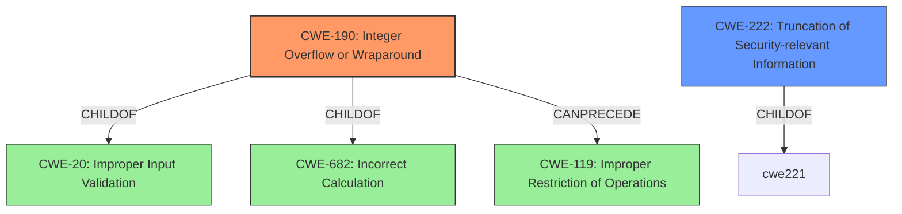

# Analysis Report for CVE-2024-37370

# Vulnerability Analysis Report: CVE-2024-37370

## Description

In MIT Kerberos 5 (aka krb5) before 1.21.3, an attacker can modify the plaintext Extra Count field of a confidential GSS krb5 wrap token, causing the unwrapped token to appear truncated to the application.

## Vulnerability Description Key Phrases

- **Impact:** truncated unwrapped token
- **Vector:** modify plaintext Extra Count field
- **Attacker:** attacker
- **Product:** MIT Kerberos 5
- **Version:** before 1.21.3
- **Component:** krb5 wrap token

## Analysis (with Relationship Data)

# Summary
| CWE ID | CWE Name | Confidence | CWE Abstraction Level | CWE Vulnerability Mapping Label | CWE-Vulnerability Mapping Notes |
|---|---|---|---|---|---|
| CWE-190 | Integer Overflow or Wraparound | 0.8 | Base | Primary CWE | Allowed |
| CWE-222 | Truncation of Security-relevant Information | 0.6 | Base | Secondary Candidate | Allowed |

## Evidence and Confidence

*   **Confidence Score:** 0.7
*   **Evidence Strength:** MEDIUM

## Relationship Analysis
The primary CWE, CWE-190, is a Base level CWE. It has parent CWEs like CWE-20 (Improper Input Validation) and CWE-682 (Incorrect Calculation). It can also precede CWE-119 (Improper Restriction of Operations Within the Bounds of a Memory Buffer).

CWE-222 (Truncation of Security-relevant Information) is a Base level CWE.



## Vulnerability Chain
The vulnerability chain starts with a potential **CWE-190 (Integer Overflow or Wraparound)** in the calculation of the "Extra Count" field, leading to **CWE-222 (Truncation of Security-relevant Information)**, where the unwrapped token appears truncated to the application.

## Summary of Analysis
The vulnerability description states that an attacker can modify the plaintext Extra Count field of a confidential GSS krb5 wrap token, causing the unwrapped token to appear truncated to the application. The root cause of the vulnerability is the **insufficient verification** of the "Extra Count" field against the encrypted header. The "Extra Count" field likely represents the length or size of extra data included in the token. If an attacker modifies this field to a larger value than the actual data length, it could lead to an integer overflow during calculation. The unwrapped token then appears truncated to the application.

**CWE Selection Justification:**

*   **CWE-190 (Integer Overflow or Wraparound):** This CWE is selected as the primary weakness because the vulnerability stems from the potential for an integer overflow when calculating the length of the unwrapped token based on the attacker-controlled "Extra Count" field. The description states, "an attacker can modify the plaintext Extra Count field...causing the unwrapped token to appear truncated." This indicates that the modified Extra Count, when used in a calculation, results in an overflow, leading to incorrect length determination.
    *   **Evidence:** "attacker can modify the plaintext Extra Count field...causing the unwrapped token to appear truncated"
    *   **Confidence:** 0.8

*   **CWE-222 (Truncation of Security-relevant Information):** This CWE is a secondary candidate because it describes the direct consequence of the vulnerability: the unwrapped token is truncated. This truncation can lead to further security issues as the application might not receive or process the complete data it expects.
    *   **Evidence:** "causing the unwrapped token to appear truncated to the application."
    *   **Confidence:** 0.6

**CWEs Considered but Not Used:**

*   CWE-79 (Improper Neutralization of Input During Web Page Generation ('Cross-site Scripting')): Not applicable because this vulnerability is not related to web page generation or cross-site scripting.
*   CWE-287 (Improper Authentication): Not applicable because the vulnerability does not relate to bypassing or weakening the authentication process.
*   CWE-330 (Use of Insufficiently Random Values): Not applicable because the vulnerability does not relate to random number generation.
*   CWE-222 (Truncation of Security-relevant Information): Considered as a possible primary weakness. While truncation occurs, it is a consequence of the integer overflow rather than a direct act of truncating data.


## CWE Relationship Analysis

Current CWEs represent these abstraction levels: .


### Vulnerability Chain Analysis

**Chain starting from CWE-330:**
- 330 (Use of Insufficiently Random Values) - ROOT


**Chain starting from CWE-682:**
- 682 (Incorrect Calculation) - ROOT


### CWE Relationship Diagram

```mermaid
graph TD
    classDef primary fill:#f96,stroke:#333,stroke-width:2px
    classDef secondary fill:#69f,stroke:#333
    classDef tertiary fill:#9e9,stroke:#333
```


*Report generated on 2025-07-13 09:41:01*
