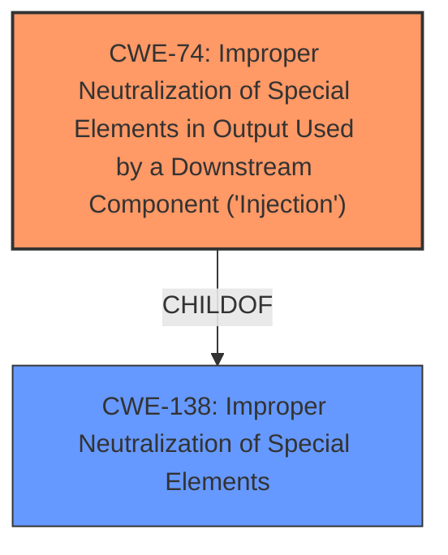

# Enhanced Analysis for CVE-2024-37442

# Summary
| CWE ID   | CWE Name                                                                                         | Confidence | CWE Abstraction Level | CWE Vulnerability Mapping Label | CWE-Vulnerability Mapping Notes |
| :--------- | :----------------------------------------------------------------------------------------------- | :--------- | :---------------------- | :------------------------------ | :-------------------------------- |
| CWE-74   | Improper Neutralization of Special Elements in Output Used by a Downstream Component ('Injection') | 0.75       | Class                   | Primary                         | Discouraged                       |
| CWE-138  | Improper Neutralization of Special Elements                                                        | 0.6        | Class                   | Secondary                       | Discouraged                       |

## Evidence and Confidence

*   **Confidence Score:** 0.7
*   **Evidence Strength:** MEDIUM

## Relationship Analysis
The primary relationship considered here is the hierarchical relationship. CWE-74 is a Class-level CWE, and there are more specific Base and Variant level CWEs that could be considered, but the description is too general to pinpoint the exact injection type. CWE-138 is a parent of CWE-74, which is also a class, so it is less specific than CWE-74.



## Vulnerability Chain
The vulnerability chain starts with **improper neutralization of special elements**, leading to code injection. The chain can be represented as: **Improper Neutralization** -> Code Injection.

## Summary of Analysis
The vulnerability description focuses on the **improper neutralization of special elements** leading to code injection. The primary CWE selected is CWE-74, which aligns with the **improper neutralization** aspect of the vulnerability and its impact of code injection. While more specific CWEs like CWE-89 (SQL Injection), CWE-90 (LDAP Injection), or CWE-1336 (Template Engine Injection) are possible, the provided description lacks the detail required to confirm the specific type of injection. Therefore, the more general CWE-74 is chosen. CWE-138 is considered as a secondary weakness because it is related to the root cause, however, it is a parent of CWE-74, and less specific.

Relevant CWE Information:

# Enhanced Context (25 CWEs)
The following CWEs were identified as potentially relevant to this vulnerability:

## CWE-74: Improper Neutralization of Special Elements in Output Used by a Downstream Component ('Injection')
**Abstraction Level**: Class
**Similarity Score**: 0.74
**Source**: dense

**Description**:
The product constructs all or part of a command, data structure, or record using externally-influenced input from an upstream component, but it does not neutralize or incorrectly neutralizes special elements that could modify how it is parsed or interpreted when it is sent to a downstream component.

**Mapping Guidance**:
- Usage: Discouraged
- Rationale: CWE-74 is high-level and often misused when lower-level weaknesses are more appropriate.

### Final Decisions:
CWE-74 is chosen as the primary CWE because it directly relates to the description "Improper Neutralization of Special Elements in Output Used by a Downstream Component (Injection)". Although the description does not give enough details to choose a more specific CWE, it is still the most accurate.

## CWE-138: Improper Neutralization of Special Elements
**Abstraction Level**: Class
**Similarity Score**: 0.73
**Source**: dense

**Description**:
The product receives input from an upstream component, but it does not neutralize or incorrectly neutralizes special elements that could be interpreted as control elements or syntactic markers when they are sent to a downstream component.

**Mapping Guidance**:
- Usage: Discouraged
- Rationale: This CWE entry is a level-1 Class (i.e., a child of a Pillar). It might have lower-level children that would be more appropriate

### Final Decisions:
CWE-138 is a related class that is considered. It is less specific than CWE-74.


## CWE Relationship Analysis

Current CWEs represent these abstraction levels: .


### Vulnerability Chain Analysis

**Chain starting from CWE-90:**
- 90 (Improper Neutralization of Special Elements used in an LDAP Query ('LDAP Injection')) - ROOT


**Chain starting from CWE-89:**
- 89 (Improper Neutralization of Special Elements used in an SQL Command ('SQL Injection')) - ROOT


### CWE Relationship Diagram

```mermaid
graph TD
    classDef primary fill:#f96,stroke:#333,stroke-width:2px
    classDef secondary fill:#69f,stroke:#333
    classDef tertiary fill:#9e9,stroke:#333
```