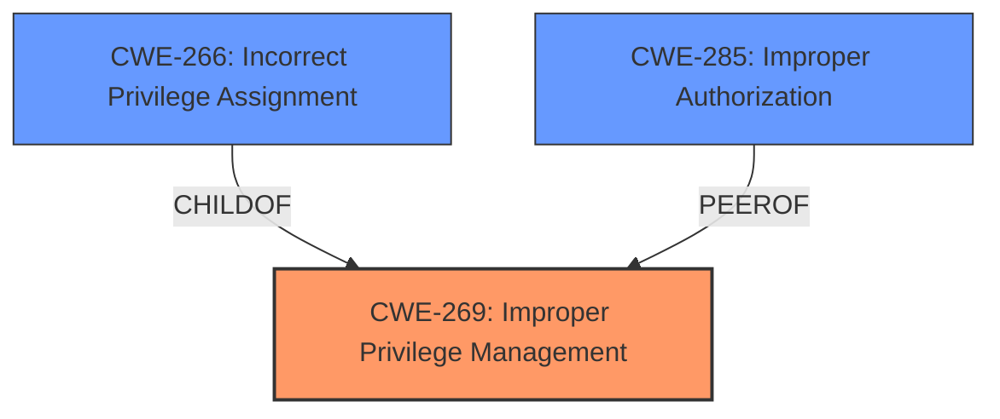

# Enhanced Analysis for CVE-2024-37484

# Summary
| CWE ID | CWE Name | Confidence | CWE Abstraction Level | CWE Vulnerability Mapping Label | CWE-Vulnerability Mapping Notes |
|---|---|---|---|---|---|
| CWE-269 | Improper Privilege Management | 0.8 | Class | Primary | Discouraged |
| CWE-266 | Incorrect Privilege Assignment | 0.7 | Base | Secondary | Allowed |
| CWE-285 | Improper Authorization | 0.6 | Class | Secondary | Discouraged |

## Evidence and Confidence

*   **Confidence Score:** 0.8
*   **Evidence Strength:** MEDIUM

## Relationship Analysis
The primary identified weakness is CWE-269, a Class-level CWE. The retriever results and vulnerability description key phrases suggest this as the primary issue (**Improper Privilege Management**). CWE-269 has child relationships with CWE-266 (Incorrect Privilege Assignment) and CWE-250 (Execution with Unnecessary Privileges).



## Vulnerability Chain
The vulnerability chain starts with **Improper Privilege Management** (CWE-269), which leads to Privilege Escalation.

## Summary of Analysis
The initial analysis identified CWE-269 (Improper Privilege Management) as the primary weakness due to the vulnerability description explicitly mentioning it. The evidence from the CVE Reference Links Content Summary confirms that the vulnerability leads to Privilege Escalation. The retriever results also list CWE-269 as the top match. While CWE-269 is a Class-level CWE and generally discouraged, the available evidence points directly to it as the root cause. CWE-266 (Incorrect Privilege Assignment) and CWE-285 (Improper Authorization) were considered as potential more specific alternatives, but the description doesn't provide enough detail to pinpoint the exact mechanism of the privilege management failure. Therefore, CWE-269 is retained as the primary weakness, with CWE-266 and CWE-285 as secondary candidates.

Relevant CWE Information:

# Enhanced Context (25 CWEs)
The following CWEs were identified as potentially relevant to this vulnerability:

## CWE-266: Incorrect Privilege Assignment
**Abstraction Level**: Base
**Similarity Score**: 0.80
**Source**: dense

**Description**:
A product incorrectly assigns a privilege to a particular actor, creating an unintended sphere of control for that actor.

**Mapping Guidance**:
- Usage: Allowed
- Rationale: This CWE entry is at the Base level of abstraction, which is a preferred level of abstraction for mapping to the root causes of vulnerabilities.

## CWE-269: Improper Privilege Management
**Abstraction Level**: Class
**Similarity Score**: 1410.68
**Source**: sparse

**Description**:
The product does not properly assign, modify, track, or check privileges for an actor, creating an unintended sphere of control for that actor.

**Mapping Guidance**:
- Usage: Discouraged
- Rationale: CWE-269 is commonly misused. It can be conflated with "privilege escalation," which is a technical impact that is listed in many low-information vulnerability reports [REF-1287]. It is not useful for trend analysis.

## CWE-285: Improper Authorization
**Abstraction Level**: Class
**Similarity Score**: 1362.71
**Source**: sparse

**Description**:
The product does not perform or incorrectly performs an authorization check when an actor attempts to access a resource or perform an action.

**Mapping Guidance**:
- Usage: Discouraged
- Rationale: CWE-285 is high-level and lower-level CWEs can frequently be used instead. It is a level-1 Class (i.e., a child of a Pillar).


## CWE Relationship Analysis

Current CWEs represent these abstraction levels: .


### Vulnerability Chain Analysis

**Chain starting from CWE-266:**
- 266 (Incorrect Privilege Assignment) - ROOT


**Chain starting from CWE-269:**
- 269 (Improper Privilege Management) - ROOT


### CWE Relationship Diagram

```mermaid
graph TD
    classDef primary fill:#f96,stroke:#333,stroke-width:2px
    classDef secondary fill:#69f,stroke:#333
    classDef tertiary fill:#9e9,stroke:#333
```