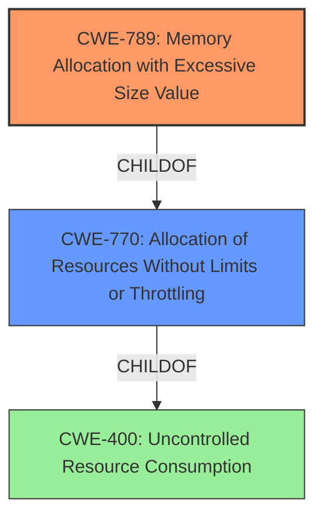

# Analysis for CVE-2024-37535

# Summary
| CWE ID | CWE Name | Confidence | CWE Abstraction Level | CWE Vulnerability Mapping Label | CWE-Vulnerability Mapping Notes |
|---|---|---|---|---|---|
| CWE-789 | Memory Allocation with Excessive Size Value | 1.0 | Variant | Allowed | Primary CWE |
| CWE-770 | Allocation of Resources Without Limits or Throttling | 0.7 | Base | Allowed | Secondary Candidate |
| CWE-400 | Uncontrolled Resource Consumption | 0.5 | Class | Discouraged | Secondary Candidate |

## Evidence and Confidence

*   **Confidence Score:** 0.9
*   **Evidence Strength:** HIGH

## Relationship Analysis
The primary CWE, CWE-789 [Memory Allocation with Excessive Size Value], is a child of CWE-770 [Allocation of Resources Without Limits or Throttling], indicating a more specific case of the broader resource allocation issue. CWE-770 itself is a child of CWE-400 [Uncontrolled Resource Consumption], representing a more general class of resource management problems. We chose CWE-789 as the primary because the vulnerability description clearly describes the excessive memory allocation based on an untrusted size value.

## Vulnerability Chain
The vulnerability chain starts with the **lack of input sanitization** of the window resize escape sequence. This leads to **unbounded resource consumption** because the application allocates memory based on the attacker-controlled size values, resulting in a **denial of service (memory consumption)**.

## Summary of Analysis
The analysis strongly supports the selection of CWE-789 [Memory Allocation with Excessive Size Value] as the primary CWE. The "CVE Reference Links Content Summary" explicitly states that the vulnerability "allows an attacker to specify arbitrarily large values for the terminal window's height and width via a specific escape sequence (`e[4;;t`). This leads to excessive memory allocation." This aligns perfectly with the description of CWE-789, which focuses on memory allocation based on untrusted, large size values without proper validation. The retriever results also list CWE-789 as a high scoring candidate.

CWE-770 [Allocation of Resources Without Limits or Throttling] is considered as a secondary CWE because it describes the broader issue of allocating resources without limits, which is a parent of CWE-789. While applicable, CWE-789 provides a more specific and accurate representation of the vulnerability.

CWE-400 [Uncontrolled Resource Consumption] is a more general class, and while relevant, it is less specific than CWE-789 and CWE-770. The mapping guidance for CWE-400 also discourages its use in low-information vulnerability reports.

The selection of CWE-789 is at the optimal level of specificity (Variant) as it directly addresses the **root cause** of the vulnerability: the **improper handling of the size value** used for memory allocation.

Other CWEs Considered:

*   CWE-150 [Improper Neutralization of Escape, Meta, or Control Sequences]: While the vulnerability involves escape sequences, the primary issue is the **lack of validation** of the size value, not the neutralization of the escape sequence itself.
*   CWE-1284 [Improper Validation of Specified Quantity in Input]: This CWE is similar to CWE-789 but focuses on the validation of any quantity, not specifically memory allocation size. CWE-789 is a better fit.
*   CWE-362 [Concurrent Execution using Shared Resource with Improper Synchronization ('Race Condition')]: This is not relevant as concurrency is not mentioned in the vulnerability description.
*   CWE-125 [Out-of-bounds Read]: This is not relevant as the issue is memory allocation, not reading.
*   CWE-843 [Access of Resource Using Incompatible Type ('Type Confusion')]: This is not relevant as the issue is about the size of memory allocation, not incompatible types.