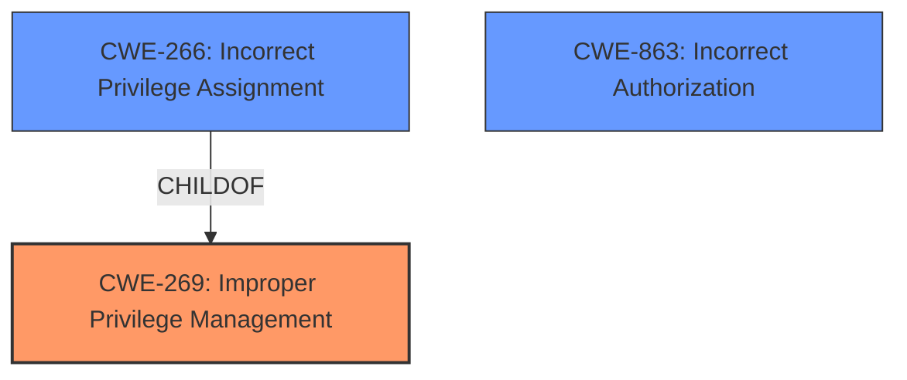

# Raw Analyzer Response for CVE-2024-37560

# Summary
| CWE ID  | CWE Name                            | Confidence | CWE Abstraction Level | CWE Vulnerability Mapping Label | CWE-Vulnerability Mapping Notes |
|---------|-------------------------------------|------------|-----------------------|---------------------------------|---------------------------------|
| CWE-269 | Improper Privilege Management       | 0.75       | Class                 | Allowed-with-Review            | Discouraged, Primary CWE        |
| CWE-266 | Incorrect Privilege Assignment      | 0.6        | Base                 | Allowed                         | Secondary Candidate             |
| CWE-863 | Incorrect Authorization    | 0.6        | Class                 | Allowed-with-Review                        | Secondary Candidate             |

## Evidence and Confidence

*   **Confidence Score:** 0.70
*   **Evidence Strength:** MEDIUM

## Relationship Analysis
The primary CWE is CWE-269, which is a Class-level CWE. The retriever results also suggest CWE-266 as a possible candidate, which is a Base-level CWE and a child of CWE-269. CWE-863 is another Class level CWE that is closely related to authorization issues. The mapping guidance suggests to use more specific CWEs if available, but the provided information does not give enough detail to map to a specific base CWE.

## Vulnerability Chain
The vulnerability chain starts with **Improper Privilege Management** (CWE-269), which allows a low privileged user to escalate their account to a higher privileged account, potentially taking full control of the website. The root cause is the **improper privilege management**, and the impact is Privilege Escalation.

## Summary of Analysis
The initial assessment identified **Improper Privilege Management** as the root cause, based on the vulnerability description key phrases. The CVE Reference Links Content Summary confirms that the root cause is related to privilege escalation. The retriever results suggest CWE-266 and CWE-863 as possible candidates, but the provided information does not give enough detail to map to a specific base CWE.
The final decision is to use CWE-269 as the primary CWE, since it is the most general and accurate description of the vulnerability. CWE-266 and CWE-863 are added as secondary candidates, since they are more specific but not fully supported by the evidence.
The selected CWE is at the optimal level of specificity, since it accurately describes the vulnerability without being too specific or general.

Relevant CWE Information:

# Enhanced Context (25 CWEs)
The following CWEs were identified as potentially relevant to this vulnerability:

## CWE-266: Incorrect Privilege Assignment
**Abstraction Level**: Base
**Similarity Score**: 0.80
**Source**: dense

**Description**:
A product incorrectly assigns a privilege to a particular actor, creating an unintended sphere of control for that actor.

**Mapping Guidance**:
- Usage: Allowed
- Rationale: This CWE entry is at the Base level of abstraction, which is a preferred level of abstraction for mapping to the root causes of vulnerabilities.

## CWE-269: Improper Privilege Management
**Abstraction Level**: Class
**Similarity Score**: 1417.88
**Source**: sparse

**Description**:
The product does not properly assign, modify, track, or check privileges for an actor, creating an unintended sphere of control for that actor.

**Mapping Guidance**:
- Usage: Discouraged
- Rationale: CWE-269 is commonly misused. It can be conflated with "privilege escalation," which is a technical impact that is listed in many low-information vulnerability reports [REF-1287]. It is not useful for trend analysis.

## CWE-863: Incorrect Authorization
**Abstraction Level**: Class
**Similarity Score**: 1400.91
**Source**: sparse

**Description**:
The product performs an authorization check when an actor attempts to access a resource or perform an action, but it does not correctly perform the check.

**Mapping Guidance**:
- Usage: Allowed-with-Review
- Rationale: This CWE entry is a Class and might have Base-level children that would be more appropriate