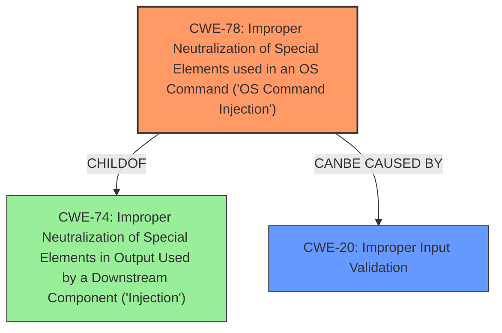

# Analysis Report for CVE-2024-37570

# Vulnerability Analysis Report: CVE-2024-37570

## Description

On Mitel 6869i 4.5.0.41 devices, the Manual Firmware Update (upgrade.html) page does not perform sanitization on the username and path parameters (sent by an authenticated user) before appending flags to the busybox ftpget command. This leads to $() command execution.

## Vulnerability Description Key Phrases

- **Rootcause:** improper input sanitization
- **Impact:** command execution
- **Attacker:** authenticated user
- **Product:** Mitel 6869i
- **Version:** 4.5.0.41
- **Component:** Manual Firmware Update page

## Analysis (with Relationship Data)

# Summary
| CWE ID | CWE Name | Confidence | CWE Abstraction Level | CWE Vulnerability Mapping Label | CWE-Vulnerability Mapping Notes |
|---|---|---|---|---|---|
| CWE-78 | Improper Neutralization of Special Elements used in an OS Command ('OS Command Injection') | 1.0 | Base | Allowed | Primary CWE: The device constructs all or part of an OS command using externally-influenced input, but it does not neutralize or incorrectly neutralizes special elements that could modify the intended OS command. |
| CWE-20 | Improper Input Validation | 0.7 | Class | Discouraged | Secondary Candidate: The product receives input or data, but it does not validate or incorrectly validates that the input has the properties that are needed to process the data safely and correctly. |

## Evidence and Confidence

*   **Confidence Score:** 0.9
*   **Evidence Strength:** HIGH

## Relationship Analysis
The primary CWE is CWE-78, which is a base-level CWE. CWE-78 is a child of CWE-74 (Improper Neutralization of Special Elements in Output Used by a Downstream Component ('Injection')). The secondary CWE candidate is CWE-20, which is a class-level CWE. CWE-20 is a parent of more specific input validation CWEs. The relationship between CWE-78 and CWE-20 indicates that **improper input validation** (CWE-20) can lead to OS command injection (CWE-78). The selection of CWE-78 is at the optimal level of specificity because it accurately describes the vulnerability.



## Vulnerability Chain
The vulnerability chain starts with **improper input sanitization** (potentially CWE-20), leading to OS command injection (CWE-78), and ultimately resulting in arbitrary command execution.
  - The root cause is the lack of sanitization.
  - The vulnerability is OS command injection.
  - The impact is arbitrary command execution.

## Summary of Analysis
The analysis is primarily based on the provided evidence, including the vulnerability description, key phrases, and CVE reference links content summary. The vulnerability description clearly states that the Manual Firmware Update page does not perform sanitization on the username and path parameters before appending them to the busybox ftpget command. The CVE reference links content summary confirms this, stating that the root cause of the vulnerability is that the Manual Firmware Update page does not sanitize the username and path parameters before appending them to the busybox ftpget command. This leads to command injection.

The relationship graph influenced the selection of CWE-78 as the primary CWE, as it accurately represents the vulnerability. CWE-20 was considered as a secondary CWE, as the lack of sanitization is a form of improper input validation. However, CWE-78 is more specific and accurately describes the vulnerability, so it was selected as the primary CWE.

The selected CWEs are at the optimal level of specificity because they accurately represent the vulnerability and the root cause. CWE-78 is a base-level CWE that specifically addresses OS command injection, while CWE-20 is a class-level CWE that addresses improper input validation.

Relevant CWE Information:

# Enhanced Context (25 CWEs)
The following CWEs were identified as potentially relevant to this vulnerability:

## CWE-138: Improper Neutralization of Special Elements
**Abstraction Level**: Class
**Similarity Score**: 0.75
**Source**: dense

**Description**:
The product receives input from an upstream component, but it does not neutralize or incorrectly neutralizes special elements that could be interpreted as control elements or syntactic markers when they are sent to a downstream component.

**Mapping Guidance**:
- Usage: Discouraged
- Rationale: This CWE entry is a level-1 Class (i.e., a child of a Pillar). It might have lower-level children that would be more appropriate

*Not Selected*: While this CWE relates to improper neutralization, it is a class-level CWE, and CWE-78 is more specific.

## CWE-80: Improper Neutralization of Script-Related HTML Tags in a Web Page (Basic XSS)
**Abstraction Level**: Variant
**Similarity Score**: 0.74
**Source**: dense

**Description**:
The product receives input from an upstream component, but it does not neutralize or incorrectly neutralizes special characters such as "<", ">", and "&" that could be interpreted as web-scripting elements when they are sent to a downstream component that processes web pages.

**Mapping Guidance**:
- Usage: Allowed
- Rationale: This CWE entry is at the Variant level of abstraction, which is a preferred level of abstraction for mapping to the root causes of vulnerabilities.

*Not Selected*: This CWE relates to XSS, which is not the vulnerability described.

## CWE-912: Hidden Functionality
**Abstraction Level**: Class
**Similarity Score**: 0.74
**Source**: dense

**Description**:
The product contains functionality that is not documented, not part of the specification, and not accessible through an interface or command sequence that is obvious to the product's users or administrators.

**Mapping Guidance**:
- Usage: Allowed-with-Review
- Rationale: This CWE entry is a Class and might have Base-level children that would be more appropriate

*Not Selected*: This CWE does not relate to the vulnerability described.

## CWE-116: Improper Encoding or Escaping of Output
**Abstraction Level**: Class
**Similarity Score**: 0.73
**Source**: dense

**Description**:
The product prepares a structured message for communication with another component, but encoding or escaping of the data is either missing or done incorrectly. As a result, the intended structure of the message is not preserved.

**Mapping Guidance**:
- Usage: Allowed-with-Review
- Rationale: This CWE entry is a Class and might have Base-level children that would be more appropriate

*Not Selected*: While this CWE relates to improper encoding, it is not the primary cause of the vulnerability described.

## CWE-74: Improper Neutralization of Special Elements in Output Used by a Downstream Component ('Injection')
**Abstraction Level**: Class
**Similarity Score**: 0.73
**Source**: dense

**Description**:
The product constructs all or part of a command, data structure, or record using externally-influenced input from an upstream component, but it does not neutralize or incorrectly neutralizes special elements that could modify how it is parsed or interpreted when it is sent to a downstream component.

**Mapping Guidance**:
- Usage: Discouraged
- Rationale: CWE-74 is high-level and often misused when lower-level weaknesses are more appropriate.

*Not Selected*: This CWE is too high-level and has more specific children.

## CWE-184: Incomplete List of Disallowed Inputs
**Abstraction Level**: Base
**Similarity Score**: 0.73
**Source**: dense

**Description**:
The product implements a protection mechanism that relies on a list of inputs (or properties of inputs) that are not allowed by policy or otherwise require other action to neutralize before additional processing takes place, but the list is incomplete.

**Mapping Guidance**:
- Usage: Allowed
- Rationale: This CWE entry is at the Base level of abstraction, which is a preferred level of abstraction for mapping to the root causes of vulnerabilities.

*Not Selected*: This CWE is not the primary cause of the vulnerability described.

## CWE-303: Incorrect Implementation of Authentication Algorithm
**Abstraction Level**: Base
**Similarity Score**: 0.73
**Source**: dense

**Description**:
The requirements for the product dictate the use of an established authentication algorithm, but the implementation of the algorithm is incorrect.

**Mapping Guidance**:
- Usage: Allowed
- Rationale: This CWE entry is at the Base level of abstraction, which is a preferred level of abstraction for mapping to the root causes of vulnerabilities.

*Not Selected*: This CWE does not relate to the vulnerability described.

## CWE-346: Origin Validation Error
**Abstraction Level**: Class
**Similarity Score**: 0.72
**Source**: dense

**Description**:
The product does not properly verify that the source of data or communication is valid.

**Mapping Guidance**:
- Usage: Allowed-with-Review
- Rationale: This CWE entry is a Class and might have Base-level children that would be more appropriate

*Not Selected*: This CWE does not relate to the vulnerability described.

## CWE-472: External Control of Assumed-Immutable Web Parameter
**Abstraction Level**: Base
**Similarity Score**: 0.72
**Source**: dense

**Description**:


## CWE Relationship Analysis

Current CWEs represent these abstraction levels: .


### Vulnerability Chain Analysis

**Chain starting from CWE-116:**
- 116 (Improper Encoding or Escaping of Output) - ROOT


**Chain starting from CWE-80:**
- 80 (Improper Neutralization of Script-Related HTML Tags in a Web Page (Basic XSS)) - ROOT


### CWE Relationship Diagram

```mermaid
graph TD
    classDef primary fill:#f96,stroke:#333,stroke-width:2px
    classDef secondary fill:#69f,stroke:#333
    classDef tertiary fill:#9e9,stroke:#333
```


*Report generated on 2025-07-13 09:47:21*
