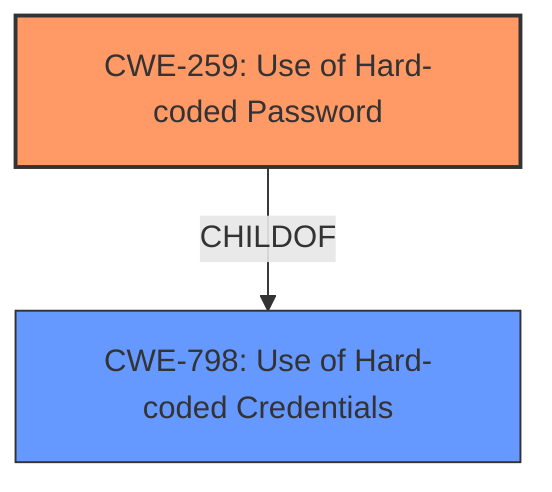

# Analysis Report for CVE-2024-37630

# Vulnerability Analysis Report: CVE-2024-37630

## Description

D-Link DIR-605L v2.13B01 was discovered to contain a **hardcoded password** vulnerability in /etc/passwd, which allows attackers to log in as root.

## Vulnerability Description Key Phrases

- **Rootcause:** hardcoded password
- **Impact:** log in as root
- **Attacker:** attackers
- **Product:** D-Link DIR-605L
- **Version:** v2.13B01
- **Component:** /etc/passwd

## Analysis (with Relationship Data)

# Summary
| CWE ID | CWE Name | Confidence | CWE Abstraction Level | CWE Vulnerability Mapping Label | CWE-Vulnerability Mapping Notes |
|---|---|---|---|---|---|
| CWE-259 | Use of Hard-coded Password | 1.0 | Variant | Allowed | Primary CWE. The vulnerability description clearly states a **hardcoded password** exists in the system. |
| CWE-798 | Use of Hard-coded Credentials | 0.7 | Base | Allowed | Secondary candidate. While CWE-259 is more specific, CWE-798 is a broader classification that encompasses various types of **hardcoded credentials**, including passwords. |

## Evidence and Confidence

*   **Confidence Score:** 1.0
*   **Evidence Strength:** HIGH

## Relationship Analysis
The primary relationship impacting the decision is the parent-child relationship between CWE-798 (Use of Hard-coded Credentials) and CWE-259 (Use of Hard-coded Password). CWE-259 is a variant of CWE-798, representing a more specific case. Since the vulnerability description explicitly mentions a **hardcoded password**, CWE-259 is the more appropriate choice.



## Vulnerability Chain
The vulnerability chain starts with the **hardcoded password** (CWE-259), which directly leads to unauthorized root access.

CWE-259 (Use of Hard-coded Password) -> Impact: Gain root access.

## Summary of Analysis
The analysis is based on the clear and direct evidence provided in the vulnerability description and CVE reference. The description explicitly states that there's a **hardcoded password** in the `/etc/passwd` file of D-Link DIR-605L v2.13B01, which can be exploited to gain root access. The CVE Reference Links Content Summary confirms the presence of a **hardcoded password** for the root user.

The selection of CWE-259 is further supported by its Variant abstraction level, which is preferred for mapping root causes. The MITRE mapping guidance for CWE-259 also allows its usage.
CWE-259 is at the optimal level of specificity because the evidence supports the existence of a hardcoded password.

Other CWEs considered but not used:

*   CWE-798 (Use of Hard-coded Credentials): Considered as a broader category, but CWE-259 is more specific.
*   CWE-321 (Use of Hard-coded Cryptographic Key): Not applicable as the vulnerability involves a password, not a cryptographic key.
*   CWE-1392 (Use of Default Credentials): Not applicable since the vulnerability involves a hardcoded password, not a default one.
*   CWE-1188 (Initialization of a Resource with an Insecure Default): While this could be loosely related, the core issue is not an insecure default, but a hardcoded password.
*   CWE-1393 (Use of Default Password): Not applicable since the vulnerability involves a hardcoded password, not a default one.


## CWE Relationship Analysis

Current CWEs represent these abstraction levels: .


### Vulnerability Chain Analysis

**Chain starting from CWE-321:**
- 321 (Use of Hard-coded Cryptographic Key) - ROOT


**Chain starting from CWE-1393:**
- 1393 (Use of Default Password) - ROOT


### CWE Relationship Diagram

```mermaid
graph TD
    classDef primary fill:#f96,stroke:#333,stroke-width:2px
    classDef secondary fill:#69f,stroke:#333
    classDef tertiary fill:#9e9,stroke:#333
```


*Report generated on 2025-07-13 09:47:53*
