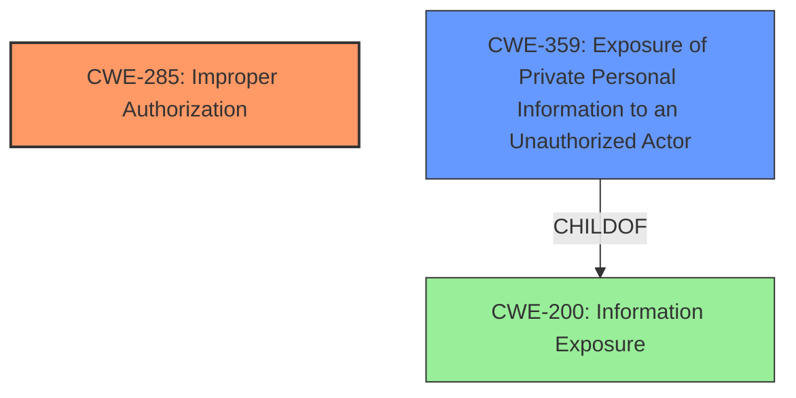

# Analysis for CVE-2024-37767

# Summary
| CWE ID    | CWE Name                                                     | Confidence | CWE Abstraction Level | CWE Vulnerability Mapping Label | CWE-Vulnerability Mapping Notes |
| :-------- | :----------------------------------------------------------- | :--------- | :-------------------- | :------------------------------ | :------------------------------ |
| CWE-285   | Improper Authorization                                       | 0.9        | Class                 | Primary                         | Discouraged                     |
| CWE-359   | Exposure of Private Personal Information to an Unauthorized Actor | 0.7        | Base                  | Secondary                       | Allowed                         |

## Evidence and Confidence

*   **Confidence Score:** 0.8
*   **Evidence Strength:** MEDIUM

## Relationship Analysis
The primary relationship influencing the CWE selection is the parent-child relationship between CWE-285 (Improper Authorization) and its potential child CWEs. While more specific child CWEs might exist, the provided evidence does not offer enough granularity to pinpoint the precise authorization flaw. Instead, the high-level classification of CWE-285 adequately captures the general failure to perform correct authorization checks. Also the relationship that CWE-359 (Exposure of Private Personal Information to an Unauthorized Actor) is a child of CWE-200 (Information Exposure) was considered here.

## Vulnerability Chain
The vulnerability chain begins with the **insecure permissions**, leading to **improper authorization**, which then results in the **exposure of private personal information**.

1.  **Root Cause:** **Insecure Permissions**
2.  **Weakness:** **Improper Authorization** (CWE-285)
3.  **Impact:** **Exposure of Private Personal Information to an Unauthorized Actor** (CWE-359)

## Summary of Analysis
The initial analysis focused on identifying the root cause of the vulnerability and its resulting impact. The key phrase "**insecure permissions**" from the vulnerability description, along with the CVE Reference Links Content Summary indicating a "lack of strict verification of user identity and permissions," strongly suggests an authorization issue.

The Retriever Results listed several candidate CWEs, including CWE-425, CWE-732, CWE-639, CWE-285, and CWE-668. While CWE-732 (Incorrect Permission Assignment for Critical Resource) initially seemed relevant, the description focuses more on *assignment* of permissions, whereas the vulnerability here appears to be about *checking* permissions. The retriever lists CWE-359 with a high score. The description of the vulnerability indicates that user information is exposed via crafted GET request.

CWE-285 (Improper Authorization) was selected as the primary CWE because it directly addresses the failure to perform or the incorrect performance of authorization checks. Although it is a Class-level CWE and thus discouraged, the available evidence doesn't sufficiently specify the exact nature of the authorization flaw to select a more specific Base-level CWE. The MITRE mapping guidance lists that the authorization logic is present but flawed.

CWE-359 (Exposure of Private Personal Information to an Unauthorized Actor) was selected as a secondary CWE to highlight the specific impact of the authorization failure. This CWE is at the Base level of abstraction and accurately describes the resulting exposure of user information.

The selection of CWE-285 and CWE-359 is based on the available evidence, relationship analysis, and mapping guidance. While more specific CWEs might be applicable with additional information, the current classification provides a reasonable representation of the vulnerability.

Relevant CWE Information:

**CWE-285: Improper Authorization**

*   **Technical Explanation:** The application fails to adequately verify whether a user has the necessary permissions to access a resource or perform an action. This can occur due to flawed logic, missing checks, or incorrect implementation of authorization mechanisms.
*   **Security Implications:** Unauthorized users can gain access to sensitive data, modify critical system settings, or perform actions they are not permitted to, leading to data breaches, privilege escalation, and other security incidents.
*   **Relationship Analysis:** This is a Class-level CWE, and more specific Base or Variant CWEs might be applicable if more details about the authorization flaw were known.
*   **Mapping Guidance Influence:** The MITRE mapping guidance influenced the decision to select this CWE, as it directly addresses the authorization aspect of the vulnerability, even though it is a Class-level CWE.
*   **Confidence:** 0.9

**CWE-359: Exposure of Private Personal Information to an Unauthorized Actor**

*   **Technical Explanation:** The application unintentionally reveals private personal information to an actor who is not authorized to access it. This can occur through various means, such as unprotected API endpoints, insecure data storage, or flawed access controls.
*   **Security Implications:** Exposure of private personal information can lead to identity theft, financial fraud, reputational damage, and other serious consequences for affected users.
*   **Relationship Analysis:** This is a Base-level CWE, providing a specific classification for the information exposure impact. It is a child of CWE-200 (Information Exposure).
*   **Mapping Guidance Influence:** The MITRE mapping guidance supports the selection of this CWE, as it directly describes the impact of the authorization failure.
*   **Confidence:** 0.7

**CWEs Considered but Not Used:**

*   **CWE-732 (Incorrect Permission Assignment for Critical Resource):** This CWE was considered but not selected because the vulnerability appears to be about incorrect *checking* of permissions rather than incorrect *assignment* of permissions.
*   **CWE-639 (Authorization Bypass Through User-Controlled Key):** This CWE was considered, but the description does not explicitly state that the authorization bypass is happening through a user-controlled key.
*   **CWE-668 (Exposure of Resource to Wrong Sphere):** This CWE is discouraged because it is high-level and other CWEs are more specific.
*   **CWE-306 (Missing Authentication for Critical Function):** This was not selected as the CVE description states that attackers craft a GET request.