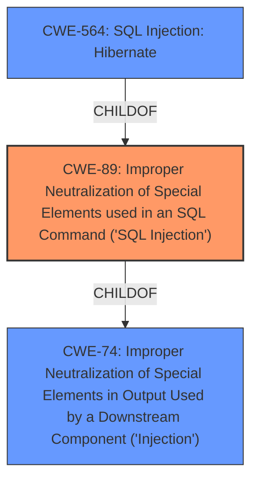

# Analysis Report for CVE-2024-37858

# Vulnerability Analysis Report: CVE-2024-37858

## Description

**SQL Injection** vulnerability in Lost and Found Information System 1.0 allows a remote attacker to escalate privileges via the id parameter to php-lfis/admin/categories/manage_category.php.

## Vulnerability Description Key Phrases

- **Weakness:** SQL Injection
- **Impact:** escalate privileges
- **Vector:** id parameter
- **Attacker:** remote attacker
- **Product:** Lost and Found Information System
- **Version:** 1
- **Component:** php-lfis/admin/categories/manage_category.php

## Analysis (with Relationship Data)

# Summary

| CWE ID | CWE Name | Confidence | CWE Abstraction Level | CWE Vulnerability Mapping Label | CWE-Vulnerability Mapping Notes |
|---|---|---|---|---|---|
| CWE-89 | Improper Neutralization of Special Elements used in an SQL Command ('SQL Injection') | 1.0 | Base | Allowed | Primary CWE |

## Evidence and Confidence

*   **Confidence Score:** 1.0
*   **Evidence Strength:** HIGH

## Relationship Analysis
The primary identified CWE is CWE-89, which is a base-level CWE. It has parent CWEs like CWE-74 and child CWEs like CWE-564. Given the information, we can be specific and select the base CWE.



## Vulnerability Chain
The vulnerability chain starts with the **SQL Injection** (**weakness**) due to **improper neutralization of special elements**, leading to privilege escalation (**impact**) when exploited through the `id` parameter.

## Summary of Analysis
The vulnerability description clearly states "**SQL Injection** vulnerability" and indicates that this leads to privilege escalation. The provided retriever results strongly suggest CWE-89 as the primary weakness, which aligns with the vulnerability description. The evidence is strong, since the vulnerability description calls out "**SQL Injection**" as the **weakness**.

Relevant CWE Information:

# Enhanced Context (25 CWEs)
The following CWEs were identified as potentially relevant to this vulnerability:

## CWE-89: Improper Neutralization of Special Elements used in an SQL Command ('SQL Injection')
**Abstraction Level**: base
**Similarity Score**: 3.14
**Source**: graph

**Description**:
CWE-89: Improper Neutralization of Special Elements used in an SQL Command ('SQL Injection')

**Mapping Guidance**:
- Usage: Allowed
- Rationale: This CWE entry is at the Base level of abstraction, which is a preferred level of abstraction for mapping to the root causes of vulnerabilities.

**Relationships**:
- PARENTOF -> CWE-564
- CANFOLLOW -> CWE-456
- CHILDOF -> CWE-74
- CHILDOF -> CWE-943
- PARENTOF -> CWE-89


## CWE Relationship Analysis

Current CWEs represent these abstraction levels: .


### Vulnerability Chain Analysis

**Chain starting from CWE-89:**
- 89 (Improper Neutralization of Special Elements used in an SQL Command ('SQL Injection')) - ROOT


**Chain starting from CWE-564:**
- 564 (SQL Injection: Hibernate) - ROOT


### CWE Relationship Diagram

```mermaid
graph TD
    classDef primary fill:#f96,stroke:#333,stroke-width:2px
    classDef secondary fill:#69f,stroke:#333
    classDef tertiary fill:#9e9,stroke:#333
```


*Report generated on 2025-07-13 09:52:37*
