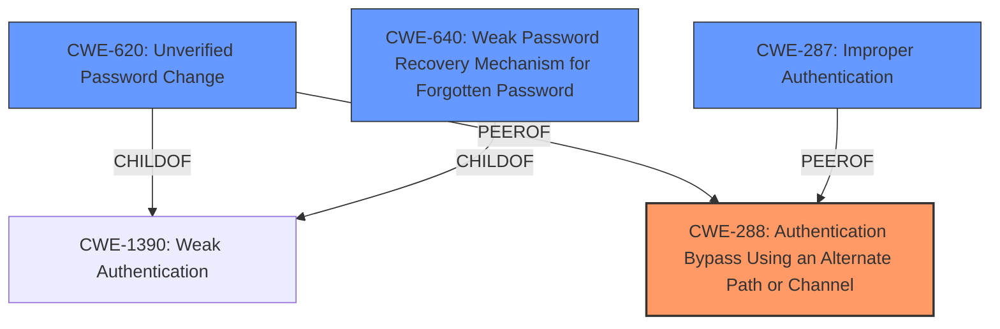

# Analysis for CVE-2024-37897

# Summary
| CWE ID | CWE Name | Confidence | CWE Abstraction Level | CWE Vulnerability Mapping Label | CWE-Vulnerability Mapping Notes |
|---|---|---|---|---|---|
| CWE-288 | Authentication Bypass Using an Alternate Path or Channel | 0.9 | Base | Allowed | Primary CWE. This is the root cause because the password reset mechanism doesn't properly check the user's access restrictions, providing an alternate path to bypass authentication. |
| CWE-620 | Unverified Password Change | 0.7 | Base | Allowed | Secondary Candidate. The password change mechanism does not verify if the user should be allowed to change their password. |
| CWE-287 | Improper Authentication | 0.6 | Class | Discouraged | Secondary Candidate. This is related because the system **does not properly** authenticate the user's right to reset the password given their access restrictions. |
| CWE-640 | Weak Password Recovery Mechanism for Forgotten Password | 0.5 | Base | Allowed-with-Review | Secondary Candidate. This is related because the password recovery mechanism is **weak** in that it allows restricted users to reset their passwords. |

## Evidence and Confidence

*   **Confidence Score:** 0.8
*   **Evidence Strength:** HIGH

## Relationship Analysis
The primary CWE is CWE-288 (Authentication Bypass Using an Alternate Path or Channel), as it identifies the core issue of bypassing access restrictions through the password reset mechanism. CWE-620 (Unverified Password Change) is a child of CWE-1390 (Weak Authentication), which is a higher-level classification. CWE-287 (Improper Authentication) and CWE-640 (Weak Password Recovery Mechanism for Forgotten Password) are also related, as they represent different aspects of the authentication and password recovery process.

## Vulnerability Chain
The vulnerability chain starts with the **insufficient access control** during the password reset process. This allows users with access restrictions to reset their passwords (**weakness: password reset for restricted users**), leading to unauthorized access. The root cause is the **authentication bypass** (CWE-288), followed by the **unverified password change** (CWE-620) and **improper authentication** (CWE-287).
  - Root Cause: Insufficient access control during password reset
  - Weakness: Password reset for restricted users
  - Impact: Unauthorized access

## Summary of Analysis
The analysis is based on the provided vulnerability description, CVE reference links content summary, and retriever results. The primary CWE, CWE-288, is selected because it accurately represents the **authentication bypass** vulnerability. The vulnerability description clearly states that users with access restrictions can reset their passwords, bypassing the intended access controls. The CVE reference links confirm that the root cause is the **insufficient access control** during the password reset process. This allows users to exploit the password reset feature (**alternate path**) to gain unauthorized access. The other CWEs considered are related but do not fully capture the root cause of the vulnerability. The selected CWEs are at the optimal level of specificity, as they provide a detailed representation of the vulnerability.

Relevant CWE Information:

# Enhanced Context (25 CWEs)
The following CWEs were identified as potentially relevant to this vulnerability:

## CWE-620: Unverified Password Change
**Abstraction Level**: Base
**Similarity Score**: 0.71
**Source**: dense

**Description**:
When setting a new password for a user, the product does not require knowledge of the original password, or using another form of authentication.

**Mapping Guidance**:
- Usage: Allowed
- Rationale: This CWE entry is at the Base level of abstraction, which is a preferred level of abstraction for mapping to the root causes of vulnerabilities.

## CWE-916: Use of Password Hash With Insufficient Computational Effort
**Abstraction Level**: Base
**Similarity Score**: 0.71
**Source**: dense

**Description**:
The product generates a hash for a password, but it uses a scheme that does not provide a sufficient level of computational effort that would make password cracking attacks infeasible or expensive.

**Mapping Guidance**:
- Usage: Allowed
- Rationale: This CWE entry is at the Base level of abstraction, which is a preferred level of abstraction for mapping to the root causes of vulnerabilities.

*This CWE is not relevant as the weakness is not about password hashing but about authentication bypass.*

## CWE-1391: Use of Weak Credentials
**Abstraction Level**: Class
**Similarity Score**: 0.70
**Source**: dense

**Description**:
The product uses weak credentials (such as a default key or hard-coded password) that can be calculated, derived, reused, or guessed by an attacker.

**Mapping Guidance**:
- Usage: Allowed-with-Review
- Rationale: This CWE entry is a Class and might have Base-level children that would be more appropriate

*This CWE is not relevant as the weakness is not about using weak credentials.*

## CWE-640: Weak Password Recovery Mechanism for Forgotten Password
**Abstraction Level**: Base
**Similarity Score**: 0.70
**Source**: dense

**Description**:
The product contains a mechanism for users to recover or change their passwords without knowing the original password, but the mechanism is weak.

**Mapping Guidance**:
- Usage: Allowed-with-Review
- Rationale: This entry appears to be frequently misused for any weakness related to password changes, even though the name focuses on "Password Recovery" for a "forgotten" password.

*This CWE could be considered, but CWE-288 is a better fit as the password recovery mechanism is weak because it allows restricted users to reset their passwords.*

## CWE-303: Incorrect Implementation of Authentication Algorithm
**Abstraction Level**: Base
**Similarity Score**: 0.70
**Source**: dense

**Description**:
The requirements for the product dictate the use of an established authentication algorithm, but the implementation of the algorithm is incorrect.

**Mapping Guidance**:
- Usage: Allowed
- Rationale: This CWE entry is at the Base level of abstraction, which is a preferred level of abstraction for mapping to the root causes of vulnerabilities.

*This CWE is not relevant as the weakness is not about the implementation of an authentication algorithm.*

## CWE-257: Storing Passwords in a Recoverable Format
**Abstraction Level**: Base
**Similarity Score**: 0.69
**Source**: dense

**Description**:
The storage of passwords in a recoverable format makes them subject to password reuse attacks by malicious users. In fact, it should be noted that recoverable encrypted passwords provide no significant benefit over plaintext passwords since they are subject not only to reuse by malicious attackers but also by malicious insiders. If a system administrator can recover a password directly, or use a brute force search on the available information, the administrator can use the password on other accounts.

**Mapping Guidance**:
- Usage: Allowed
- Rationale: This CWE entry is at the Base level of abstraction, which is a preferred level of abstraction for mapping to the root causes of vulnerabilities.

*This CWE is not relevant as the weakness is not about storing passwords in a recoverable format.*

## CWE-288: Authentication Bypass Using an Alternate Path or Channel
**Abstraction Level**: Base
**Similarity Score**: 0.69
**Source**: dense

**Description**:
The product requires authentication, but the product has an alternate path or channel that does not require authentication.

**Mapping Guidance**:
- Usage: Allowed
- Rationale: This CWE entry is at the Base level of abstraction, which is a preferred level of abstraction for mapping to the root causes of vulnerabilities.

*This CWE is a good fit as the password reset feature provides an alternate path to bypass authentication.*

## CWE-212: Improper Removal of Sensitive Information Before Storage or Transfer
**Abstraction Level**: Base
**Similarity Score**: 0.68
**Source**: dense

**Description**:
The product stores, transfers, or shares a resource that contains sensitive information, but it does not properly remove that information before the product makes the resource available to unauthorized actors.

**Mapping Guidance**:
- Usage: Allowed
- Rationale: This CWE entry is at the Base level of abstraction, which is a preferred level of abstraction for mapping to