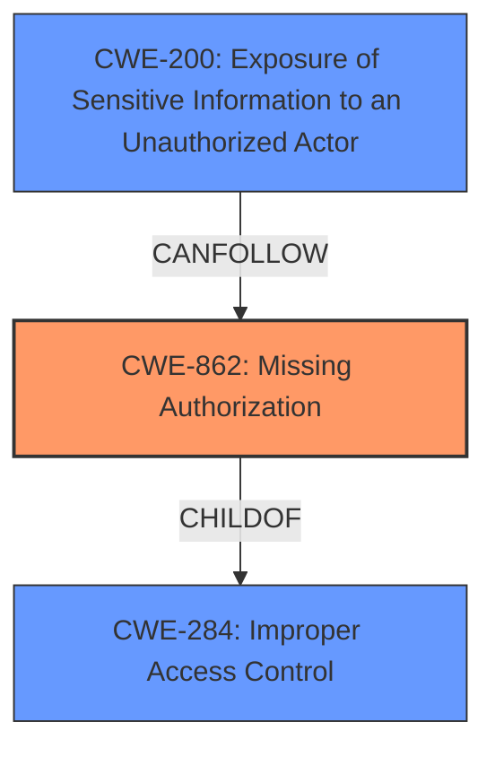

# Analysis for CVE-2024-37930

# Summary
| CWE ID | CWE Name | Confidence | CWE Abstraction Level | CWE Vulnerability Mapping Label | CWE-Vulnerability Mapping Notes |
|---|---|---|---|---|---|
| CWE-862 | Missing Authorization | 1.0 | Class | Primary CWE | Allowed-with-Review |
| CWE-200 | Exposure of Sensitive Information to an Unauthorized Actor | 0.7 | Class | Secondary Candidate | Discouraged |

## Evidence and Confidence

*   **Confidence Score:** 0.85
*   **Evidence Strength:** HIGH

## Relationship Analysis
The primary relationship influencing the CWE selection is the parent-child relationship between CWE-284 (Improper Access Control) and CWE-862 (Missing Authorization). While CWE-284 is a broader category, the description explicitly mentions "**Missing Authorization vulnerability**," making CWE-862 a more specific and appropriate choice. CWE-200 (Exposure of Sensitive Information to an Unauthorized Actor) is considered due to the impact described, but it's a consequence of the missing authorization, not the root cause.

## Vulnerability Chain
The vulnerability chain starts with the **missing authorization** (**CWE-862**), which then leads to the exposure of sensitive information (**CWE-200**) and allows unauthorized access to functionality.

## Summary of Analysis
The initial analysis identified CWE-862 as the primary candidate due to the explicit mention of "**Missing Authorization vulnerability**" in the description. The retriever results also listed CWE-862 as a strong candidate. The guidance section "Authentication vs Authorization vs Access Control Guidance" further supports this decision, emphasizing that CWE-862 is appropriate when an application doesn't check whether the user is authorized at all.

The vulnerability description states "**Missing Authorization vulnerability** in ThemeSphere SmartMag allows Excavation, Accessing Functionality Not Properly Constrained by ACLs.This issue affects SmartMag from n/a through 9.3.0." The CVE Reference Links Content Summary further reinforces the root cause: "The vulnerabilities can be exploited by unauthenticated users."

CWE-200 is included as a secondary candidate due to the impact of the vulnerability, as it leads to the exposure of sensitive information. However, CWE-862 is the root cause, making it the primary classification.

The chosen CWEs are at the optimal level of specificity. CWE-862 is a Class-level CWE, but it accurately represents the **missing authorization** issue. Lower-level CWEs might exist, but they would require more specific details about the implementation, which are not available in the description.

Relevant CWE Information:

# Enhanced Context (25 CWEs)
The following CWEs were identified as potentially relevant to this vulnerability:

## CWE-668: Exposure of Resource to Wrong Sphere
**Abstraction Level**: Class
**Similarity Score**: 0.74
**Source**: dense

**Description**:
The product exposes a resource to the wrong control sphere, providing unintended actors with inappropriate access to the resource.

**Mapping Guidance**:
- Usage: Discouraged
- Rationale: CWE-668 is high-level and is often misused as a catch-all when lower-level CWE IDs might be applicable. It is sometimes used for low-information vulnerability reports [REF-1287]. It is a level-1 Class (i.e., a child of a Pillar). It is not useful for trend analysis.

*CWE-668 was considered but not selected because it is too generic and discouraged for use when more specific CWEs exist.*

## CWE-639: Authorization Bypass Through User-Controlled Key
**Abstraction Level**: Base
**Similarity Score**: 0.74
**Source**: dense

**Description**:
The system's authorization functionality does not prevent one user from gaining access to another user's data or record by modifying the key value identifying the data.

**Mapping Guidance**:
- Usage: Allowed
- Rationale: This CWE entry is at the Base level of abstraction, which is a preferred level of abstraction for mapping to the root causes of vulnerabilities.

*CWE-639 was considered but not selected because the vulnerability description does not provide sufficient evidence to suggest that the authorization bypass is occurring through user-controlled keys. The description states a more general "Missing Authorization vulnerability".*

## CWE-497: Exposure of Sensitive System Information to an Unauthorized Control Sphere
**Abstraction Level**: Base
**Similarity Score**: 0.73
**Source**: dense

**Description**:
The product does not properly prevent sensitive system-level information from being accessed by unauthorized actors who do not have the same level of access to the underlying system as the product does.

**Mapping Guidance**:
- Usage: Allowed
- Rationale: This CWE entry is at the Base level of abstraction, which is a preferred level of abstraction for mapping to the root causes of vulnerabilities.

*CWE-497 was considered but not selected because the vulnerability description mentions exposure of sensitive information, but there is no evidence to suggest that this information is specifically "system-level".*

## CWE-472: External Control of Assumed-Immutable Web Parameter
**Abstraction Level**: Base
**Similarity Score**: 0.73
**Source**: dense

**Description**:
The web application does not sufficiently verify inputs that are assumed to be immutable but are actually externally controllable, such as hidden form fields.

**Mapping Guidance**:
- Usage: Allowed
- Rationale: This CWE entry is at the Base level of abstraction, which is a preferred level of abstraction for mapping to the root causes of vulnerabilities.

*CWE-472 was considered but not selected because the vulnerability description does not provide any indication that the vulnerability is related to externally controllable, assumed-immutable web parameters.*

## CWE-267: Privilege Defined With Unsafe Actions
**Abstraction Level**: Base
**Similarity Score**: 0.73
**Source**: dense

**Description**:
A particular privilege, role, capability, or right can be used to perform unsafe actions that were not intended, even when it is assigned to the correct entity.

**Mapping Guidance**:
- Usage: Allowed
- Rationale: This CWE entry is at the Base level of abstraction, which is a preferred level of abstraction for mapping to the root causes of vulnerabilities.

*CWE-267 was considered but not selected because there is no evidence to suggest that a privilege is defined with unsafe actions. The description focuses on a missing authorization check.*

## CWE-807: Reliance on Untrusted Inputs in a Security Decision
**Abstraction Level**: Base
**Similarity Score**: 0.73
**Source**: dense

**Description**:
The product uses a protection mechanism that relies on the existence or values of an input, but the input can be modified by an untrusted actor in a way that bypasses the protection mechanism.

**Mapping Guidance**:
- Usage: Allowed
- Rationale: This CWE entry is at the Base level of abstraction, which is a preferred level of abstraction for mapping to the root causes of vulnerabilities.

*CWE-807 was considered but not selected because the vulnerability description does not provide evidence that the product is relying on untrusted inputs in a security decision.*

## CWE-1390: Weak Authentication
**Abstraction Level**: Class
**Similarity Score**: 0.73
**Source**: dense

**Description**:
The product uses an authentication mechanism to restrict access to specific users or identities, but the mechanism does not sufficiently prove that the claimed identity is correct.

**Mapping Guidance**:
- Usage: Allowed-with-Review
- Rationale: This CWE entry is a Class and might have Base-level children that would be more appropriate

*CWE-1390 was considered but not selected because the description explicitly mentions a "Missing Authorization vulnerability", which is different than weak authentication.*

## CWE-345: Insufficient Verification of Data Authenticity
**Abstraction Level**: Class
**Similarity Score**: 0.73
**Source**: dense

**Description**:
The product does not sufficiently verify the origin or authenticity of data, in a way that causes it to accept invalid data.

**Mapping Guidance**:
- Usage: Discouraged
- Rationale: This CWE entry is a level-1 Class (i.e., a child of a Pillar). It might have lower-level children that would be more appropriate

*CWE-345 was considered but not selected because the vulnerability description does not provide any indication that the vulnerability is related to insufficient verification of data authenticity.*

## CWE-425: Direct Request ('Forced Browsing')
**Abstraction Level**: Base
**Similarity Score**: 0.73
**Source**: dense

**Description**:
The web application does not adequately