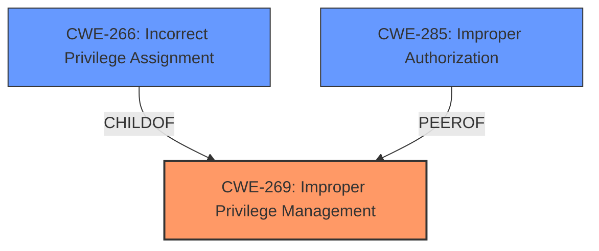

# Raw Analyzer Response for CVE-2024-37952

# Summary
| CWE ID | CWE Name | Confidence | CWE Abstraction Level | CWE Vulnerability Mapping Label | CWE-Vulnerability Mapping Notes |
|---|---|---|---|---|---|
| CWE-269 | Improper Privilege Management | 0.9 | Class | Primary | Discouraged |
| CWE-266 | Incorrect Privilege Assignment | 0.7 | Base | Secondary Candidate | Allowed |
| CWE-285 | Improper Authorization | 0.6 | Class | Secondary Candidate | Discouraged |

## Evidence and Confidence

*   **Confidence Score:** 0.8
*   **Evidence Strength:** MEDIUM

## Relationship Analysis
The primary CWE is CWE-269, a Class-level CWE. While discouraged, it directly reflects the **Improper Privilege Management** stated in the vulnerability description. CWE-266 (Incorrect Privilege Assignment) is a Base CWE and a child of CWE-269. CWE-285 (Improper Authorization) is also related as it describes incorrect authorization checks, which could be a contributing factor to **Improper Privilege Management**. The choice of CWE-269 is made due to its direct match with the description's key phrase, but the analysis also considers the more specific CWE-266, keeping in mind the discouraged usage of CWE-269.

## Vulnerability Chain
The vulnerability chain starts with **Improper Privilege Management** (CWE-269), which leads to Privilege Escalation. This could be due to an **Incorrect Privilege Assignment** (CWE-266) or **Improper Authorization** (CWE-285). The final impact is full control of the website, depending on the privileges gained.

## Summary of Analysis
The initial assessment focused on the direct match of CWE-269 with the provided vulnerability description: "**Improper Privilege Management** vulnerability...allows Privilege Escalation". However, guidance discourages the use of CWE-269 due to its high-level nature. The evidence suggests that **Improper Privilege Management** is the root cause.

The analysis considered more specific CWEs like CWE-266 (Incorrect Privilege Assignment) and CWE-285 (Improper Authorization), which could be the underlying reasons for the **Improper Privilege Management**.

The final decision is to use CWE-269 as the primary because it exactly matches the reported vulnerability, but to acknowledge CWE-266 and CWE-285 as potential contributing factors. This approach balances the need for accuracy with the guidance to avoid overusing high-level CWEs.

Relevant CWE Information:

# Enhanced Context (25 CWEs)
The following CWEs were identified as potentially relevant to this vulnerability:

## CWE-266: Incorrect Privilege Assignment
**Abstraction Level**: Base
**Similarity Score**: 0.80
**Source**: dense

**Description**:
A product incorrectly assigns a privilege to a particular actor, creating an unintended sphere of control for that actor.

**Mapping Guidance**:
- Usage: Allowed
- Rationale: This CWE entry is at the Base level of abstraction, which is a preferred level of abstraction for mapping to the root causes of vulnerabilities.

## CWE-269: Improper Privilege Management
**Abstraction Level**: Class
**Similarity Score**: 1594.00
**Source**: sparse

**Description**:
The product does not properly assign, modify, track, or check privileges for an actor, creating an unintended sphere of control for that actor.

**Mapping Guidance**:
- Usage: Discouraged
- Rationale: CWE-269 is commonly misused. It can be conflated with "privilege escalation," which is a technical impact that is listed in many low-information vulnerability reports [REF-1287]. It is not useful for trend analysis.

## CWE-285: Improper Authorization
**Abstraction Level**: Class
**Similarity Score**: 1531.52
**Source**: sparse

**Description**:
The product does not perform or incorrectly performs an authorization check when an actor attempts to access a resource or perform an action.

**Mapping Guidance**:
- Usage: Discouraged
- Rationale: CWE-285 is high-level and lower-level CWEs can frequently be used instead. It is a level-1 Class (i.e., a child of a Pillar).