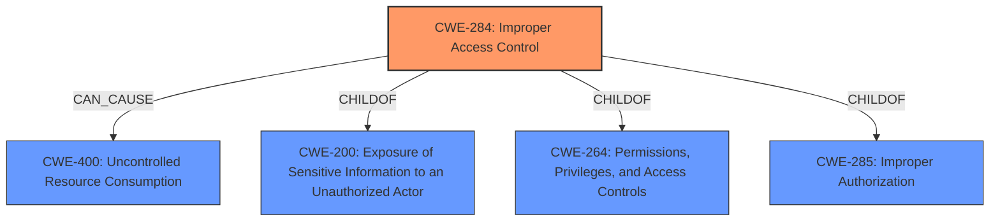

# Analysis Report for CVE-2024-37993

# Vulnerability Analysis Report: CVE-2024-37993

## Description

A vulnerability has been identified in SIMATIC Reader RF610R CMIIT (6GT2811-6BC10-2AA0) (All versions < V4.2), SIMATIC Reader RF610R ETSI (6GT2811-6BC10-0AA0) (All versions < V4.2), SIMATIC Reader RF610R FCC (6GT2811-6BC10-1AA0) (All versions < V4.2), SIMATIC Reader RF615R CMIIT (6GT2811-6CC10-2AA0) (All versions < V4.2), SIMATIC Reader RF615R ETSI (6GT2811-6CC10-0AA0) (All versions < V4.2), SIMATIC Reader RF615R FCC (6GT2811-6CC10-1AA0) (All versions < V4.2), SIMATIC Reader RF650R ARIB (6GT2811-6AB20-4AA0) (All versions < V4.2), SIMATIC Reader RF650R CMIIT (6GT2811-6AB20-2AA0) (All versions < V4.2), SIMATIC Reader RF650R ETSI (6GT2811-6AB20-0AA0) (All versions < V4.2), SIMATIC Reader RF650R FCC (6GT2811-6AB20-1AA0) (All versions < V4.2), SIMATIC Reader RF680R ARIB (6GT2811-6AA10-4AA0) (All versions < V4.2), SIMATIC Reader RF680R CMIIT (6GT2811-6AA10-2AA0) (All versions < V4.2), SIMATIC Reader RF680R ETSI (6GT2811-6AA10-0AA0) (All versions < V4.2), SIMATIC Reader RF680R FCC (6GT2811-6AA10-1AA0) (All versions < V4.2), SIMATIC Reader RF685R ARIB (6GT2811-6CA10-4AA0) (All versions < V4.2), SIMATIC Reader RF685R CMIIT (6GT2811-6CA10-2AA0) (All versions < V4.2), SIMATIC Reader RF685R ETSI (6GT2811-6CA10-0AA0) (All versions < V4.2), SIMATIC Reader RF685R FCC (6GT2811-6CA10-1AA0) (All versions < V4.2), SIMATIC RF1140R (6GT2831-6CB00) (All versions < V1.1), SIMATIC RF1170R (6GT2831-6BB00) (All versions < V1.1), SIMATIC RF166C (6GT2002-0EE20) (All versions < V2.2), SIMATIC RF185C (6GT

## Vulnerability Description Key Phrases

- **Product:** SIMATIC Reader RF610R CMIIT
- **Version:** All versions < V4.2

## Analysis (with Relationship Data)

# Summary
| CWE ID | CWE Name | Confidence | CWE Abstraction Level | CWE Vulnerability Mapping Label | CWE-Vulnerability Mapping Notes |
|---|---|---|---|---|---|
| CWE-284 | Improper Access Control | 0.8 | Class | Primary CWE | Allowed |
| CWE-400 | Uncontrolled Resource Consumption | 0.6 | Class | Secondary Candidate | Discouraged |

## Evidence and Confidence

*   **Confidence Score:** 0.7
*   **Evidence Strength:** MEDIUM

## Relationship Analysis
The primary CWE is CWE-284, **Improper Access Control**, which describes the root cause of the vulnerability. CWE-400, **Uncontrolled Resource Consumption**, is a potential impact of the **improper access control**, leading to a denial-of-service. CWE-284 is a child of CWE-200 (Information Exposure), CWE-264 (Permissions, Privileges, and Access Controls), and CWE-285 (Improper Authorization). These relationships help to contextualize the access control issue within broader categories of security weaknesses.



## Vulnerability Chain
The vulnerability chain starts with **improper access control** (CWE-284), which allows an unauthenticated attacker to create Ajax2App instances. This leads to **uncontrolled resource consumption** (CWE-400), resulting in a denial-of-service condition.

## Summary of Analysis
The primary weakness is **improper access control** (CWE-284) as supported by the CVE Reference Links Content Summary, which stated, "The affected applications do not properly authenticate the creation of Ajax2App instances. This lack of authentication allows unauthorized actions." The resulting impact is denial of service, which can be caused by **uncontrolled resource consumption** (CWE-400). The retriever results also listed CWE-400 as a potential match. While CWE-400 is listed, it's more of a consequence of the **improper access control** rather than the root cause.

Relevant CWE Information:

*   **CWE-284: Improper Access Control** - This is the root cause because the application **fails to restrict access** to the creation of Ajax2App instances. This aligns with the definition of CWE-284, which involves a failure to properly control access to resources or functionality.
*   **CWE-400: Uncontrolled Resource Consumption** - This is a potential consequence because the **lack of access control** allows an attacker to create numerous instances, leading to resource exhaustion and denial of service. While CWE-400 is often misused, in this case, the resource consumption directly results from the **improper access control**, making it a relevant secondary consideration.

CWEs considered but not used:

*   CWE-NVD-Other and CWE-NVD-noinfo: These are placeholders used when there is no clear CWE mapping. The current analysis allows for a better match.
*   CWE-306: Authentication Missing: Authentication is a type of access control, so CWE-284 is a broader and better fit.
*   CWE-755: Improper Handling of Exceptional Conditions - While a DoS can be an exceptional condition, the root cause isn't the improper handling, but the access control.
*   CWE-119: Improper Restriction of Operations within the Bounds of a Memory Buffer - Not applicable, as the issue isn't memory corruption.
*   CWE-835: Loop with Unreachable Exit Condition ('Infinite Loop') - Not applicable, as the issue isn't about a loop, but about access control.


## CWE Relationship Analysis

Current CWEs represent these abstraction levels: .


### Vulnerability Chain Analysis

**Chain starting from CWE-400:**
- 400 (Uncontrolled Resource Consumption) - ROOT


**Chain starting from CWE-306:**
- 306 (Missing Authentication for Critical Function) - ROOT


### CWE Relationship Diagram

```mermaid
graph TD
    classDef primary fill:#f96,stroke:#333,stroke-width:2px
    classDef secondary fill:#69f,stroke:#333
    classDef tertiary fill:#9e9,stroke:#333
```


*Report generated on 2025-07-13 09:59:40*
