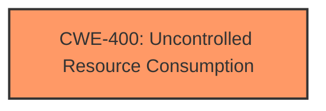

# Analysis Report for CVE-2024-38027

# Vulnerability Analysis Report: CVE-2024-38027

## Description

Windows Line Printer Daemon Service Denial of Service Vulnerability

## Vulnerability Description Key Phrases

- **Impact:** Service Denial of Service
- **Product:** Windows
- **Component:** Line Printer Daemon

## Analysis (with Relationship Data)

# Summary
| CWE ID | CWE Name | Confidence | CWE Abstraction Level | CWE Vulnerability Mapping Label | CWE-Vulnerability Mapping Notes |
|---|---|---|---|---|---|
| CWE-400 | Uncontrolled Resource Consumption | 0.6 | Class | Primary | Allowed-with-Review |

## Evidence and Confidence

*   **Confidence Score:** 0.6
*   **Evidence Strength:** LOW

## Relationship Analysis
The primary CWE is CWE-400, which is a Class-level CWE. While more specific Base or Variant CWEs would be preferred, the provided information does not offer enough specificity to narrow down the root cause.



## Vulnerability Chain
The vulnerability chain starts with an unspecified flaw in the Line Printer Daemon service, which leads to uncontrolled resource consumption, ultimately causing a denial of service. The lack of details makes it impossible to identify the root cause.

## Summary of Analysis
The vulnerability description indicates a denial-of-service vulnerability in the Windows Line Printer Daemon service. The provided information is very limited, with the CVE Reference Links providing 'unrelated' content. The **impact** is clearly a Service Denial of Service.

Given the information, the most appropriate CWE is CWE-400 (Uncontrolled Resource Consumption). This is a high-level Class CWE, but without further information about the root cause, it is the best available choice. The retriever results suggest several potential CWEs, including CWE-617 (Reachable Assertion), CWE-1285 (Improper Validation of Specified Index, Position, or Offset in Input), and CWE-407 (Inefficient Algorithmic Complexity). However, none of these can be confirmed based on the limited evidence.

Relevant CWE Information:

# Enhanced Context (25 CWEs)
The following CWEs were identified as potentially relevant to this vulnerability:

## CWE-59: Improper Link Resolution Before File Access ('Link Following')
**Abstraction Level**: Base

## CWE-617: Reachable Assertion
**Abstraction Level**: Base

## CWE-755: Improper Handling of Exceptional Conditions
**Abstraction Level**: Class

## CWE-178: Improper Handling of Case Sensitivity
**Abstraction Level**: Base

## CWE-427: Uncontrolled Search Path Element
**Abstraction Level**: Base

## CWE-134: Use of Externally-Controlled Format String
**Abstraction Level**: Base

## CWE-184: Incomplete List of Disallowed Inputs
**Abstraction Level**: Base

## CWE-41: Improper Resolution of Path Equivalence
**Abstraction Level**: Base

## CWE-497: Exposure of Sensitive System Information to an Unauthorized Control Sphere
**Abstraction Level**: Base

## CWE-67: Improper Handling of Windows Device Names
**Abstraction Level**: Variant

## CWE-776: Improper Restriction of Recursive Entity References in DTDs ('XML Entity Expansion')
**Abstraction Level**: Base

## CWE-367: Time-of-check Time-of-use (TOCTOU) Race Condition
**Abstraction Level**: Base

## CWE-407: Inefficient Algorithmic Complexity
**Abstraction Level**: Class

## CWE-617: Reachable Assertion
**Abstraction Level**: Base

## CWE-1285: Improper Validation of Specified Index, Position, or Offset in Input
**Abstraction Level**: Base

## CWE-617: Reachable Assertion
**Abstraction Level**: Base

## CWE-193: Off-by-one Error
**Abstraction Level**: Base

## CWE-363: Race Condition Enabling Link Following
**Abstraction Level**: base

## CWE-776: Improper Restriction of Recursive Entity References in DTDs ('XML Entity Expansion')
**Abstraction Level**: base

## CWE-367: Time-of-check Time-of-use (TOCTOU) Race Condition
**Abstraction Level**: base

## CWE-1285: Improper Validation of Specified Index, Position, or Offset in Input
**Abstraction Level**: base

## CWE-170: Improper Null Termination
**Abstraction Level**: base

## CWE-609: Double-Checked Locking
**Abstraction Level**: base

## CWE-289: Authentication Bypass by Alternate Name
**Abstraction Level**: base

## CWE-129: Improper Validation of Array Index
**Abstraction Level**: variant

CWE-400 was chosen as the best fit because the **impact** is a denial of service, and the vulnerability involves uncontrolled resource consumption.

Other CWEs Considered:
*   CWE-617: Reachable Assertion - This would be more appropriate if there was evidence of an assertion being triggered by an attacker, but the description lacks this detail.
*   CWE-1285: Improper Validation of Specified Index, Position, or Offset in Input - This could be relevant if the vulnerability involved invalid input, but there is no information to support this.
*   CWE-407: Inefficient Algorithmic Complexity - This would be relevant if the vulnerability involved an algorithm with poor performance, but the description doesn't provide this detail.


## CWE Relationship Analysis

Current CWEs represent these abstraction levels: .


### Vulnerability Chain Analysis

**Chain starting from CWE-400:**
- 400 (Uncontrolled Resource Consumption) - ROOT


**Chain starting from CWE-193:**
- 193 (Off-by-one Error) - ROOT


### CWE Relationship Diagram

```mermaid
graph TD
    classDef primary fill:#f96,stroke:#333,stroke-width:2px
    classDef secondary fill:#69f,stroke:#333
    classDef tertiary fill:#9e9,stroke:#333
```


*Report generated on 2025-07-13 10:01:49*
