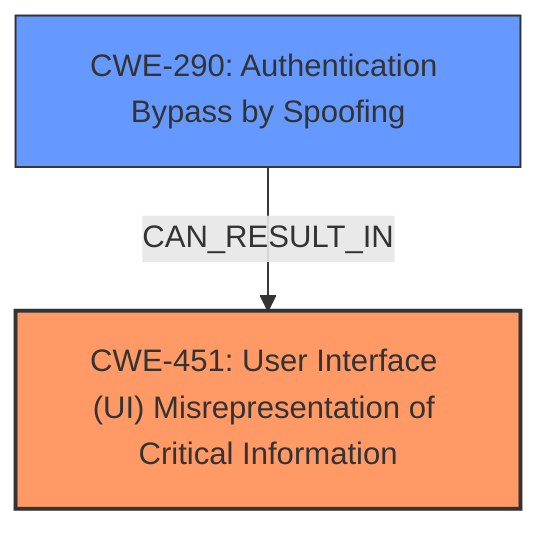

# Analysis for CVE-2024-38030

# Summary
| CWE ID | CWE Name | Confidence | CWE Abstraction Level | CWE Vulnerability Mapping Label | CWE-Vulnerability Mapping Notes |
|---|---|---|---|---|---|
| CWE-451 | User Interface (UI) Misrepresentation of Critical Information | 0.8 | Class | Allowed-with-Review | Primary CWE. The UI is being misrepresented to the user, which is the root cause. |
| CWE-290 | Authentication Bypass by Spoofing | 0.5 | Base | Allowed | Secondary candidate. The vulnerability could potentially lead to bypassing authentication through spoofing. |

## Evidence and Confidence

*   **Confidence Score:** 0.7
*   **Evidence Strength:** LOW

## Relationship Analysis
The primary CWE is CWE-451, which is a Class-level CWE. While it doesn't have explicit child relationships listed in the provided information, it's related to the concept of misleading users through UI manipulation. CWE-290 is related to spoofing attacks and authentication bypass. Though not directly linked to CWE-451 in the provided relationships, spoofing can be a consequence of UI misrepresentation. The abstraction level influenced the selection, prioritizing the Class-level CWE-451 because the specific mechanism of misrepresentation isn't detailed enough to select a more specific Base or Variant.

## Vulnerability Chain
The vulnerability chain starts with the **UI Misrepresentation** (CWE-451). This can potentially lead to **Authentication Bypass by Spoofing** (CWE-290).

## Summary of Analysis
The initial analysis identified CWE-451 as the primary weakness due to the "Spoofing Vulnerability" description and "UI Misrepresentation" from the Retriever results. The evidence is weak because the "CVE Reference Links Content Summary" is "UNRELATED". However, the vulnerability description focuses on "spoofing", which aligns with the concept of misleading users through the UI.

CWE-451 is at the Class level, and while a more specific Base or Variant would be ideal, the provided information lacks the necessary details to pinpoint the exact mechanism of UI misrepresentation. Therefore, CWE-451 is the most appropriate choice based on the available evidence.

CWE-290 was considered as a secondary CWE because spoofing often leads to authentication bypass. However, without more details on the attack vector, it remains a potential consequence rather than a direct root cause.

The graph relationships, although limited, support the connection between UI misrepresentation and potential spoofing attacks.

Relevant CWE Information:
CWE-451: User Interface (UI) Misrepresentation of Critical Information
CWE-290: Authentication Bypass by Spoofing