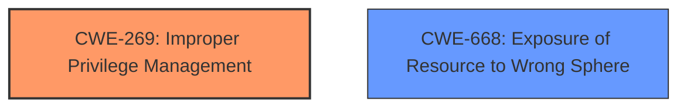

# Enhanced Analysis for CVE-2024-38043

# Summary

| CWE ID  | CWE Name                                                        | Confidence | CWE Abstraction Level | CWE Vulnerability Mapping Label | CWE-Vulnerability Mapping Notes |
| :-------- | :-------------------------------------------------------------- | :--------- | :-------------------- | :------------------------------ | :------------------------------ |
| CWE-269 | Improper Privilege Management                                    | 0.6        | Class                 | Primary                         | Discouraged                   |
| CWE-668 | Exposure of Resource to Wrong Sphere                                | 0.4        | Class                 | Secondary                       | Discouraged                   |

## Evidence and Confidence

*   **Confidence Score:** 0.6
*   **Evidence Strength:** LOW

## Relationship Analysis

The primary relationship considered here is the parent-child relationship. CWE-269 (Improper Privilege Management) is a class-level CWE, and it has child CWEs that could be more specific, but the information provided is insufficient to determine the exact nature of the privilege management issue. CWE-668 (Exposure of Resource to Wrong Sphere) is also a class-level CWE and related because privilege management often involves controlling access to resources, making these two CWEs potentially linked. The abstraction levels influenced the decision to stay at the class level due to lack of detailed information.



## Vulnerability Chain

The chain of the vulnerability is not well-defined in the provided information. The starting point appears to be a privilege management issue (CWE-269), leading to a potential exposure of resources to the wrong sphere (CWE-668). However, the exact steps or mechanisms by which this occurs are missing. The vulnerability description only mentions "PowerShell Elevation of Privilege Vulnerability," which is an impact statement rather than a detailed root cause analysis.

## Summary of Analysis

The initial analysis and resulting conclusion are heavily based on the limited evidence provided. The primary indicator is the phrase "PowerShell Elevation of Privilege Vulnerability," which suggests a privilege management issue. The retriever results and the CWE guidance on privileges vs. permissions were also considered.

The selection of CWE-269 (Improper Privilege Management) as the primary CWE is based on the high-level nature of the vulnerability description. While it's a discouraged CWE due to its broadness, the lack of specific root cause details justifies its use as a starting point. Similarly, CWE-668 (Exposure of Resource to Wrong Sphere) is a possible consequence of the **improper privilege management**, but the information is not sufficient to strongly support this.

The graph relationships highlight the potential connection between privilege management and resource exposure. The decision to stay at the class level is due to the absence of more granular details about the root cause.

Relevant CWE Information:

# Enhanced Context (25 CWEs)
The following CWEs were identified as potentially relevant to this vulnerability:

## CWE-266: Incorrect Privilege Assignment
**Abstraction Level**: Base
**Similarity Score**: 0.79
**Source**: dense

**Description**:
A product incorrectly assigns a privilege to a particular actor, creating an unintended sphere of control for that actor.

**Mapping Guidance**:
- Usage: Allowed
- Rationale: This CWE entry is at the Base level of abstraction, which is a preferred level of abstraction for mapping to the root causes of vulnerabilities.

## CWE-269: Improper Privilege Management
**Abstraction Level**: Class
**Similarity Score**: 1193.44
**Source**: sparse

**Description**:
The product does not properly assign, modify, track, or check privileges for an actor, creating an unintended sphere of control for that actor.

**Mapping Guidance**:
- Usage: Discouraged
- Rationale: CWE-269 is commonly misused. It can be conflated with "privilege escalation," which is a technical impact that is listed in many low-information vulnerability reports [REF-1287]. It is not useful for trend analysis.

## CWE-668: Exposure of Resource to Wrong Sphere
**Abstraction Level**: Class
**Similarity Score**: 0.74
**Source**: dense

**Description**:
The product exposes a resource to the wrong control sphere, providing unintended actors with inappropriate access to the resource.

**Mapping Guidance**:
- Usage: Discouraged
- Rationale: CWE-668 is high-level and is often misused as a catch-all when lower-level CWE IDs might be applicable. It is sometimes used for low-information vulnerability reports [REF-1287]. It is a level-1 Class (i.e., a child of a Pillar). It is not useful for trend analysis.

## CWE Analysis

**CWE-269: Improper Privilege Management**

*   **How the vulnerability's details match the CWE's characteristics:** The vulnerability is described as an "Elevation of Privilege," which directly relates to privilege management. The system is failing to properly manage privileges, allowing unintended elevation.
*   **The security implications and potential impact:** This can lead to unauthorized access to sensitive resources, data breaches, and system compromise.
*   **Any parent-child relationships or chain patterns that influenced your mapping:** CWE-269 is a class-level CWE, and more specific child CWEs might be applicable if more information were available.
*   **Whether the weakness is primary or secondary in the vulnerability:** Primary.
*   **How the official MITRE mapping guidance influenced your decision:** The guidance discourages using CWE-269 due to its broadness. However, the lack of specific root cause information makes it a reasonable starting point.

**CWE-668: Exposure of Resource to Wrong Sphere**

*   **How the vulnerability's details match the CWE's characteristics:** An elevation of privilege often results in resources being exposed to actors who should not have access to them.
*   **The security implications and potential impact:** Unauthorized access to resources, data breaches, and potential system compromise.
*   **Any parent-child relationships or chain patterns that influenced your mapping:** CWE-668 is a class-level CWE.
*   **Whether the weakness is primary or secondary in the vulnerability:** Secondary.
*   **How the official MITRE mapping guidance influenced your decision:** The guidance discourages using CWE-668 due to its high-level nature. Its inclusion is based on the potential consequences of the privilege elevation.

**CWEs Considered But Not Used:**

*   **CWE-266 (Incorrect Privilege Assignment):** Considered, but there's no specific evidence pointing to incorrect assignment rather than a broader management issue.
*   **CWE-285 (Improper Authorization)** and **CWE-863 (Incorrect Authorization):** These were considered but are more about incorrect authorization checks. The description lacks enough detail to confirm whether an authorization check was present but flawed, or if the privilege management was flawed at a higher level.
*   **CWE-250 (Execution with Unnecessary Privileges):** This assumes that PowerShell was running with elevated privileges that it didn't need. There is no evidence for this scenario.


## CWE Relationship Analysis

Current CWEs represent these abstraction levels: .


### Vulnerability Chain Analysis

**Chain starting from CWE-863:**
- 863 (Incorrect Authorization) - ROOT


**Chain starting from CWE-269:**
- 269 (Improper Privilege Management) - ROOT


### CWE Relationship Diagram

```mermaid
graph TD
    classDef primary fill:#f96,stroke:#333,stroke-width:2px
    classDef secondary fill:#69f,stroke:#333
    classDef tertiary fill:#9e9,stroke:#333
```