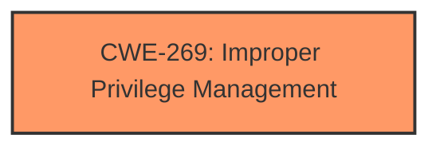

# Raw Analyzer Response for CVE-2024-38046

# Summary
| CWE ID  | CWE Name                                                       | Confidence | CWE Abstraction Level | CWE Vulnerability Mapping Label | CWE-Vulnerability Mapping Notes |
| ------- | ------------------------------------------------------------- | ---------- | --------------------- | ------------------------------- | ------------------------------- |
| CWE-269 | Improper Privilege Management                               | 0.60       | Class                 | Primary                         | Discouraged                    |

## Evidence and Confidence

*   **Confidence Score:** 0.60
*   **Evidence Strength:** LOW

## Relationship Analysis
The primary identified weakness is CWE-269 [Improper Privilege Management], which is a Class-level CWE. It's a high-level class which might benefit from a deeper dive. However, the description is too vague for a more specific determination.

## Vulnerability Chain
The vulnerability chain consists of:
1.  **ROOT CAUSE:** CWE-269 [Improper Privilege Management]
2.  **IMPACT:** Elevation of Privilege

## Summary of Analysis
The initial assessment identified CWE-269 [Improper Privilege Management] as the primary weakness due to the high-level description of "Elevation of Privilege". However, I recognize the limitations of using such a broad CWE.

The description mentions "PowerShell Elevation of Privilege Vulnerability" and the key phrases include "impact: Elevation of Privilege" and "component: PowerShell". The provided information is very limited.

The Retriever Results and graph-based analysis offer several potential CWEs, including CWE-59 [Improper Link Resolution Before File Access ('Link Following')], CWE-266 [Incorrect Privilege Assignment], and CWE-863 [Incorrect Authorization].

The CWE guidance document emphasizes that CWE-269 [Improper Privilege Management] should be avoided and more specific cause be identified. However, the provided information is too limited and does not provide specifics related to privilege assignment, permission checks, or insecure API usage.

I am overriding the general mapping guidance to select CWE-269 [Improper Privilege Management] due to lack of detailed information.

Relevant CWE Information:
# Enhanced Context (25 CWEs)
The following CWEs were identified as potentially relevant to this vulnerability: